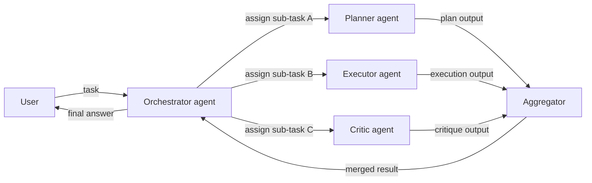
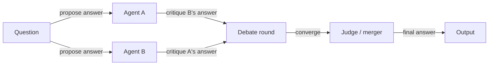

## Definição

Sistemas multi-agentes (MAS) envolvem múltiplos agentes de IA que interagem para resolver tarefas: colaboração (dividir trabalho, compartilhar estado), debate (argumentar e refinar respostas) ou papéis especializados (planejador, executor, crítico). Em vez de um único agente monolítico tentando fazer tudo, o MAS atribui responsabilidades distintas a diferentes agentes e compõe suas saídas.

Eles estendem [agentes](/docs/agents) individuais quando um modelo ou um ciclo é insuficiente: por exemplo, um agente para recuperação via [RAG](/docs/rag), outro para geração e outro para crítica e verificação de fatos. Cada agente pode usar um modelo diferente, um conjunto diferente de ferramentas e um system prompt diferente ajustado para seu papel. Essa modularidade torna os agentes individuais mais simples, mais confiáveis e mais fáceis de substituir ou atualizar.

[Subagentes](/docs/subagents) são uma forma hierárquica onde um agente raiz delega para filhos; sistemas multi-agentes também podem ser planos (ponto a ponto) ou em malha, onde os agentes se comunicam entre si sem um orquestrador central. A topologia correta — hierárquica, plana ou híbrida — depende de se o fluxo de trabalho tem uma decomposição natural em subtarefas independentes ou sequencialmente dependentes.

## Como funciona

### Topologia orquestrada (hierárquica)



### Topologia de debate / revisão



O **usuário** envia uma tarefa a um **orquestrador** (que pode ser um LLM ou um fluxo de trabalho fixo). O orquestrador atribui trabalho ao **Agente 1**, **Agente 2**, etc., cada um com seu próprio papel, ferramentas e, opcionalmente, modelo. Os agentes podem compartilhar um estado comum, trocar mensagens ou ser invocados em sequência ou em paralelo. Suas saídas são **agregadas** (combinadas, votadas ou resumidas) e retornadas. MAS são úteis quando você quer **modularidade**, **especialização**, **reutilização** e **controle de fluxo estruturado** em tarefas complexas de múltiplos passos.

## Quando usar / Quando NÃO usar

| Cenário | Use MAS | Não use MAS |
|---|---|---|
| A tarefa se decompõe claramente em papéis distintos | Sim — planejador + executor + crítico é uma divisão natural | Não — se a tarefa é de papel único, um agente é suficiente |
| Alta confiança necessária via debate/revisão | Sim — o padrão de debate filtra erros por meio de discordância | Não — agente único é adequado para domínios bem compreendidos |
| Subtarefas diferentes precisam de ferramentas/modelos diferentes | Sim — cada agente usa apenas o que precisa | Não — um agente com todas as ferramentas é mais simples se os papéis se sobrepõem muito |
| Prototipagem rápida ou pipelines simples | Não — a sobrecarga do MAS adiciona complexidade | Sim — comece com um único agente e adicione complexidade conforme necessário |
| Requisitos fortes de latência em tempo real | Não — agentes em paralelo adicionam sobrecarga de coordenação | Sim — agente único é mais rápido para orçamentos de latência apertados |

## Comparações

| Padrão | Estrutura | Comunicação | Autonomia | Melhor para |
|---|---|---|---|---|
| Agente único | Monolítico | Nenhuma | Alta por agente | Tarefas simples ou moderadas |
| MAS hierárquico | Árvore (raiz → filhos) | Raiz delega | Média por agente | Fluxos de trabalho estruturados |
| MAS plano / ponto a ponto | Malha ou anel | Mensagens diretas | Alta | Raciocínio colaborativo |
| Debate / revisão | Paralelo + mesclagem | Baseado em crítica | Média | Geração de alta confiança |
| Subagente (hierarquia estrita) | Árvore (raiz é dona do objetivo) | Delegação controlada | Baixa por subagente | Tarefas complexas de longo horizonte |

## Prós e contras

| Prós | Contras |
|---|---|
| Modular — cada agente tem uma responsabilidade clara e testável | Sobrecarga de coordenação (latência, tokens, sincronização de estado) |
| Agentes especializados superam agentes generalistas em seu papel | Mais difícil de depurar do que uma trilha de agente único |
| Reutilizável — mesmo agente em diferentes fluxos de trabalho | O design do protocolo de comunicação é não trivial |
| Padrões de debate podem melhorar significativamente a precisão | Risco de erros em cascata entre agentes |

## Exemplos de código

```python
from langchain_openai import ChatOpenAI
from langchain_core.messages import HumanMessage, SystemMessage

llm = ChatOpenAI(model="gpt-4o-mini")

def planner_agent(task: str) -> str:
    """Break a task into a numbered plan."""
    response = llm.invoke([
        SystemMessage(content="You are a planning agent. Break the task into 3–5 clear steps."),
        HumanMessage(content=task),
    ])
    return response.content

def executor_agent(plan: str) -> str:
    """Execute the plan and produce a draft output."""
    response = llm.invoke([
        SystemMessage(content="You are an execution agent. Follow the plan and produce a detailed output."),
        HumanMessage(content=f"Plan:\n{plan}"),
    ])
    return response.content

def critic_agent(draft: str) -> str:
    """Review the draft and suggest improvements."""
    response = llm.invoke([
        SystemMessage(content="You are a critic agent. Identify flaws and suggest concrete improvements."),
        HumanMessage(content=f"Draft:\n{draft}"),
    ])
    return response.content

# Orchestrate
task = "Write a short guide on how to get started with RAG."
plan = planner_agent(task)
print("Plan:\n", plan)

draft = executor_agent(plan)
print("\nDraft:\n", draft)

critique = critic_agent(draft)
print("\nCritique:\n", critique)
```

## Recursos práticos

- [From Prototypes to Agents with ADK – Google Codelabs](https://codelabs.developers.google.com/your-first-agent-with-adk#0) — ADK suporta a composição de múltiplos agentes em um sistema multi-agente
- [LangChain – Multi-agent orchestration](https://python.langchain.com/docs/concepts/multi_agent/) — Padrões multi-agentes incluindo topologias de supervisor e enxame
- [Microsoft AutoGen](https://microsoft.github.io/autogen/) — Framework para construir sistemas multi-agentes conversacionais
- [AgentsKit](https://emersonbraun.github.io/agentskit/) — Framework pronto para produção para construir agentes de IA com memória, ferramentas e orquestração multi-agente

## Fontes

- [AutoGen: Enabling Next-Gen LLM Applications via Multi-Agent Conversation (Wu et al., 2023)](https://arxiv.org/abs/2308.08155) — Artigo fundamental sobre sistemas multi-agentes orientados à conversa.
- [Communicative Agents for Software Development (Qian et al., 2023)](https://arxiv.org/abs/2307.07924) — Colaboração multi-agente para tarefas complexas de engenharia de software.
- [MetaGPT: Meta Programming for A Multi-Agent Collaborative Framework (Hong et al., 2023)](https://arxiv.org/abs/2308.00352) — Framework multi-agente estruturado com atribuição de papéis e procedimentos operacionais padronizados.
- [Camel: Communicative Agents for "Mind" Exploration of Large Scale Language Model Society (Li et al., 2023)](https://arxiv.org/abs/2303.17760) — Framework de role-playing para cooperação autônoma entre agentes.

## Veja também

- [Agentes](/docs/agents)
- [Subagentes](/docs/subagents)
- [Agentes autônomos](/docs/autonomous-agents)
- [ReAct](/docs/reasoning-patterns/react)
