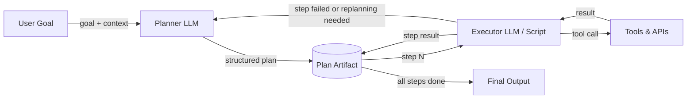

## Definição

A arquitetura Planner-Executor separa a preocupação de *decidir o que fazer* da preocupação de *fazê-lo*. Um LLM **Planner** recebe um objetivo de alto nível e produz um plano estruturado, passo a passo — uma sequência de subtarefas que juntas realizam o objetivo. Um LLM **Executor** (ou um programa determinístico) então percorre o plano uma etapa de cada vez, invocando ferramentas e produzindo resultados. Os dois componentes se comunicam por meio de um artefato de plano compartilhado em vez de por um único prompt monolítico.

Essa separação de preocupações aborda uma limitação fundamental dos ciclos ReAct de agente único: quando uma tarefa é complexa, pedir a um LLM para simultaneamente raciocinar sobre estratégia, escolher a próxima ação e lidar com detalhes de ferramentas de baixo nível leva a erros e alucinações. Ao delegar a decomposição de alto nível ao Planner e a execução de baixo nível ao Executor, cada componente pode ser otimizado, promovido e monitorado independentemente. O Planner pode usar um modelo mais capaz; o Executor pode ser um modelo mais rápido e barato ou mesmo um programa que não é LLM.

Refinamento do plano e replanejamento são extensões críticas da arquitetura básica. Tarefas do mundo real raramente se desenrolam como esperado: uma chamada de ferramenta pode falhar, uma página web pode retornar dados inesperados ou um resultado intermediário pode revelar que o plano original estava errado. Um sistema Planner-Executor robusto monitora os resultados de execução e invoca novamente o Planner quando o replanejamento é necessário. Esse ciclo de feedback transforma um pipeline frágil em um agente adaptativo.

## Como funciona

### Planner

O Planner recebe o objetivo do usuário junto com as ferramentas disponíveis e qualquer contexto relevante. Ele produz um plano estruturado — tipicamente uma lista JSON de objetos de etapa, cada um descrevendo uma subtarefa, a entrada/saída esperada e, opcionalmente, qual ferramenta usar. Um bom prompt de planejamento inclui os esquemas de ferramentas para que o Planner possa referenciá-los com precisão. O Planner não invoca nenhuma ferramenta por si só; ele apenas raciocina sobre a sequência de operações necessárias. A temperatura deve geralmente ser baixa para produzir planos determinísticos e bem estruturados.

### Artefato do plano

O plano é o contrato entre Planner e Executor. É um documento legível por máquina (JSON ou texto estruturado) que codifica a sequência de etapas, suas dependências e seus resultados esperados. Armazenar o plano como um artefato explícito — em vez de mantê-lo implícito na cadeia de pensamento do modelo — torna o sistema auditável, pausável e retomável. Uma etapa de aprovação com humanos no ciclo pode ser inserida aqui, permitindo que os usuários revisem e editem o plano antes do início da execução.

### Executor

O Executor lê o plano uma etapa de cada vez, resolve quaisquer referências de entrada para saídas de etapas anteriores, chama as ferramentas apropriadas e registra o resultado. O Executor pode ser um segundo LLM (útil quando as etapas requerem raciocínio em linguagem natural), um script determinístico (útil para etapas estruturadas como chamadas de API) ou um híbrido. Após cada etapa, o resultado é escrito de volta no artefato do plano para que etapas subsequentes possam referenciá-lo. Se uma etapa falhar, o Executor a sinaliza e opcionalmente aciona o replanejamento.

### Ciclo de replanejamento

Quando a execução diverge do plano — devido a falhas de ferramentas, saídas inesperadas ou condições alteradas — o controle retorna ao Planner com o registro de execução parcial. O Planner revisa as etapas restantes dadas as novas informações. O replanejamento pode ser acionado automaticamente (por exemplo, em qualquer falha de etapa) ou após cada etapa para máxima adaptabilidade. Limitar as iterações de replanejamento evita loops infinitos.



## Quando usar / Quando NÃO usar

| Use quando | Evite quando |
|---|---|
| A tarefa requer múltiplas etapas sequenciais que são difíceis de enumerar antecipadamente | A tarefa é simples o suficiente para uma única chamada ao LLM ou um ciclo ReAct |
| Você quer revisão ou aprovação humana antes que a execução comece | A latência é crítica e a chamada extra ao planner é inaceitável |
| As etapas de execução têm dependências claras e podem ser validadas individualmente | A estrutura do plano seria trivial e adiciona complexidade desnecessária |
| Você precisa auditar o que o agente fez e por que cada etapa foi tomada | A tarefa é exploratória e não pode ser planejada antecipadamente de forma alguma |
| Replanejamento em caso de falha é importante para a confiabilidade | As APIs de ferramentas são tão não confiáveis que nenhum plano sobrevive ao primeiro contato |

## Comparações

| Critério | Planner-Executor | Agente ReAct único | Agentes baseados em DAG |
|---|---|---|---|
| Separação de preocupações | Alta — planejamento e execução são distintos | Nenhuma — um agente faz ambos | Alta — cada nó é uma unidade separada |
| Adaptabilidade / replanejamento | Moderada — replanejamento adiciona uma viagem de ida e volta | Alta — agente se ajusta a cada etapa | Baixa — estrutura DAG é tipicamente fixa |
| Auditabilidade | Alta — artefato do plano é explícito | Baixa — raciocínio está apenas no contexto | Alta — estrutura do grafo é explícita |
| Paralelismo | Nenhum por padrão | Nenhum | Nativo — branches independentes executam em paralelo |
| Complexidade de implementação | Média | Baixa | Alta |
| Melhor para | Tarefas de múltiplos passos com dependências sequenciais | Tarefas exploratórias e dinâmicas | Tarefas com subtarefas paralelizáveis conhecidas |

## Exemplos de código

```python
"""
Planner-Executor implementation using the OpenAI API.

The Planner produces a JSON plan; the Executor steps through it,
calling mock tools and writing results back. Replanning is triggered
on step failure.
"""
from __future__ import annotations

import json
import os
from typing import Any

from openai import OpenAI  # pip install openai

client = OpenAI(api_key=os.environ.get("OPENAI_API_KEY", "sk-placeholder"))

# ---------------------------------------------------------------------------
# Mock tools
# ---------------------------------------------------------------------------

def web_search(query: str) -> str:
    """Mock web search tool."""
    return f"[Search result for '{query}': Found 5 relevant pages about {query}.]"

def summarize_text(text: str) -> str:
    """Mock summarizer tool."""
    return f"[Summary of: {text[:40]}...]"

def write_report(sections: list[str]) -> str:
    """Mock report writer tool."""
    return f"[Report written with {len(sections)} sections.]"

TOOLS: dict[str, Any] = {
    "web_search": web_search,
    "summarize_text": summarize_text,
    "write_report": write_report,
}

# ---------------------------------------------------------------------------
# Planner
# ---------------------------------------------------------------------------

PLANNER_SYSTEM = """
You are a planning assistant. Given a goal and available tools, produce a JSON plan.
The plan is a list of steps. Each step has:
  - "id": int (1-indexed)
  - "description": str (what this step does)
  - "tool": str (tool name from the available list, or "none")
  - "input": str (what to pass to the tool, may reference prior steps as {step_N_result})
  - "depends_on": list[int] (ids of steps that must complete first)

Return ONLY valid JSON — no markdown, no prose.
Available tools: web_search, summarize_text, write_report
"""

def create_plan(goal: str, context: str = "") -> list[dict]:
    """Call the Planner LLM to create a structured plan for the given goal."""
    user_msg = f"Goal: {goal}\n\nAdditional context: {context}" if context else f"Goal: {goal}"
    response = client.chat.completions.create(
        model="gpt-4o-mini",
        temperature=0,
        response_format={"type": "json_object"},
        messages=[
            {"role": "system", "content": PLANNER_SYSTEM},
            {"role": "user", "content": user_msg},
        ],
    )
    raw = response.choices[0].message.content
    parsed = json.loads(raw)
    # Handle both {"steps": [...]} and bare [...]
    return parsed.get("steps", parsed) if isinstance(parsed, dict) else parsed


# ---------------------------------------------------------------------------
# Executor
# ---------------------------------------------------------------------------

def resolve_input(template: str, results: dict[int, str]) -> str:
    """Replace {step_N_result} placeholders with actual results."""
    for step_id, result in results.items():
        template = template.replace(f"{{step_{step_id}_result}}", result)
    return template

def execute_plan(plan: list[dict]) -> dict[int, str]:
    """
    Execute each step sequentially, respecting dependencies.
    Returns a mapping of step_id -> result string.
    """
    results: dict[int, str] = {}

    for step in plan:
        step_id = step["id"]
        tool_name = step.get("tool", "none")
        raw_input = step.get("input", "")
        resolved_input = resolve_input(raw_input, results)

        print(f"  Step {step_id}: {step['description']}")

        if tool_name != "none" and tool_name in TOOLS:
            try:
                result = TOOLS[tool_name](resolved_input)
            except Exception as exc:
                # Signal failure for potential replanning
                result = f"ERROR: {exc}"
                print(f"    [FAILED] {result}")
        else:
            result = f"[No tool — step noted: {resolved_input}]"

        results[step_id] = result
        print(f"    Result: {result}\n")

    return results


# ---------------------------------------------------------------------------
# Planner-Executor orchestration with simple replanning
# ---------------------------------------------------------------------------

def run_planner_executor(goal: str, max_replan_attempts: int = 2) -> str:
    """
    Full Planner-Executor loop with replanning on failure.
    Returns the result of the last step as the final output.
    """
    attempt = 0
    context = ""

    while attempt <= max_replan_attempts:
        print(f"\n--- Planning (attempt {attempt + 1}) ---")
        plan = create_plan(goal, context=context)
        print(f"Plan has {len(plan)} steps.")

        print("\n--- Executing ---")
        results = execute_plan(plan)

        # Check for failures
        failures = {sid: r for sid, r in results.items() if r.startswith("ERROR")}
        if not failures:
            # Return the result of the last step
            last_id = max(results.keys())
            return results[last_id]

        # Build replanning context
        context = (
            f"Previous plan failed at steps: {list(failures.keys())}. "
            f"Errors: {failures}. Please revise the plan to avoid these failures."
        )
        attempt += 1

    return "Max replanning attempts reached. Could not complete goal."


if __name__ == "__main__":
    goal = "Research the latest trends in renewable energy and write a brief report."
    final = run_planner_executor(goal)
    print(f"\nFinal output:\n{final}")
```

## Recursos práticos

- [Plan-and-Solve Prompting (Wang et al., 2023)](https://arxiv.org/abs/2305.04091) — Artigo mostrando que separar o planejamento da resolução melhora a precisão do raciocínio em relação à cadeia de pensamento padrão.
- [LangGraph — Plan-and-Execute Agent](https://langchain-ai.github.io/langgraph/tutorials/plan-and-execute/plan-and-execute/) — Tutorial oficial do LangGraph implementando um ciclo Planner-Executor com replanejamento.
- [LLM Compiler (Kim et al., 2023)](https://arxiv.org/abs/2312.04511) — Estende o Planner-Executor com execução paralela de etapas de plano independentes.
- [Anthropic — Building Effective Agents](https://www.anthropic.com/research/building-effective-agents) — Orientação prática sobre arquiteturas de agentes incluindo padrões orquestrador-subagente.

## Fontes

- [Plan-and-Solve: Improving Zero-Shot Chain-of-Thought Reasoning (Wang et al., 2023)](https://arxiv.org/abs/2305.04091) — Artigo que estabelece que o planejamento explícito antes da execução melhora a precisão do raciocínio.
- [LLM Compiler: Parallel Function Calling (Kim et al., 2023)](https://arxiv.org/abs/2312.04511) — Estende o planner-executor com execução paralela de subtarefas independentes.
- [Reflexion: Language Agents with Verbal Reinforcement Learning (Shinn et al., 2023)](https://arxiv.org/abs/2303.11366) — Replanejamento via reflexão verbal quando a execução falha.
- [Anthropic — Building Effective Agents](https://www.anthropic.com/research/building-effective-agents) — Orientação oficial sobre padrões orquestrador–subagente para sistemas de agentes em produção.

## Veja também

- [Agentes de IA](/docs/agents)
- [Agentes baseados em DAG](/docs/agents/dag-agents)
- [Raciocínio em cadeia de pensamento](/docs/reasoning-patterns/cot)
