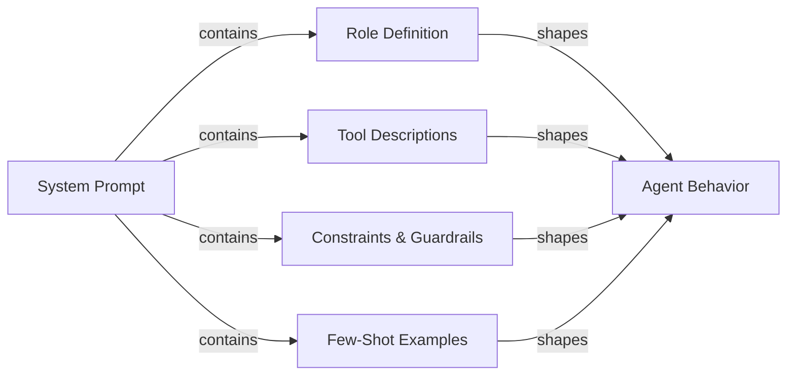

## Definição

A engenharia de prompt para agentes é a arte de escrever system prompts e definições de ferramentas que produzem de forma confiável o comportamento desejado de um agente de IA. Ao contrário da engenharia de prompt para um chatbot de turno único — onde você se preocupa principalmente com formato e tom — os prompts de agentes devem governar raciocínio de múltiplos passos, disciplina na seleção de ferramentas, adesão a restrições, recuperação de erros e condições de encerramento ao longo de uma sequência ilimitada de etapas. Um prompt de agente mal escrito produz agentes que entram em loop infinito, chamam ferramentas com argumentos errados, ignoram restrições do usuário ou inventam resultados quando as ferramentas falham.

O system prompt é a constituição do agente. Ele define o que o agente é, o que pode fazer, o que nunca deve fazer, como deve raciocinar e como deve ser sua saída. Como os LLMs são altamente sensíveis à formulação, estrutura e ordenação, pequenas mudanças no system prompt podem ter grandes efeitos comportamentais. A engenharia de prompt para agentes é, portanto, uma disciplina iterativa e empírica: você escreve um prompt, avalia em relação a um conjunto de dados de tarefas, identifica modos de falha e refina. Ferramentas como LangSmith e DeepEval (veja [avaliação](/docs/agents/evaluation)) tornam esse ciclo de feedback mais rápido.

Bons prompts de agentes são modulares e explícitos. Eles separam definição de papel, declaração de capacidades, especificação de restrições, regras de formato de saída e exemplos few-shot em seções claramente delimitadas. Essa estrutura torna os prompts mais fáceis de manter, auditar e estender à medida que as capacidades do agente evoluem. Ela também ajuda o LLM a ativar o "modo" certo para cada seção em vez de misturar preocupações.

## Como funciona



### Definição de papel

A definição de papel informa ao agente quem ele é, qual é seu propósito principal e qual persona adotar. Uma boa definição de papel é específica: "Você é um engenheiro de software sênior especializado em Python e PostgreSQL, ajudando desenvolvedores a depurar problemas de produção" é mais útil do que "Você é um assistente prestativo." A especificidade ativa conhecimento relevante e define o tom de resposta apropriado. O papel também deve estabelecer a relação do agente com o usuário (par, assistente, especialista), o que influencia como o agente lida com incerteza e discordância. Mantenha a definição de papel concisa (3-5 frases) e coloque-a primeiro no system prompt para que enquadre todas as instruções subsequentes.

### Descrições de ferramentas e seleção de ferramentas

Cada ferramenta que o agente tem acesso deve ser descrita com precisão. O nome da ferramenta, descrição, nomes de parâmetros, tipos de parâmetros e formato de retorno devem ser todos especificados. Descrições de ferramentas ambíguas são uma das causas mais comuns de seleção incorreta de ferramentas e argumentos malformados. Inclua: o que a ferramenta faz, quando usá-la (e criticamente, quando não usá-la), quais entradas ela espera e qual formato de saída esperar. Para ferramentas com propósitos similares, adicione desambiguação explícita: "Use `search_web` para eventos atuais e notícias; use `search_documents` para consultas à base de conhecimento interno da empresa." Exemplos few-shot de invocações corretas de ferramentas (dentro do system prompt ou como histórico de conversa) reduzem significativamente erros de seleção de ferramentas.

### Chain-of-thought para agentes

O prompting com cadeia de pensamento (CoT) pede ao agente que raciocine explicitamente antes de agir. Para agentes, isso significa pensar em: o que o usuário está pedindo, que informações eu tenho, que informações eu preciso, qual ferramenta devo chamar a seguir e como espero que o resultado seja. Instruir o agente a raciocinar antes de agir ("Antes de chamar qualquer ferramenta, descreva brevemente seu plano") melhora a precisão em tarefas complexas de múltiplos passos e torna as trilhas mais interpretáveis. Alguns frameworks (ReAct, veja [ReAct](/docs/reasoning-patterns/react)) formalizam isso como ciclos de Pensamento / Ação / Observação. Seja explícito no prompt sobre se o raciocínio deve estar na saída ou apenas no rascunho.

### Restrições e salvaguardas nos prompts

As restrições definem o que o agente não deve fazer. Elas devem ser declaradas positivamente onde possível ("sempre peça confirmação antes de excluir dados") em vez de apenas negativamente ("nunca exclua dados sem perguntar"). Inclua: restrições de escopo (só responda perguntas sobre X), restrições de saída (sempre responda em português, sempre use JSON válido), restrições de comportamento (nunca invente URLs ou caminhos de arquivos) e restrições de segurança (nunca gere conteúdo prejudicial). As salvaguardas nos prompts são uma primeira linha de defesa, não um substituto para controles técnicos (veja [segurança](/docs/agents/security)); elas são mais eficazes quando especificam o comportamento exato esperado em casos limítrofes.

### Especificação do formato de saída

Agentes que produzem saída estruturada (JSON, markdown, chamadas de funções) precisam de instruções explícitas de formato. Especifique o esquema exato, nomes de campos, tipos e campos obrigatórios versus opcionais. Inclua um exemplo válido no prompt. Para agentes que chamam ferramentas, esclareça quando retornar uma resposta final versus continuar a chamar ferramentas, e como é a condição de encerramento. Se o agente interage com sistemas downstream, o formato de saída é um contrato; a ambiguidade aqui se propaga em integrações quebradas.

## Quando usar / Quando NÃO usar

| Use quando | Evite quando |
|---|---|
| O agente está chamando múltiplas ferramentas e a seleção de ferramentas é inconsistente | Tratar o system prompt como uma configuração única a nunca ser revisada |
| O agente entra em loop ou termina prematuramente sem completar a tarefa | Escrever um prompt enorme e sem estrutura ou seções |
| O agente ignora restrições do usuário ou viola políticas de segurança | Depender apenas dos padrões do modelo sem nenhuma especificação de papel ou restrição |
| Integrando um novo LLM e precisando transferir comportamento do modelo anterior | Adicionar novas instruções de forma ad-hoc sem avaliar regressões |
| Construindo um fluxo de trabalho de múltiplos passos com requisitos de formato de saída determinístico | Esperar que o prompt sozinho lide com ameaças de segurança (use também controles técnicos) |

## Comparações

| Elemento do prompt | Propósito | Erros comuns |
|---|---|---|
| Definição de papel | Define persona, expertise e tom | Muito vago ("assistente prestativo") ou muito longo; colocado após outras seções |
| Descrições de ferramentas | Orienta seleção correta de ferramentas e formação de argumentos | Falta orientação de quando/quando-não-usar; sem exemplos de invocação |
| Restrições | Impõe limites de escopo, segurança e formato | Apenas restrições negativas ("nunca faça X") sem especificar a alternativa correta |
| Instrução de cadeia de pensamento | Melhora a precisão do raciocínio em tarefas complexas | Misturar o raciocínio na saída da chamada de ferramenta quando deveria ficar no rascunho |
| Exemplos few-shot | Demonstra comportamento esperado para uso de ferramentas e formato de saída | Exemplos muito simples para representar casos extremos reais |

## Prós e contras

| Prós | Contras |
|---|---|
| Efeito imediato: sem necessidade de fine-tuning ou retreinamento | A sensibilidade ao prompt significa que pequenas mudanças de formulação podem quebrar o comportamento |
| Estrutura modular facilita manutenção e auditoria | Prompts longos consomem tokens em cada chamada, aumentando o custo |
| Exemplos few-shot reduzem significativamente erros de seleção de ferramentas | Instruções podem conflitar; LLMs podem priorizar instruções posteriores |
| Restrições fornecem uma primeira linha de defesa contra uso indevido | Prompts são visíveis para o modelo mas não protegidos criptograficamente |
| Cadeia de pensamento melhora precisão e interpretabilidade das trilhas | Especificar excessivamente o comportamento pode tornar o agente frágil em casos extremos |

## Exemplos de código

```python
# Well-structured agent system prompt with tool definitions
# pip install anthropic

import os
import json
import anthropic

# ---------------------------------------------------------------------------
# Tool definitions with precise descriptions
# ---------------------------------------------------------------------------

TOOLS = [
    {
        "name": "search_documents",
        "description": (
            "Search the internal company knowledge base for documents, policies, and procedures. "
            "Use this tool when the user asks about internal processes, company policies, or "
            "historical project information. Do NOT use this for current news or external information."
        ),
        "input_schema": {
            "type": "object",
            "properties": {
                "query": {
                    "type": "string",
                    "description": "The search query. Use specific keywords; avoid vague terms.",
                },
                "max_results": {
                    "type": "integer",
                    "description": "Maximum number of results to return. Default 5. Max 20.",
                    "default": 5,
                },
            },
            "required": ["query"],
        },
    },
    {
        "name": "create_ticket",
        "description": (
            "Create a support ticket in the project management system. "
            "Use this ONLY after confirming the details with the user. "
            "Never call this tool without explicit user confirmation of the ticket content."
        ),
        "input_schema": {
            "type": "object",
            "properties": {
                "title": {
                    "type": "string",
                    "description": "Short, descriptive title (under 80 characters).",
                },
                "description": {
                    "type": "string",
                    "description": "Full description of the issue or request.",
                },
                "priority": {
                    "type": "string",
                    "enum": ["low", "medium", "high", "critical"],
                    "description": "Ticket priority. Ask the user if unclear.",
                },
                "assignee": {
                    "type": "string",
                    "description": "Email address of the assignee. Optional.",
                },
            },
            "required": ["title", "description", "priority"],
        },
    },
]

# ---------------------------------------------------------------------------
# System prompt with all sections
# ---------------------------------------------------------------------------

SYSTEM_PROMPT = """
## Role
You are a senior IT support specialist for Acme Corp, helping internal employees resolve
technical issues and navigate company processes. You are thorough, patient, and always
confirm destructive actions before proceeding. You do not have access to external systems
or the public internet.

## Capabilities
You have access to two tools:
- `search_documents`: Search the internal knowledge base. Use this to find policies,
  procedures, troubleshooting guides, and historical decisions.
- `create_ticket`: Create a support ticket. ALWAYS confirm ticket details with the user
  before calling this tool.

## Reasoning approach
Before calling any tool, briefly state your plan in one sentence (e.g., "I'll search for
the VPN setup guide first."). After receiving tool results, summarize what you found and
what you'll do next. If a tool returns no results, say so and ask the user for more
details rather than guessing.

## Constraints
- Only answer questions about Acme Corp's internal systems and processes.
- If asked about external topics (competitor products, news, general knowledge),
  politely decline and redirect to your area of expertise.
- Never make up document names, ticket IDs, or employee contact information.
- If you do not know the answer and cannot find it in the knowledge base, say so clearly.
- Never create a ticket without explicit user confirmation of the title, description,
  and priority.
- Always respond in clear, professional English, regardless of the user's language.

## Output format
- For search results: summarize the key points in 2-4 bullet points, then offer to help
  with a follow-up action.
- For ticket creation: confirm the ticket details in a structured block before calling
  the tool, wait for user approval, then report the created ticket ID.
- Keep responses concise: under 300 words unless the user asks for more detail.

## Examples of correct tool use

Example 1 — searching the knowledge base:
User: "How do I request VPN access?"
Plan: I'll search the knowledge base for VPN access request procedures.
[call search_documents with query="VPN access request procedure"]
Response: summarize results in bullet points.

Example 2 — creating a ticket with confirmation:
User: "Can you create a ticket to fix my broken monitor?"
Response: "I'll create a ticket with these details — please confirm:
- Title: Broken monitor replacement request
- Description: User's monitor is not functioning; replacement needed.
- Priority: medium
Shall I proceed?"
[wait for user confirmation before calling create_ticket]
"""

# ---------------------------------------------------------------------------
# Simulated tool implementations
# ---------------------------------------------------------------------------

def search_documents(query: str, max_results: int = 5) -> list[dict]:
    """Simulated knowledge base search."""
    # In production, this calls a vector database or search API
    return [
        {
            "title": "VPN Access Request Process",
            "summary": "Submit an IT request form via the portal. Approval takes 1-2 business days.",
            "url": "internal://kb/vpn-access",
        }
    ][:max_results]


def create_ticket(title: str, description: str, priority: str, assignee: str = "") -> dict:
    """Simulated ticket creation."""
    return {
        "ticket_id": "TICK-4821",
        "title": title,
        "priority": priority,
        "status": "open",
        "assignee": assignee or "unassigned",
    }


def dispatch_tool(tool_name: str, tool_input: dict) -> str:
    """Route tool calls to their implementations."""
    if tool_name == "search_documents":
        results = search_documents(**tool_input)
        return json.dumps(results, indent=2)
    elif tool_name == "create_ticket":
        result = create_ticket(**tool_input)
        return json.dumps(result, indent=2)
    else:
        return json.dumps({"error": f"Unknown tool: {tool_name}"})


# ---------------------------------------------------------------------------
# Agent loop
# ---------------------------------------------------------------------------

def run_support_agent(user_message: str) -> str:
    """Run the support agent with the structured system prompt."""
    client = anthropic.Anthropic(api_key=os.environ["ANTHROPIC_API_KEY"])
    messages = [{"role": "user", "content": user_message}]

    while True:
        response = client.messages.create(
            model="claude-opus-4-5",
            max_tokens=1024,
            system=SYSTEM_PROMPT,
            tools=TOOLS,
            messages=messages,
        )

        # Append assistant response to conversation history
        messages.append({"role": "assistant", "content": response.content})

        if response.stop_reason == "end_turn":
            # Extract text response
            for block in response.content:
                if hasattr(block, "text"):
                    return block.text
            return ""

        elif response.stop_reason == "tool_use":
            # Process all tool calls in this response
            tool_results = []
            for block in response.content:
                if block.type == "tool_use":
                    print(f"  [Tool call] {block.name}({json.dumps(block.input)})")
                    result = dispatch_tool(block.name, block.input)
                    tool_results.append({
                        "type": "tool_result",
                        "tool_use_id": block.id,
                        "content": result,
                    })

            messages.append({"role": "user", "content": tool_results})

        else:
            # Unexpected stop reason
            return f"Agent stopped unexpectedly: {response.stop_reason}"


# ---------------------------------------------------------------------------
# Example run
# ---------------------------------------------------------------------------
if __name__ == "__main__":
    queries = [
        "How do I request VPN access for a new employee?",
        "What's the weather like in São Paulo today?",  # Out of scope — should be declined
    ]
    for query in queries:
        print(f"\nUser: {query}")
        answer = run_support_agent(query)
        print(f"Agent: {answer}")
```

## Recursos práticos

- [Anthropic - Visão geral de engenharia de prompt](https://docs.anthropic.com/en/docs/build-with-claude/prompt-engineering/overview) — Orientação oficial da Anthropic sobre estrutura de system prompt, definição de papel e cadeia de pensamento para modelos Claude.
- [Anthropic - Documentação de uso de ferramentas](https://docs.anthropic.com/en/docs/build-with-claude/tool-use) — Referência completa para escrever definições de ferramentas, lidar com chamadas de ferramentas e estruturar conversas de uso de ferramentas com Claude.
- [OpenAI - Guia de engenharia de prompt](https://platform.openai.com/docs/guides/prompt-engineering) — Técnicas fundamentais para prompting estruturado, incluindo exemplos few-shot, instruções explícitas de formato e especificação de restrições.
- [ReAct: Synergizing Reasoning and Acting in Language Models](https://arxiv.org/abs/2210.03629) — Artigo original descrevendo o padrão de prompting Pensamento/Ação/Observação fundamental para a maioria dos frameworks de agentes.

## Fontes

- [ReAct: Synergizing Reasoning and Acting in Language Models (Yao et al., 2022)](https://arxiv.org/abs/2210.03629) — Estabelece o padrão de prompting pensamento–ação–observação usado em system prompts de agentes.
- [Chain-of-Thought Prompting Elicits Reasoning in Large Language Models (Wei et al., 2022)](https://arxiv.org/abs/2201.11903) — Trabalho fundamental sobre raciocínio passo a passo em prompts de agentes.
- [Anthropic Prompt Engineering overview](https://docs.anthropic.com/en/docs/build-with-claude/prompt-engineering/overview) — Guia oficial para estrutura de system prompt, definição de papel e prompting de uso de ferramentas para Claude.
- [Prompt Engineering Guide (DAIR.AI)](https://www.promptingguide.ai/) — Referência da comunidade para técnicas em modelos e frameworks de agentes.

## Veja também

- [Agentes](/docs/agents)
- [Engenharia de prompt](/docs/prompt-engineering)
- [Ferramentas e ações de agentes](/docs/agents/tools-actions)
- [Anthropic Tool Use](/docs/agents/anthropic-tool-use)
