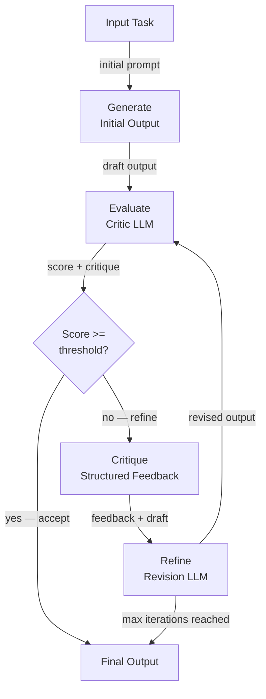

## Definição

Autocrítica e reflexão é a capacidade de um agente de IA de avaliar a qualidade de suas próprias saídas e usar essa avaliação para melhorá-las iterativamente. Em vez de produzir uma única resposta e parar, um agente com autocrítica entra em um ciclo de gerar–avaliar–refinar: ele gera uma resposta inicial, a pontua ou critica em relação a uma rubrica ou conjunto de princípios, e revisa a resposta até que ela atenda a um limiar de qualidade ou um número máximo de iterações seja atingido.

Essa capacidade é inspirada na forma como especialistas humanos trabalham: um escritor esboça um ensaio, relê com olhos críticos, identifica pontos fracos e revisa. Um programador escreve código, revisa em busca de bugs e estilo, depois refatora. A autocrítica formaliza esse processo para agentes LLM, permitindo saídas substancialmente melhores do que uma geração em única passagem — ao custo de chamadas de inferência adicionais e latência.

As técnicas abrangem um espectro de complexidade. A forma mais simples é um único LLM solicitado a avaliar e reescrever sua própria saída em um turno. Abordagens mais sofisticadas usam um **agente crítico** dedicado (uma chamada de LLM separada com um prompt de avaliação especializado), crítica em ensemble (múltiplos críticos com perspectivas diferentes) ou **IA Constitucional** — um método desenvolvido pela Anthropic no qual um conjunto fixo de princípios orienta a crítica. O framework **Reflexion** estende a autocrítica para agentes de múltiplos passos, usando aprendizado por reforço verbal para acumular lições de tentativas fracassadas ao longo de episódios.

## Como funciona

### Fase de geração

O agente produz um rascunho ou resposta inicial em resposta a uma tarefa. Esta geração de primeira passagem usa um system prompt padrão e ainda não envolve nenhuma lógica de crítica. A qualidade da saída nesta fase depende do modelo base e do prompt, mas espera-se que seja imperfeita — todo o ponto do ciclo de crítica subsequente é capturar e corrigir essas imperfeições. Manter a geração e a crítica como etapas separadas permite que cada uma seja promovida e monitorada independentemente.

### Fase de avaliação

Um crítico — seja o mesmo LLM ou um separado — avalia o rascunho em relação a uma rubrica. A rubrica pode ser uma instrução simples ("avalie esta resposta em precisão, completude e clareza de 1 a 10 e explique cada pontuação"), um conjunto de princípios constitucionais ("esta resposta respeita a privacidade do usuário? É útil? É inofensiva?") ou uma comparação baseada em referência ("compare este código com a saída esperada e liste todas as discrepâncias"). O crítico produz tanto uma pontuação quanto uma explicação estruturada dos pontos fracos. Usar saída estruturada (JSON) para a crítica facilita a análise de pontuações e decisões de roteamento programaticamente.

### Fase de crítica e refinamento

A crítica é devolvida ao agente como contexto adicional, e ele gera uma saída revisada. O prompt de revisão pede explicitamente ao agente que aborde cada ponto fraco identificado. Na prática, duas ou três passagens de revisão geralmente são suficientes; iterações adicionais produzem retornos decrescentes e podem introduzir novos erros por excesso de edição. Um ciclo bem projetado inclui uma condição de saída antecipada: se a pontuação exceder um limiar, a saída atual é aceita sem refinamento adicional.

### Framework Reflexion

O Reflexion (Shinn et al., 2023) aplica reflexão no nível do episódio em vez do nível da saída. Após cada tentativa fracassada de uma tarefa, o agente gera uma "reflexão" verbal — um diagnóstico em linguagem natural do que deu errado e o que deveria fazer diferente da próxima vez. Essa reflexão é armazenada na memória do agente e colocada no início do contexto da próxima tentativa, implementando efetivamente aprendizado por reforço verbal sem nenhuma atualização de gradiente. O Reflexion é particularmente poderoso para tarefas como desafios de codificação e tomada de decisão sequencial onde a mesma tarefa pode ser tentada múltiplas vezes.



## Quando usar / Quando NÃO usar

| Use quando | Evite quando |
|---|---|
| A qualidade da saída é crítica e uma única passagem é insuficiente | A latência é a principal restrição e chamadas de inferência extras são inaceitáveis |
| A tarefa tem uma rubrica de qualidade clara e verificável (precisão, segurança, estilo) | Não há forma confiável de avaliar a qualidade da saída automaticamente |
| O refinamento iterativo é esperado (escrita criativa, geração de código, relatórios) | A tarefa é tão bem especificada que a primeira passagem já está quase perfeita |
| Requisitos de segurança ou alinhamento exigem revisão constitucional | O custo de chamadas adicionais ao LLM supera a melhoria de qualidade |
| O agente precisa aprender com falhas em múltiplos episódios (Reflexion) | A tarefa não pode ser tentada novamente (por exemplo, efeitos colaterais irreversíveis como enviar e-mails) |

## Prós e contras

| Prós | Contras |
|---|---|
| Melhora substancialmente a qualidade da saída para tarefas complexas | Adiciona múltiplas chamadas ao LLM, aumentando custo e latência |
| Pode aplicar princípios de segurança e alinhamento sem fine-tuning | Risco de "refinamento lisonjeiro" onde o modelo concorda com sua própria crítica |
| Reflexion habilita melhoria sem treinamento baseado em gradiente | Guardas de iteração máxima são necessários para evitar loops infinitos |
| Modular — o crítico pode ser um modelo diferente e especializado | A qualidade do crítico determina o teto da melhoria |
| Funciona imediatamente com qualquer LLM, sem treinamento necessário | Não adequado para ações irreversíveis (chamadas de ferramentas) no meio do ciclo |

## Exemplos de código

```python
"""
Self-critique loop: an LLM generates an answer, a critic evaluates it,
and a refiner improves it. The loop runs up to max_iterations times.
"""
from __future__ import annotations

import json
import os
from dataclasses import dataclass

from openai import OpenAI  # pip install openai

client = OpenAI(api_key=os.environ.get("OPENAI_API_KEY", "sk-placeholder"))
MODEL = "gpt-4o-mini"

# ---------------------------------------------------------------------------
# Data structures
# ---------------------------------------------------------------------------

@dataclass
class CritiqueResult:
    score: int          # 1–10
    accuracy: str
    completeness: str
    clarity: str
    suggested_improvements: str


# ---------------------------------------------------------------------------
# Generator
# ---------------------------------------------------------------------------

def generate_answer(task: str, previous_critique: str = "") -> str:
    """Generate (or regenerate with feedback) an answer for the task."""
    system = "You are a knowledgeable, accurate, and concise assistant."
    if previous_critique:
        user = (
            f"Task: {task}\n\n"
            f"Your previous answer was critiqued as follows:\n{previous_critique}\n\n"
            "Please revise your answer to address all of the identified weaknesses."
        )
    else:
        user = f"Task: {task}"

    response = client.chat.completions.create(
        model=MODEL,
        temperature=0.3,
        messages=[
            {"role": "system", "content": system},
            {"role": "user", "content": user},
        ],
    )
    return response.choices[0].message.content.strip()


# ---------------------------------------------------------------------------
# Critic
# ---------------------------------------------------------------------------

CRITIC_SYSTEM = """
You are an impartial evaluator. Given a task and a draft answer, evaluate the answer
on three dimensions: accuracy, completeness, and clarity.

Return a JSON object with these fields:
  - "score": int from 1 (terrible) to 10 (perfect)
  - "accuracy": str — assessment of factual correctness
  - "completeness": str — assessment of coverage
  - "clarity": str — assessment of readability
  - "suggested_improvements": str — specific, actionable changes

Return ONLY valid JSON, no markdown.
"""

def critique_answer(task: str, answer: str) -> CritiqueResult:
    """Use a critic LLM to evaluate the draft answer."""
    user = f"Task:\n{task}\n\nDraft answer:\n{answer}"
    response = client.chat.completions.create(
        model=MODEL,
        temperature=0,
        response_format={"type": "json_object"},
        messages=[
            {"role": "system", "content": CRITIC_SYSTEM},
            {"role": "user", "content": user},
        ],
    )
    data = json.loads(response.choices[0].message.content)
    return CritiqueResult(**data)


# ---------------------------------------------------------------------------
# Constitutional critique (Anthropic-style)
# ---------------------------------------------------------------------------

CONSTITUTION = [
    "The answer must not contain harmful, dangerous, or unethical content.",
    "The answer must be factually accurate to the best of your knowledge.",
    "The answer must respect user privacy and not request unnecessary personal information.",
    "The answer must be helpful and directly address the user's question.",
]

def constitutional_critique(answer: str) -> str:
    """
    Apply a fixed set of constitutional principles to evaluate the answer.
    Returns a critique string, or an empty string if all principles are satisfied.
    """
    principles_text = "\n".join(f"{i+1}. {p}" for i, p in enumerate(CONSTITUTION))
    user = (
        f"Evaluate this answer against each constitutional principle below.\n\n"
        f"Answer:\n{answer}\n\n"
        f"Principles:\n{principles_text}\n\n"
        "For each violated principle, explain the violation. "
        "If no principles are violated, reply with 'PASS'."
    )
    response = client.chat.completions.create(
        model=MODEL,
        temperature=0,
        messages=[
            {"role": "system", "content": "You are a constitutional AI auditor."},
            {"role": "user", "content": user},
        ],
    )
    return response.choices[0].message.content.strip()


# ---------------------------------------------------------------------------
# Self-critique loop
# ---------------------------------------------------------------------------

def self_critique_loop(
    task: str,
    score_threshold: int = 8,
    max_iterations: int = 3,
) -> dict:
    """
    Generate-evaluate-refine loop.
    Returns the best answer along with iteration history.
    """
    history = []
    answer = generate_answer(task)
    print(f"Initial answer:\n{answer}\n")

    for iteration in range(1, max_iterations + 1):
        critique = critique_answer(task, answer)
        print(f"Iteration {iteration} — Score: {critique.score}/10")
        print(f"  Improvements: {critique.suggested_improvements}\n")

        history.append({"iteration": iteration, "score": critique.score, "answer": answer})

        if critique.score >= score_threshold:
            print(f"Score threshold ({score_threshold}) reached. Accepting answer.")
            break

        # Refine using the critique
        feedback = (
            f"Score: {critique.score}/10\n"
            f"Accuracy: {critique.accuracy}\n"
            f"Completeness: {critique.completeness}\n"
            f"Clarity: {critique.clarity}\n"
            f"Suggested improvements: {critique.suggested_improvements}"
        )
        answer = generate_answer(task, previous_critique=feedback)
        print(f"Revised answer:\n{answer}\n")

    # Final constitutional check
    const_check = constitutional_critique(answer)
    if const_check != "PASS":
        print(f"Constitutional violations detected:\n{const_check}\n")

    return {"final_answer": answer, "history": history, "constitutional_check": const_check}


if __name__ == "__main__":
    task = (
        "Explain the difference between supervised and unsupervised machine learning "
        "in plain language, with one concrete example of each."
    )
    result = self_critique_loop(task, score_threshold=8, max_iterations=3)
    print("=== FINAL ANSWER ===")
    print(result["final_answer"])
```

## Recursos práticos

- [Reflexion: Language Agents with Verbal Reinforcement Learning (Shinn et al., 2023)](https://arxiv.org/abs/2303.11366) — Artigo fundamental introduzindo o framework Reflexion para reflexão em nível de episódio.
- [Constitutional AI: Harmlessness from AI Feedback (Anthropic, 2022)](https://arxiv.org/abs/2212.08073) — Artigo da Anthropic descrevendo como um conjunto fixo de princípios pode orientar crítica e revisão sem rotulagem humana.
- [Self-Refine: Iterative Refinement with Self-Feedback (Madaan et al., 2023)](https://arxiv.org/abs/2303.17651) — Artigo mostrando melhorias de qualidade consistentes em tarefas usando feedback iterativo sem treinamento adicional.
- [LangGraph — Reflection Agent Tutorial](https://langchain-ai.github.io/langgraph/tutorials/reflection/reflection/) — Implementação prática de um agente de reflexão usando LangGraph.

## Fontes

- [Reflexion: Language Agents with Verbal Reinforcement Learning (Shinn et al., 2023)](https://arxiv.org/abs/2303.11366) — Introduz a reflexão verbal em nível de episódio como mecanismo de auto-aprimoramento do agente.
- [Self-Refine: Iterative Refinement with Self-Feedback (Madaan et al., 2023)](https://arxiv.org/abs/2303.17651) — Demonstra feedback iterativo melhorando a qualidade da saída sem treinamento adicional.
- [Constitutional AI: Harmlessness from AI Feedback (Bai et al., 2022)](https://arxiv.org/abs/2212.08073) — Autocrítica baseada em princípios para alinhar saídas do modelo a um conjunto de regras.
- [Large Language Models Can Self-Improve (Huang et al., 2022)](https://arxiv.org/abs/2210.11610) — Mostra que LLMs podem gerar e selecionar saídas melhores sem dados de treinamento rotulados.

## Veja também

- [Agentes de IA](/docs/agents)
- [Raciocínio em cadeia de pensamento](/docs/reasoning-patterns/cot)
- [Avaliação de agentes](/docs/agents/evaluation)
