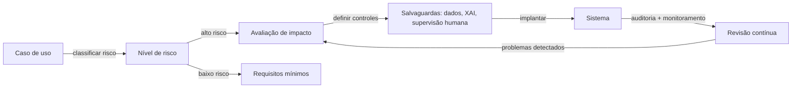

# Ética em IA

## Definição

A ética em IA é o campo que trata dos princípios morais, estruturas de governança e padrões práticos que orientam como os sistemas de IA são projetados, implantados e supervisionados. Os princípios fundamentais incluem equidade (evitar discriminação), transparência (tornar os sistemas compreensíveis para os afetados), responsabilidade (atribuir responsabilidade clara pelos resultados) e privacidade (respeitar os direitos de dados dos indivíduos). Esses princípios são operacionalizados por meio de códigos de conduta, avaliações de impacto, processos de auditoria e, cada vez mais, por regulamentação vinculante.

A IA ética não é apenas sobre prevenir danos — também se trata de promover ativamente resultados benéficos para diversas partes interessadas. Isso inclui garantir que os benefícios da IA sejam distribuídos equitativamente, que as comunidades afetadas tenham recursos significativos quando algo der errado, e que o desenvolvimento da IA não concentre poder de maneiras que minem as instituições democráticas ou a autonomia individual. A ética fornece o quadro normativo dentro do qual o trabalho técnico de segurança e equidade opera.

Na prática, a ética em IA se conecta diretamente à [segurança em IA](/docs/ai-safety) em riscos e alinhamento, ao [viés em IA](/docs/bias-in-ai) em resultados de equidade, e à [IA explicável](/docs/xai) em requisitos de transparência. A regulamentação está operacionalizando rapidamente a ética em lei: a Lei de IA da UE introduz classificação de risco em camadas, obrigações de transparência obrigatórias e práticas proibidas, tornando as avaliações de ética e impacto legalmente exigidas para aplicações de alto risco. As organizações agora devem traduzir princípios abstratos em decisões de design concretas, [práticas de avaliação](/docs/evaluation-metrics) e controles de implantação.

## Como funciona

### Tradução de princípio para prática

Os princípios éticos tornam-se acionáveis por meio de processos estruturados. Uma avaliação de impacto identifica quem é afetado por um sistema, o que poderia dar errado, quão grave seria o dano e quais mitigações estão disponíveis. Comitês de ética (internos ou externos) avaliam sistemas propostos em relação a padrões organizacionais e regulatórios antes da implantação.

### Conformidade regulatória



### Estruturas de governança

As organizações implementam governança por meio de políticas de IA responsável, cartões de modelo, fichas de dados para conjuntos de dados e documentação de decisões de design e cadeias de responsabilidade. Mecanismos de human-in-the-loop preservam supervisão significativa para decisões consequentes. O envolvimento das partes interessadas garante que as comunidades afetadas tenham voz nos sistemas que as afetam.

## Quando usar / Quando NÃO usar

| Usar quando | Evitar quando |
|-------------|--------------|
| Projetando ou implantando IA em domínios regulados ou de alto risco (saúde, contratação, crédito) | O sistema não toma decisões consequentes e não afeta pessoas diretamente |
| Conformidade regulatória é necessária (Lei de IA da UE, LGPD, regras setoriais) | O aplicativo é um protótipo de pesquisa puro sem caminho para implantação |
| Lançando um produto ou serviço de IA voltado ao público | Todas as saídas são revisadas por pessoas qualificadas antes que qualquer ação seja tomada |
| Gerenciando ferramentas de IA de terceiros que afetam clientes ou funcionários | A ferramenta é puramente interna e os resultados são totalmente reversíveis |

## Comparações

| Conceito | Escopo | Resultado principal |
|----------|--------|---------------------|
| Ética em IA | Princípios, governança, valores | Políticas, avaliações de impacto, estruturas de responsabilidade |
| Segurança em IA | Alinhamento técnico e risco | Técnicas de robustez, salvaguardas, sistemas de monitoramento |
| Viés em IA | Equidade entre grupos | Auditorias de equidade, métodos de redução de viés, relatórios de métricas |
| IA explicável | Interpretabilidade | Explicações, atribuição de características, ferramentas de auditoria |

## Prós e contras

| Prós | Contras |
|------|---------|
| Reduz risco legal e reputacional | Revisões éticas podem retardar ciclos de desenvolvimento |
| Constrói confiança de usuários e do público | Princípios são frequentemente vagos e difíceis de operacionalizar |
| Cria responsabilidade e trilhas de auditoria | Métricas de equidade podem entrar em conflito entre si e com a precisão |
| Incentiva a prevenção proativa de danos | A fragmentação regulatória global aumenta a complexidade de conformidade |

## Exemplos de código

### Gerando um cartão de modelo simples (Python)

```python
from dataclasses import dataclass, asdict
import json

@dataclass
class ModelCard:
    model_name: str
    version: str
    intended_use: str
    out_of_scope_use: str
    training_data: str
    evaluation_metrics: list[str]
    known_limitations: str
    ethical_considerations: str
    contact: str

card = ModelCard(
    model_name="loan-approval-classifier",
    version="1.2.0",
    intended_use="Assist loan officers in reviewing consumer loan applications.",
    out_of_scope_use="Fully automated loan decisions without human review.",
    training_data="Internal loan data 2015-2023; balanced by income bracket and region.",
    evaluation_metrics=["accuracy", "F1", "demographic_parity", "equalized_odds"],
    known_limitations="Underperforms for applicants with non-traditional credit histories.",
    ethical_considerations="Reviewed by ethics board Q1 2024. Fairness audited across gender and race.",
    contact="ai-governance@example.com",
)

print(json.dumps(asdict(card), indent=2))
```

## Recursos práticos

- [Lei de IA da UE](https://digital-strategy.ec.europa.eu/en/policies/regulatory-framework-artificial-intelligence) — Estrutura regulatória da UE com níveis de risco e requisitos de conformidade
- [OCDE – Princípios de IA](https://oecd.ai/en/ai-principles) — Princípios internacionais sobre IA confiável
- [Google – Práticas de IA responsável](https://ai.google/responsibility/responsible-ai-practices/) — Orientação prática para aplicar ética no desenvolvimento de IA
- [Model Cards for Model Reporting (Mitchell et al.)](https://arxiv.org/abs/1810.03993) — Artigo fundador sobre documentação de transparência
- [AI Now Institute](https://ainowinstitute.org/) — Pesquisa sobre implicações sociais da IA

## Veja também

- [Segurança em IA](/docs/ai-safety)
- [Viés em IA](/docs/bias-in-ai)
- [IA explicável](/docs/xai)
