## Definição

Métodos de alinhamento são técnicas de treinamento que direcionam o comportamento de um modelo de linguagem para corresponder a valores humanos, intenções e requisitos de segurança após o pré-treinamento inicial. O pré-treinamento em texto bruto da internet produz modelos que imitam bem a distribuição dos dados, mas podem gerar conteúdo prejudicial, falso ou inútil. O alinhamento é o processo de moldar o comportamento do modelo via sinais de treinamento adicionais derivados de preferências humanas ou princípios explícitos.

As principais abordagens até 2025-2026:

- **RLHF (Aprendizado por Reforço com Feedback Humano)** — humanos classificam saídas do modelo; um modelo de recompensa é treinado nessas classificações; o LLM é ajustado via RL (geralmente PPO) para maximizar o modelo de recompensa. Usado para alinhar GPT-4, Claude 1-2, Gemini e Llama 2-Chat.
- **Constitutional AI (CAI)** — introduzido pela Anthropic; o modelo critica e revisa suas próprias saídas com base em um conjunto de princípios escritos (uma "constituição"), gerando dados de preferência sem anotadores humanos para a dimensão de inocuidade. Usado no Claude 3+.
- **Direct Preference Optimization (DPO)** — reformula o RLHF como um objetivo de classificação sem requerer RL explícito. Dado um dataset de preferências de triplas (prompt, escolhido, rejeitado), o DPO atualiza diretamente o LLM para preferir respostas escolhidas sobre as rejeitadas. Mais simples de implementar e frequentemente iguala ou supera a qualidade do RLHF.
- **Supervisão escalável** — técnicas projetadas para alinhar modelos mesmo quando avaliadores humanos não conseguem julgar de forma confiável as saídas do modelo no nível de capacidade (por exemplo, debate, modelagem de recompensa recursiva, generalização fraco-para-forte).

## Como funciona

### Pipeline RLHF

```mermaid
flowchart LR
  PT[LLM pré-treinado] -->|ajuste fino supervisionado em demonstrações| SFT[Modelo SFT]
  SFT -->|amostrar saídas para prompts| Pairs[Pares de saídas]
  Pairs -->|rotulagem de preferência humana| Prefs[Dataset de preferências]
  Prefs -->|treinar modelo de recompensa| RM[Modelo de recompensa]
  RM -->|sinal de recompensa| PPO[Ajuste fino PPO]
  SFT --> PPO
  PPO -->|modelo alinhado| RLHF[Modelo RLHF]
```

1. **SFT** — ajuste fino em demonstrações escritas por humanos de alta qualidade.
2. **Modelo de recompensa** — treinar um classificador que pontua saídas pela preferência humana prevista.
3. **PPO** — usar RL para atualizar o LLM de política para maximizar a pontuação do modelo de recompensa, com uma penalidade KL em relação ao modelo SFT para prevenir reward hacking.

### Constitutional AI

O CAI substitui anotadores humanos de inocuidade por auto-crítica do modelo. Um modelo "vermelho" amostra respostas potencialmente prejudiciais; um modelo "crítico" as revisa iterativamente de acordo com a constituição (por exemplo, "Esta resposta respeita a autonomia do usuário? Revise caso contrário"). As respostas revisadas resultantes formam um dataset de preferências para DPO ou RLHF.

### Objetivo de treinamento DPO

Dado um dataset de preferências D = \{(x, y_w, y_l)\}, o DPO otimiza:

`L_DPO = -E[log σ(β log π_θ(y_w|x)/π_ref(y_w|x) - β log π_θ(y_l|x)/π_ref(y_l|x))]`

onde π_ref é a política de referência SFT e β controla a divergência KL da referência. Nenhum modelo de recompensa separado ou loop de RL é necessário.

## Quando usar / Quando NÃO usar

| Cenário | Abordagem recomendada | Observações |
|---|---|---|
| Alinhamento de chat de propósito geral (utilidade + segurança) | RLHF ou DPO em dados de preferência humana | DPO é mais simples de implementar |
| Alinhamento de inocuidade em grande escala sem anotadores humanos | Constitutional AI | Reduz custo de anotação |
| Alinhamento em preferências específicas de domínio (médico, jurídico) | DPO em pares de preferência de domínio | Iteração mais rápida que RLHF |
| Alinhar modelos que superam a capacidade humana de julgamento | Supervisão escalável (debate, RRM) | Área de pesquisa ativa, ainda não padrão de produção |
| Equipes pequenas, computação limitada | DPO com biblioteca TRL — sem infraestrutura RL | PPO RLHF requer mais engenharia |

## Fontes

- [RLHF — Treinando modelos de linguagem para seguir instruções com feedback humano (InstructGPT, OpenAI, 2022)](https://arxiv.org/abs/2203.02155)
- [Constitutional AI — Inocuidade a partir de feedback de IA (Anthropic, 2022)](https://arxiv.org/abs/2212.08073)
- [Direct Preference Optimization (DPO — Rafailov et al., 2023)](https://arxiv.org/abs/2305.18290)
- [Supervisão escalável — Supervisionando aprendizes fortes (Irving et al., 2018)](https://arxiv.org/abs/1805.00899)
- [Generalização fraco-para-forte (OpenAI, 2023)](https://arxiv.org/abs/2312.09390)

## Veja também

- [Segurança em IA](/docs/ai-safety)
- [Red teaming](/docs/ai-safety/red-teaming)
- [Interpretabilidade](/docs/ai-safety/interpretability)
- [RLHF](/docs/rl/rlhf)
- [LLMs](/docs/llms)
