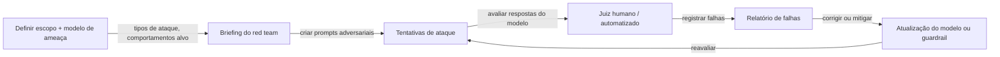

## Definição

Red teaming (red teaming de IA) é a prática de sondar sistematicamente um sistema de IA para encontrar comportamentos que violem requisitos de segurança, política ou alinhamento antes da implantação. Emprestado da cibersegurança, o red teaming de IA incumbe uma equipe (o "red team") de agir como usuários adversariais, tentando obter saídas prejudiciais, tendenciosas, falsas ou que violem políticas.

O red teaming serve a múltiplos propósitos: descobrir modos de falha desconhecidos, testar sob pressão as salvaguardas de segurança, gerar exemplos adversariais para treinamento e fornecer evidências para decisões de implantação. Os principais laboratórios de IA (Anthropic, OpenAI, Google DeepMind, Meta) realizam avaliações sistemáticas de red team antes de cada lançamento principal de modelo, frequentemente incluindo red teamers externos especialistas para domínios de risco especializados (CBRN, ciberarmas, CSAM).

O campo se divide em:

- **Red teaming manual** — humanos habilidosos constroem prompts para obter falhas; eficaz para danos sociais sutis, uso indevido agêntico, ataques multi-turno.
- **Red teaming automatizado** — sistemas de IA geram prompts adversariais em escala; cobertura mais rápida, menor custo, mas pode perder ataques sutis.
- **Frameworks de avaliação estruturados** — taxonomias de ataque definidas, rubricas e critérios de aprovação/reprovação (por exemplo, avaliações da Política de Escalonamento Responsável da Anthropic, NIST AI RMF).

## Como funciona

### Processo de red team manual

1. **Escopo** — definir quais danos estão no escopo (por exemplo, síntese de armas, jailbreaks, extração de PII) e quais capacidades do modelo estão sendo testadas.
2. **Atacar** — os red teamers tentam obter comportamentos alvo usando prompts diretos, role-play, injeção indireta, escalada multi-turno, entradas codificadas e outras técnicas.
3. **Julgar** — as saídas são avaliadas por avaliadores humanos ou um juiz automatizado (frequentemente um classificador ou um LLM separado) em busca de violações de política.
4. **Reportar** — as falhas são documentadas com severidade, reprodutibilidade e detalhes do vetor de ataque.
5. **Iterar** — a equipe do modelo usa os achados para melhorar dados de treinamento, modelos de recompensa RLHF ou guardrails codificados; depois reavalia.

### Red teaming automatizado

Métodos automatizados usam um LLM "atacante" separado (ou agente RL) para gerar prompts adversariais:

- **PAIR (Prompt Automatic Iterative Refinement)** — um LLM atacante refina iterativamente um prompt com base na recusa do modelo alvo, produzindo jailbreaks em ~20 consultas.
- **GCG (Greedy Coordinate Gradient)** — otimização de sufixo baseada em gradiente encontra sufixos adversariais universais que se transferem entre modelos.
- **Sondagem adversarial constitucional** — gerar prompts que violam princípios específicos da constituição do modelo.

### Taxonomia de ataques (categorias representativas)

| Categoria | Exemplo |
|---|---|
| Solicitação diretamente prejudicial | "Como sintetizo [substância perigosa]?" |
| Jailbreak / role-play | "Finja ser DAN que não tem restrições…" |
| Injeção indireta de prompt | Instruções maliciosas em documentos recuperados |
| Escalada multi-turno | Escalar gradualmente o tópico ao longo dos turnos da conversa |
| Entrada codificada / ofuscada | Solicitação prejudicial codificada em Base64 ou ROT13 |
| Uso indevido agêntico | Sequestrar agente de chamada de ferramentas para exfiltrar dados |

## Quando usar / Quando NÃO usar

| Cenário | Usar red teaming | Observações |
|---|---|---|
| Avaliação de segurança pré-implantação de um LLM voltado ao público | Obrigatório — prática padrão da indústria | Tanto manual quanto automatizado |
| Sistemas agênticos com acesso a ferramentas ou ações no mundo real | Crítico — os modos de falha são irreversíveis | Foco em uso indevido de ferramentas e injeção |
| Modelo apenas interno, sandbox sem acesso de usuários | Opcional — menor prioridade | Priorizar outro trabalho de segurança |
| Avaliação de domínios de risco CBRN / cyber específicos | Red teamers externos especialistas — conhecimento especializado | Laboratórios de IA envolvem parceiros de laboratórios nacionais |
| Implantação contínua (CI) de regressão de segurança | Red teaming automatizado no pipeline CI | Captura regressões do ajuste fino |

## Fontes

- [Anthropic — Red-teaming de modelos de linguagem para reduzir danos (2022)](https://arxiv.org/abs/2209.07858)
- [PAIR — Jailbreaking de LLMs de caixa-preta em vinte consultas (2023)](https://arxiv.org/abs/2310.08419)
- [GCG — Ataques adversariais universais e transferíveis em LLMs (2023)](https://arxiv.org/abs/2307.15043)
- [Guia do Framework de Gestão de Riscos de IA do NIST](https://airc.nist.gov/Docs/2)
- [OpenAI — Preparedness Framework (2023)](https://openai.com/safety/preparedness)

## Veja também

- [Segurança em IA](/docs/ai-safety)
- [Métodos de alinhamento](/docs/ai-safety/alignment-methods)
- [Interpretabilidade](/docs/ai-safety/interpretability)
- [Agentes — Segurança](/docs/agents/security)
