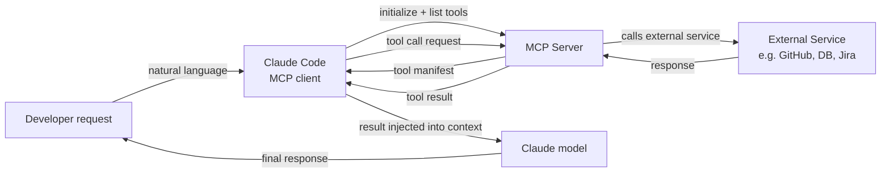

## Definição

O Model Context Protocol (MCP) é um padrão aberto desenvolvido pela Anthropic que define como modelos de IA se comunicam com fontes de dados e ferramentas externas. No contexto do Claude Code, servidores MCP são plugins que estendem o conjunto de ferramentas disponíveis para o Claude além de suas capacidades integradas (acesso ao sistema de arquivos, comandos shell, git). Com MCP, o Claude pode consultar bancos de dados, chamar APIs externas, navegar na web, ler tickets do Jira, consultar dashboards do Grafana, interagir com o GitHub e fazer qualquer outra coisa que um servidor MCP implemente — tudo através da mesma interface de linguagem natural que as ferramentas integradas.

O MCP segue uma arquitetura cliente-servidor. O Claude Code atua como **cliente MCP**: ele descobre servidores MCP disponíveis na configuração, conecta-se a eles no início da sessão e os consulta para obter a lista de ferramentas que expõem. Cada servidor MCP expõe um conjunto de **ferramentas** (funções com definições de entrada JSON Schema, idênticas em estrutura às ferramentas integradas), **recursos** opcionais (fontes de dados somente leitura como documentação ou esquemas de banco de dados) e **prompts** opcionais (modelos de prompt reutilizáveis). Quando o Claude decide chamar uma ferramenta MCP, o Claude Code roteia a chamada para o servidor apropriado, executa a operação e retorna o resultado ao modelo como resultado de ferramenta.

O benefício fundamental do MCP sobre integrações de ferramentas ad-hoc é a padronização. Antes do MCP, cada assistente de IA tinha seu próprio formato de plugin proprietário. O MCP define um protocolo universal para que um servidor MCP escrito uma vez possa funcionar com qualquer cliente compatível com MCP — Claude Code, Claude Desktop ou qualquer outro cliente MCP. Isso significa que o ecossistema de integrações disponíveis está crescendo rapidamente, e construir uma nova integração não requer entender os internos específicos do Claude.

## Como funciona

### Tipos de servidores MCP e transportes

Servidores MCP vêm em duas variedades de transporte. **Servidores stdio** executam como subprocessos locais: o Claude Code inicia o processo do servidor no início da sessão e se comunica via stdin/stdout usando JSON-RPC. Servidores stdio são o tipo mais comum para ferramentas locais (clientes de banco de dados, processadores de arquivos, análise de código especializada). **Servidores SSE (Server-Sent Events)** executam como servidores HTTP persistentes e se comunicam via conexão de rede. Servidores SSE são melhores para serviços remotos, infraestrutura de equipe compartilhada ou servidores que precisam manter estado entre múltiplas conexões de clientes.

### Configuração e descoberta

Servidores MCP são configurados no arquivo de configuração do Claude Code, tipicamente em `~/.claude/settings.json` para configuração global ou `.claude/settings.json` para servidores específicos do projeto. Cada entrada de servidor especifica um nome, tipo de transporte e o comando (para stdio) ou URL (para SSE) necessário para iniciar ou conectar. O Claude Code lê essa configuração no início da sessão, inicializa conexões para todos os servidores configurados e busca seus manifestos de ferramentas. As ferramentas de todos os servidores MCP conectados aparecem na lista de ferramentas do modelo junto às ferramentas integradas — da perspectiva do modelo, não há diferença.

### Fluxo de invocação de ferramentas

Quando o Claude decide chamar uma ferramenta MCP, o Claude Code age como intermediário: serializa os argumentos da chamada de ferramenta para JSON, envia uma requisição `tools/call` ao servidor MCP pelo transporte configurado, aguarda a resposta, desserializa o resultado e o retorna ao modelo como um bloco `tool_result`. Todo o ciclo de ida e volta é transparente para o modelo — ele simplesmente vê um resultado de ferramenta, assim como uma chamada de ferramenta integrada. Servidores MCP podem retornar texto, imagens ou dados estruturados, todos os quais o Claude Code encaminha ao modelo adequadamente.

### Autenticação e segurança

Servidores MCP gerenciam sua própria autenticação. Um servidor MCP do GitHub, por exemplo, lê um token de acesso pessoal do GitHub de uma variável de ambiente configurada no campo `env` da entrada do servidor. O Claude Code passa o ambiente configurado ao subprocesso mas não gerencia segredos por conta própria — é responsabilidade do servidor MCP autenticar com serviços externos. Como servidores MCP executam código com as permissões do usuário local, deve-se ter cuidado ao usar servidores MCP de terceiros: revise o código do servidor ou confie no publicador antes de adicioná-lo à sua configuração.



## Quando usar / Quando NÃO usar

| Usar quando | Evitar quando |
|---|---|
| Você precisa que o Claude interaja com um serviço externo (GitHub, Jira, Slack, bancos de dados) | A tarefa pode ser realizada com ferramentas integradas (sistema de arquivos, shell) — sem necessidade de adicionar complexidade |
| Sua equipe compartilha um conjunto comum de ferramentas e você quer uma camada de integração padronizada | Você está em um ambiente sensível à segurança onde o acesso a ferramentas externas deve ser rigorosamente controlado |
| Você quer dar ao Claude acesso a fontes de dados privadas (APIs internas, bancos de dados proprietários) | Você precisa de uma integração pontual rápida — um script shell chamado via a ferramenta Bash é mais simples |
| Você está construindo uma ferramenta reutilizável que deve funcionar em múltiplos clientes de IA | O servidor MCP que você quer usar é de uma fonte não confiável — revise seu código primeiro |
| Você quer que o Claude tenha acesso em tempo real ao estado do sistema (métricas, logs, rastreamento de erros) | O serviço externo tem limites de taxa que poderiam ser excedidos pelas chamadas autônomas de ferramentas do Claude |

## Exemplos de código

```json
// ~/.claude/settings.json — MCP server configuration
{
  "mcpServers": {
    // GitHub MCP server — gives Claude access to repos, issues, PRs
    "github": {
      "command": "npx",
      "args": ["-y", "@modelcontextprotocol/server-github"],
      "env": {
        "GITHUB_PERSONAL_ACCESS_TOKEN": "${GITHUB_TOKEN}"
      }
    },

    // PostgreSQL MCP server — gives Claude read access to your database schema and query capability
    "postgres": {
      "command": "npx",
      "args": ["-y", "@modelcontextprotocol/server-postgres", "postgresql://localhost/mydb"],
      "env": {
        "PGPASSWORD": "${DB_PASSWORD}"
      }
    },

    // Filesystem MCP server (extended) — gives Claude access to directories beyond the project root
    "filesystem": {
      "command": "npx",
      "args": [
        "-y",
        "@modelcontextprotocol/server-filesystem",
        "/Users/me/projects",
        "/Users/me/documents/specs"
      ]
    },

    // Custom internal MCP server (stdio, local binary)
    "internal-tools": {
      "command": "/usr/local/bin/my-mcp-server",
      "args": ["--config", "/etc/my-mcp/config.json"],
      "env": {
        "INTERNAL_API_KEY": "${INTERNAL_API_KEY}"
      }
    },

    // Remote SSE server — shared team infrastructure
    "team-server": {
      "url": "https://mcp.internal.mycompany.com/sse",
      "headers": {
        "Authorization": "Bearer ${TEAM_MCP_TOKEN}"
      }
    }
  }
}
```

```typescript
// Custom MCP server — TypeScript implementation using the official MCP SDK
// This example creates an MCP server that wraps an internal metrics API

import { McpServer } from "@modelcontextprotocol/sdk/server/mcp.js";
import { StdioServerTransport } from "@modelcontextprotocol/sdk/server/stdio.js";
import { z } from "zod";

// Initialize the MCP server with a name and version
const server = new McpServer({
  name: "metrics-server",
  version: "1.0.0",
});

// Define a tool: get_error_rate
// The description is critical — Claude uses it to decide when to call this tool
server.tool(
  "get_error_rate",
  "Get the error rate for a service over a specified time window. Use this when the user asks about errors, reliability, or service health.",
  {
    // Zod schema — the SDK converts this to JSON Schema automatically
    service: z.string().describe("The service name, e.g. 'api', 'frontend', 'worker'"),
    window: z
      .enum(["1h", "6h", "24h", "7d"])
      .describe("Time window for the metric. Defaults to 1h."),
  },
  async ({ service, window }) => {
    // In production, this would call your metrics API (Prometheus, Datadog, etc.)
    const response = await fetch(
      `https://metrics.internal.mycompany.com/api/error-rate?service=${service}&window=${window}`,
      { headers: { Authorization: `Bearer ${process.env.METRICS_API_KEY}` } }
    );

    if (!response.ok) {
      return {
        content: [{ type: "text", text: `Error fetching metrics: ${response.statusText}` }],
        isError: true,
      };
    }

    const data = await response.json();
    return {
      content: [
        {
          type: "text",
          text: JSON.stringify({
            service,
            window,
            error_rate: data.errorRate,
            total_requests: data.totalRequests,
            error_count: data.errorCount,
            timestamp: new Date().toISOString(),
          }, null, 2),
        },
      ],
    };
  }
);

// Define a tool: list_services
server.tool(
  "list_services",
  "List all services that have metrics available for monitoring.",
  {},
  async () => {
    const response = await fetch("https://metrics.internal.mycompany.com/api/services", {
      headers: { Authorization: `Bearer ${process.env.METRICS_API_KEY}` },
    });
    const services = await response.json();
    return {
      content: [{ type: "text", text: JSON.stringify(services, null, 2) }],
    };
  }
);

// Start the server with stdio transport (for local subprocess use)
const transport = new StdioServerTransport();
await server.connect(transport);
```

```bash
# Install the MCP SDK for building custom servers
npm install @modelcontextprotocol/sdk zod

# Compile and run the custom server locally for testing
npx ts-node metrics-server.ts

# Add the custom server to your Claude Code configuration
cat >> ~/.claude/settings.json << 'EOF'
# (add to the mcpServers object in your existing settings.json)
"metrics": {
  "command": "node",
  "args": ["/path/to/metrics-server.js"],
  "env": {
    "METRICS_API_KEY": "your-api-key-here"
  }
}
EOF

# Inside a Claude Code session, use the MCP tools naturally:
claude
> What is the current error rate for the api service?
> List all services and show me the error rates for any that exceed 1% in the last hour
> Compare error rates across all services for the past 24 hours
```

## Recursos práticos

- [Documentação MCP — Anthropic](https://docs.anthropic.com/en/docs/mcp) — Especificação oficial do MCP, visão geral do protocolo e arquitetura cliente/servidor.
- [SDK TypeScript do MCP](https://github.com/modelcontextprotocol/typescript-sdk) — SDK oficial para construir servidores e clientes MCP em TypeScript/JavaScript.
- [Repositório de servidores MCP](https://github.com/modelcontextprotocol/servers) — Coleção oficial de servidores MCP de referência: sistema de arquivos, GitHub, PostgreSQL, Google Drive, Slack e mais.
- [Guia de integração MCP do Claude Code](https://docs.anthropic.com/en/docs/claude-code/mcp) — Guia específico do Claude Code para configurar e usar servidores MCP em sessões.
- [Especificação MCP](https://spec.modelcontextprotocol.io) — Especificação completa do protocolo para implementar clientes ou servidores personalizados.

## Veja também

- [Visão geral do Claude Code](/docs/claude-code)
- [Skills do Claude Code](/docs/claude-code/skills)
- [Uso de ferramentas da Anthropic](/docs/agents/anthropic-tool-use)
