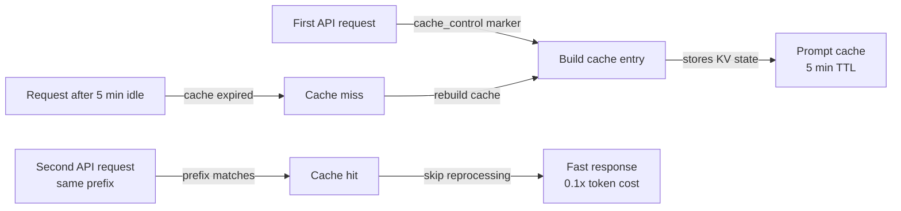

## Definição

Cache de prompts é uma funcionalidade da API Claude que permite que porções repetidas de um prompt — o prompt de sistema, definições de ferramentas, contexto de documentos ou longos prefixos de conversa — sejam processadas uma vez e reutilizadas em múltiplas chamadas de API subsequentes. Em vez de reprocessar sequências de tokens idênticas em cada requisição, o modelo as lê de um cache, o que reduz a latência e diminui o custo dos tokens em cache. No Claude Code, o cache de prompts opera automaticamente em segundo plano para tornar sessões longas e uso repetido de ferramentas mais rápidos e econômicos.

A ideia central por trás do cache de prompts é que a maior parte do que muda entre chamadas de API em uma sessão de codificação é pequena: uma nova mensagem do usuário, um novo resultado de ferramenta ou um arquivo atualizado. As partes grandes e estáveis — o prompt de sistema contendo instruções do projeto, as definições de todas as ferramentas disponíveis e o histórico de conversa acumulado — permanecem inalteradas na maioria dos turnos. Processar essas partes estáveis de forma redundante em cada requisição é um desperdício. O cache de prompts elimina esse desperdício armazenando estados chave-valor processados e reutilizando-os quando o prefixo do prompt corresponde.

Da perspectiva de um desenvolvedor, o cache de prompts é amplamente transparente em sessões do Claude Code — acontece automaticamente sem configuração. Entendê-lo importa mais quando se constrói diretamente sobre a API Claude, projetando loops de agentes de longa duração, ou solucionando problemas de latência ou custos inesperadamente altos. Nesses contextos, saber como estruturar prompts para utilização ótima do cache pode gerar economias substanciais: tokens de entrada em cache são cobrados a uma fração do custo dos tokens de entrada regulares, e os acertos de cache eliminam completamente a latência de processamento das partes em cache.

## Como funciona

### Marcadores de controle de cache

O cache de prompts usa anotações `cache_control` explícitas para marcar onde no prompt um ponto de verificação de cache deve ser criado. Quando a API processa uma requisição com controle de cache `{"type": "ephemeral"}` em um bloco de conteúdo, ela armazena o estado processado de todos os tokens até e incluindo aquele bloco. Em requisições subsequentes com o mesmo prefixo, a API detecta o acerto de cache e pula o reprocessamento desses tokens. Um prompt pode ter até quatro pontos de verificação de cache ativos simultaneamente, permitindo que desenvolvedores façam cache do prompt de sistema separadamente das definições de ferramentas e do histórico de conversa.

### Vida útil do cache e invalidação

O cache efêmero tem um tempo de vida de aproximadamente cinco minutos de inatividade. Se nenhuma chamada de API referenciar um prefixo em cache dentro dessa janela, a entrada de cache é removida e deve ser reconstruída na próxima requisição. Isso significa que o cache de prompts é mais eficaz para casos de uso de alta frequência: sessões de codificação interativas onde requisições chegam a cada poucos segundos, loops de agentes que executam muitas chamadas de ferramentas em rápida sucessão, ou pipelines de processamento em lote que processam muitos documentos com um prompt de sistema compartilhado. Para fluxos de trabalho de baixa frequência onde minutos se passam entre requisições, o cache pode expirar e não fornecer nenhum benefício.

### O que fazer cache

Os melhores candidatos para cache são conteúdos que são grandes, estáveis e reutilizados com frequência. O prompt de sistema é o candidato mais óbvio: no Claude Code ele contém instruções do projeto do CLAUDE.md, definições de ferramentas e diretrizes de comportamento — frequentemente milhares de tokens que são idênticos em cada turno. As definições de ferramentas (esquemas JSON para todas as ferramentas disponíveis) são outro candidato sólido. Em fluxos de trabalho RAG ou com muitos documentos, grandes documentos de referência carregados no início de uma sessão podem ter cache para que perguntas subsequentes sobre esses documentos incorram apenas no custo marginal da nova pergunta, não no custo de reler os documentos.

### Detecção de acertos de cache e relatórios de uso

A resposta da API inclui um objeto `usage` que distingue entre tokens de entrada regulares, tokens de criação de cache e tokens de leitura de cache. Os tokens de criação de cache são cobrados a 1,25x da taxa base (o custo único de escrever no cache). Os tokens de leitura de cache são cobrados a 0,1x da taxa base — um desconto de 90% versus tokens de entrada regulares. Monitorar esses campos permite que desenvolvedores meçam a eficácia real do cache: a proporção de tokens de leitura de cache em relação ao total de tokens de entrada indica quanto do prompt está sendo servido do cache.



## Quando usar / Quando NÃO usar

| Usar quando | Evitar quando |
|---|---|
| Seu prompt de sistema é grande (>1.000 tokens) e constante em muitas requisições | Seus prompts mudam significativamente em cada requisição — sem prefixo estável para fazer cache |
| Você está rodando um loop de agente com muitas chamadas de ferramentas sequenciais em uma única sessão | Requisições são infrequentes (>5 min entre turnos) — o cache expira antes de poder ser reutilizado |
| Você carrega grandes documentos de referência (especificações, bases de código) no início da sessão | Seu caso de uso são requisições únicas sem contexto repetido |
| Você quer reduzir a latência na primeira resposta visível ao usuário em uma sessão interativa | Você está testando ou depurando e quer contagens determinísticas de tokens por requisição |
| Você está otimizando custos em um sistema de produção com alto volume de chamadas de API | A sobrecarga de estruturar marcadores cache_control supera as economias com baixo volume |

## Exemplos de código

```python
import anthropic

client = anthropic.Anthropic()

# Example: caching a large system prompt and tool definitions
# The system prompt is the same on every request — mark it for caching

SYSTEM_PROMPT = """
You are a senior software engineer working on a large TypeScript monorepo.
The project uses React on the frontend, Node.js/Express on the backend, and PostgreSQL.
[... imagine 2000+ tokens of detailed project instructions here ...]
""" * 10  # simulating a large system prompt

# Tool definitions for the coding agent — stable across all requests
TOOLS = [
    {
        "name": "read_file",
        "description": "Read a file from the project directory",
        "input_schema": {
            "type": "object",
            "properties": {
                "path": {"type": "string", "description": "Relative file path"}
            },
            "required": ["path"]
        }
    },
    {
        "name": "write_file",
        "description": "Write content to a file",
        "input_schema": {
            "type": "object",
            "properties": {
                "path": {"type": "string"},
                "content": {"type": "string"}
            },
            "required": ["path", "content"]
        }
    },
    # ... more tools
]

def make_request(messages: list, turn_number: int) -> dict:
    """
    Make a Claude API request with prompt caching enabled.
    The system prompt and tools are marked with cache_control so they are
    processed once and reused on subsequent calls in the same session.
    """
    response = client.messages.create(
        model="claude-opus-4-5",
        max_tokens=4096,
        # Mark the system prompt for caching with cache_control
        system=[
            {
                "type": "text",
                "text": SYSTEM_PROMPT,
                # This tells the API to cache everything up to this point
                "cache_control": {"type": "ephemeral"}
            }
        ],
        # Mark tool definitions for caching too
        tools=[
            {**tool, "cache_control": {"type": "ephemeral"}} if i == len(TOOLS) - 1 else tool
            for i, tool in enumerate(TOOLS)
        ],
        messages=messages
    )

    # Inspect cache usage in the response
    usage = response.usage
    print(f"Turn {turn_number} token usage:")
    print(f"  Input tokens:        {usage.input_tokens:>8}")
    print(f"  Cache creation:      {usage.cache_creation_input_tokens:>8}  (1.25x cost)")
    print(f"  Cache read:          {usage.cache_read_input_tokens:>8}  (0.1x cost)")
    print(f"  Output tokens:       {usage.output_tokens:>8}")

    # Calculate effective cost savings
    if usage.cache_read_input_tokens > 0:
        savings_pct = (usage.cache_read_input_tokens / usage.input_tokens) * 100 * 0.9
        print(f"  Estimated savings:   {savings_pct:.1f}% on input tokens this turn")

    return response

# Simulate a multi-turn coding session
messages = []

# Turn 1 — cold start, cache is built
messages.append({"role": "user", "content": "What files exist in the src/ directory?"})
response1 = make_request(messages, turn_number=1)
# Output: cache_creation_input_tokens > 0, cache_read_input_tokens = 0
messages.append({"role": "assistant", "content": response1.content})

# Turn 2 — system prompt and tools are now cached
messages.append({"role": "user", "content": "Read the main entry point file"})
response2 = make_request(messages, turn_number=2)
# Output: cache_read_input_tokens > 0, significant cost savings

# Turn 3 — still cache-hitting on system prompt + tools
messages.append({"role": "user", "content": "Explain how the authentication middleware works"})
response3 = make_request(messages, turn_number=3)
# Output: continued cache hits, growing cache_read_input_tokens
```

```bash
# Observing prompt caching in Claude Code sessions
# Claude Code automatically applies caching — use verbose mode to see token counts

# Start a session with verbose output to inspect token usage
claude --verbose

# Inside the session, run several requests in sequence
> List all TypeScript files in src/
> Read src/index.ts
> Explain the main function

# With --verbose, Claude Code prints token usage per turn including cache statistics
# You'll see cache_creation_input_tokens spike on turn 1, then
# cache_read_input_tokens grow on subsequent turns
```

## Recursos práticos

- [Documentação de cache de prompts — Anthropic](https://docs.anthropic.com/en/docs/build-with-claude/prompt-caching) — Referência oficial completa: formato de controle de cache, preços de tokens, TTL e modelos suportados.
- [Cookbook de cache de prompts](https://github.com/anthropics/anthropic-cookbook/blob/main/misc/prompt_caching.ipynb) — Jupyter notebook com exemplos funcionais incluindo cálculo de custo e medição de acertos de cache.
- [Preços da API Claude](https://www.anthropic.com/pricing) — Taxas atuais de tokens para entrada, criação de cache e leitura de cache em todos os modelos.
- [Monitoramento de uso da Anthropic](https://console.anthropic.com/usage) — Painel do console para inspecionar desagregações de uso de tokens por chave de API.

## Veja também

- [Visão geral do Claude Code](/docs/claude-code)
- [Gerenciamento de contexto](/docs/claude-code/context-management)
- [Modos de raciocínio e esforço](/docs/claude-code/thinking-modes)
