## Definição

**Otimização de custos de LLM** é a prática de reduzir o gasto por requisição e o custo agregado de operar aplicações de IA baseadas em APIs de modelos de linguagem de grande escala, preservando a qualidade das respostas e a latência aceitável. À medida que empresas movem cargas de trabalho de LLM para produção, o gasto com APIs frequentemente torna-se o principal item de infraestrutura — é comum ver sessões por usuário custando $6 em implantações não otimizadas cair para menos de $1 após a aplicação de uma pilha completa de otimização.

O custo é determinado por quatro fatores: o número de **tokens de entrada** enviados ao modelo, o número de **tokens de saída** gerados, o **nível de preço** do modelo selecionado, e se as respostas podem ser **servidas do cache** em vez de invocar o modelo. Esta seção aborda cada alavanca de forma independente e mostra como compô-las:

- **[Orçamento de tokens](/docs/cost-optimization/token-budgeting)** — controle do volume de tokens de entrada por compressão de prompt, corte de contexto RAG e restrições de saída.
- **[Cache de prompts](/docs/cost-optimization/prompt-caching)** — reutilização de tokens de prefixo inalterados entre requisições com cache de prefixo da Anthropic e cache automático da OpenAI.
- **[Escalonamento de modelos](/docs/cost-optimization/model-tiering)** — roteamento de consultas para o modelo mais barato capaz de respondê-las, incluindo cache semântico para ignorar o LLM completamente.

## Como funciona

```mermaid
flowchart LR
  Request[Consulta recebida] --> Cache\{Cache semântico<br/>acerto?\}
  Cache -->|Sim| Return[Retornar resposta em cache<br/>100% de economia]
  Cache -->|Não| Router[Roteador de modelos<br/>classificador de complexidade]
  Router -->|simples| Cheap[Modelo pequeno<br/>ex.: Haiku / GPT-4o-mini]
  Router -->|complexo| Premium[Modelo premium<br/>ex.: Opus / GPT-4o]
  Cheap --> PromptCache\{Prefixo do prompt<br/>em cache?\}
  Premium --> PromptCache
  PromptCache -->|Sim| Discount[Desconto de 90% no custo de entrada<br/>Anthropic / 50% OpenAI]
  PromptCache -->|Não| Full[Inferência com preço integral]
  Discount --> Store[Armazenar no cache semântico]
  Full --> Store
```

## Quando usar / Quando NÃO usar

| Cenário | Aplicar otimização | Ignorar |
|---|---|---|
| App em produção com > 1.000 requisições/dia | Sim — mesmo 30% de economia se acumula rapidamente | Não — otimizar prematuramente em fase de protótipo |
| Prompts de sistema longos (> 1.000 tokens) repetidos por requisição | Sim — cache de prompts entrega 50–90% de desconto na entrada | Não — prompts curtos e variáveis perdem a âncora do cache |
| Complexidade mista de consultas (FAQs simples + análise complexa) | Sim — escalonamento roteia 60-70% para modelos baratos | Não — cargas de trabalho uniformes ganham menos com roteamento |
| Alta repetição de consultas (bots de suporte, FAQs) | Sim — cache semântico elimina chamadas ao LLM | Não — consultas criativas ou únicas por usuário não serão cacheadas |
| SLA de latência rígido &lt; 200 ms | Com cache semântico (sem chamada ao modelo) | Orçamento de tokens / roteamento adiciona latência de classificador |

## Impacto combinado (ilustrativo)

| Alavanca | Economia típica | Gasto cumulativo |
|---|---|---|
| Baseline | — | $6,00/sessão |
| Cache de prompts (prompt de sistema longo) | 40% | $3,60 |
| Escalonamento de modelos (60% das consultas → mini) | 35% | $2,34 |
| Cache semântico (taxa de acerto de 30%) | 30% | $1,64 |
| Orçamento de tokens (corte de contexto RAG) | 20% | $1,31 |

Os números são ilustrativos; a economia real depende da mistura de carga de trabalho e das taxas de acerto do cache.

## Fontes

- [LLM cost optimization: 5 levers to cut API spend 70–85% — Morph](https://www.morphllm.com/llm-cost-optimization)
- [LLM token optimization: cut costs and latency in 2026 — Redis](https://redis.io/blog/llm-token-optimization-speed-up-apps/)
- [Prompt caching: the optimization that cuts LLM costs by 90% — TianPan](https://tianpan.co/blog/2025-10-13-prompt-caching-cut-llm-costs)
- [LLM cost optimization: complete guide — Koombea AI](https://ai.koombea.com/blog/llm-cost-optimization)

## Veja também

- [Orçamento de tokens](/docs/cost-optimization/token-budgeting)
- [Cache de prompts](/docs/cost-optimization/prompt-caching)
- [Escalonamento de modelos](/docs/cost-optimization/model-tiering)
- [Roteamento de modelos](/docs/model-routing)
- [RAG](/docs/rag)
- [LLMs](/docs/llms)
