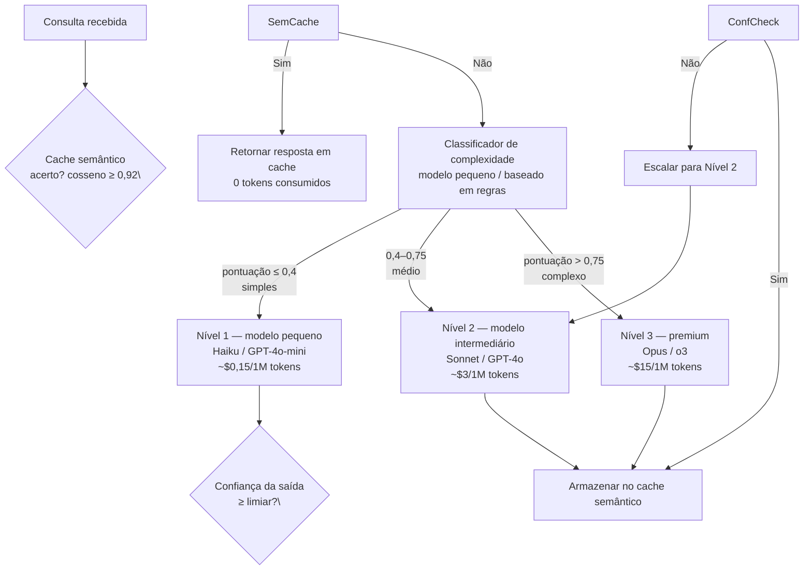

## Definição

**Escalonamento de modelos** é a prática de classificar consultas recebidas por complexidade e rotear cada consulta para o modelo menos caro capaz de respondê-la corretamente. Em vez de enviar toda requisição para um modelo de fronteira, um sistema de escalonamento mantém dois ou três níveis de modelos — um modelo pequeno e barato, um modelo intermediário e um modelo premium opcional — e direciona o tráfego com base na dificuldade estimada.

Dados da indústria de 2025–2026 mostram consistentemente que 50–70% das requisições de LLM empresariais podem ser tratadas pelo nível mais barato sem perda mensurável de qualidade, enquanto apenas 5–15% genuinamente requerem um modelo de fronteira premium. Aplicar escalonamento a essas cargas de trabalho sozinhas reduz o custo médio por requisição em 40–70%.

**Cache semântico** fica acima de todos os níveis: quando uma nova consulta é semanticamente equivalente a uma consulta previamente respondida (similaridade de cosseno > limiar), a resposta em cache é retornada diretamente sem invocar nenhum modelo, gerando 100% de economia nessa requisição.

## Como funciona

### Estratégias de roteamento

**Roteamento baseado em classificador:** um classificador leve (modelo pequeno ajustado fino ou similaridade de embeddings com exemplos rotulados) pontua a complexidade da consulta antes da invocação. RouteLLM (LMSys, 2024) treina um roteador com dados de preferência humana e reduz chamadas ao modelo premium em 40–85% com degradação de taxa de vitória &lt; 5%. O roteador LiteLLM suporta roteamento baseado em classificador junto com balanceamento de carga e fallback.

**Roteamento baseado em regras:** listas de palavras-chave, limiares de contagem de tokens ou classificadores de intenção (regex + embeddings) roteiam padrões comuns de forma determinística. Buscas factuais simples, tarefas de classificação curtas e extração estruturada vão de forma confiável para modelos baratos; raciocínio em múltiplos passos, geração de código e tarefas ambíguas são escaladas.

**Cascata (fallback sequencial):** a consulta sempre começa no Nível 1; se a confiança da saída ou uma pontuação de autoavaliação cair abaixo de um limiar, a consulta original é reenviada ao Nível 2. A cascata verdadeira custa mais do que o roteamento por classificador porque o Nível 1 sempre roda, mas elimina o overhead do classificador e é mais simples de implementar.

### Cache semântico

O cache semântico armazena pares `(embedding_da_consulta, resposta)`. Em uma nova consulta, o sistema computa o embedding e verifica a similaridade de cosseno em relação aos embeddings em cache; se uma correspondência supera o limiar (tipicamente 0,90–0,95 dependendo dos requisitos de precisão), a resposta armazenada é retornada.

Considerações-chave:
- **Ajuste de limiar:** limiares menores aumentam a taxa de acerto mas arriscam retornar respostas obsoletas ou ligeiramente equivocadas; 0,92 é um ponto de partida comum.
- **Invalidação de cache:** TTL baseado em tempo (1–24 horas para consultas factuais; menor para consultas de dados ao vivo) previne respostas obsoletas.
- **Armazenamento do cache:** Redis com busca vetorial (RedisVL) ou Qdrant são backends comuns; embutir a consulta adiciona ~5 ms de latência, muito menos do que uma chamada ao modelo.
- **Taxas de acerto no mundo real:** 31% das consultas de LLM empresariais exibem similaridade semântica suficiente para cache; bots de FAQ e fluxos de suporte podem atingir 50–70% de taxa de acerto.

## Quando usar / Quando NÃO usar

| Cenário | Usar escalonamento de modelos | Evitar |
|---|---|---|
| Carga de trabalho mista com consultas simples e complexas | Sim — escalonamento captura a maioria barata | Não — consultas premium uniformes não ganham nada |
| Produção em alto volume (> 10 k requisições/dia) | Sim — redução de 40% se acumula diariamente | Não — cargas de trabalho de protótipo; otimizar depois |
| Bots de suporte / FAQ com consultas repetitivas | Sim — cache semântico especialmente eficaz | Não — geração criativa ou altamente personalizada |
| Requisitos de qualidade rígidos sem tolerância a degradação | Cascata com portão de qualidade | Não — erros do classificador podem rotear mal consultas complexas |
| Aplicações em tempo real sensíveis à latência | Com cache semântico (sem chamada ao modelo) | Classificador adiciona 10–50 ms; medir antes de ativar |

## Opções de plataforma

| Ferramenta | Abordagem | Cache semântico | Código aberto |
|---|---|---|---|
| **LiteLLM** | Roteador com balanceamento de carga + fallback | Via integração | Sim |
| **RouteLLM** | Classificador treinado (LMSys) | Não | Sim |
| **Portkey** | Gateway com regras de roteamento | Sim (embutido) | Não |
| **Maxim** | Gateway com cache semântico | Sim (embutido) | Não |
| **OpenRouter** | Roteamento de provedor + fallback | Não | Não |

## Fontes

- [LLM routing and model cascades — TianPan](https://tianpan.co/blog/2025-11-03-llm-routing-model-cascades)
- [Top 5 LLM routing techniques — Maxim](https://www.getmaxim.ai/articles/top-5-llm-routing-techniques/)
- [LiteLLM – routing and load balancing documentation](https://docs.litellm.ai/docs/routing-load-balancing)
- [Intelligent LLM routing: how multi-model AI cuts costs by 85% — Swfte AI](https://www.swfte.com/blog/intelligent-llm-routing-multi-model-ai)
- [Top LLM gateways with semantic caching in 2026 — DEV Community](https://dev.to/debmckinney/top-llm-gateways-that-support-semantic-caching-in-2026-3dho)

## Veja também

- [Otimização de custos](/docs/cost-optimization)
- [Orçamento de tokens](/docs/cost-optimization/token-budgeting)
- [Cache de prompts](/docs/cost-optimization/prompt-caching)
- [Roteamento de modelos](/docs/model-routing)
- [Busca semântica](/docs/semantic-search)
