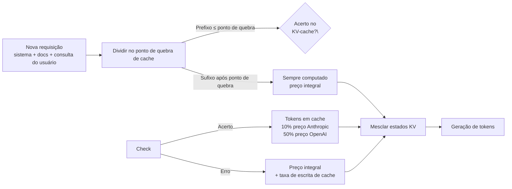

## Definição

**Cache de prompts** é uma otimização no lado do servidor oferecida por provedores de LLM que evita o reprocessamento de tokens que aparecem sem alteração no início de prompts sucessivos. Quando um prompt compartilha um longo prefixo comum entre requisições — como um prompt de sistema fixo, um documento grande ou uma lista de ferramentas persistente — o provedor armazena o estado do KV-cache para esses tokens e o reutiliza em requisições subsequentes, cobrando uma taxa fortemente descontada para tokens em cache em vez do preço integral de entrada.

Em maio de 2026, dois provedores oferecem cache de prompts em produção:

- **Anthropic** — "pontos de quebra de cache" explícitos com marcadores `cache_control: \{type: "ephemeral"\}`; tokens em cache custam 10% do preço de entrada padrão (desconto de 90%); TTL do cache é 5 minutos (estendido para 1 hora com acerto do ponto de quebra dentro da janela).
- **OpenAI** — cache automático de prefixo ativado por padrão no GPT-4o e modelos mais novos; sem alterações na API; tokens em cache custam 50% do preço de entrada padrão.

O cache de prompts oferece maior benefício quando o mesmo prefixo longo é reutilizado em muitas requisições: um prompt de sistema de 10.000 tokens reutilizado em 1.000 requisições por dia economiza aproximadamente 9 milhões de tokens em cache por dia às taxas da Anthropic.

## Como funciona

### Pontos de quebra de cache da Anthropic

Os pontos de quebra de cache são marcadores explícitos colocados no array de mensagens. O conteúdo antes do último ponto de quebra é elegível para cache. Regras:

1. O bloco mínimo cacheável é **1.024 tokens** (texto) ou **2.048 tokens** (lista de ferramentas).
2. Pontos de quebra podem ser colocados em blocos de mensagem `system`, `user` e `tool_results`.
3. Em caso de erro de cache, o provedor cobra uma **taxa de escrita de cache** de 25% do preço de entrada padrão além da taxa padrão; acertos subsequentes ficam a 10%.
4. O TTL é renovado a cada acerto, até um máximo de 1 hora.

Posicionamento ideal: coloque um ponto de quebra após o prompt de sistema e quaisquer documentos estáticos; deixe o turno dinâmico do usuário e o histórico recente após o último ponto de quebra.

### Cache automático da OpenAI

O GPT-4o (e as séries o1, o3) fazem cache do prefixo correspondente mais longo automaticamente sem alterações na API. O prefixo correspondente deve ser um múltiplo de 128 tokens. Os acertos de cache são refletidos no campo `usage.prompt_tokens_details.cached_tokens` da resposta. Como o cache é automático, a responsabilidade do desenvolvedor é **manter o prefixo estável**: evite inserir timestamps, IDs de requisição ou conteúdo dinâmico no início do prompt.

### Medindo a efetividade do cache

Rastreie `cache_read_input_tokens` (Anthropic) ou `cached_tokens` (OpenAI) nos objetos de uso da resposta. Uma implantação de produção saudável com um prompt de sistema longo deve alcançar > 70% dos tokens de entrada servidos do cache após o aquecimento.

## Quando usar / Quando NÃO usar

| Cenário | Usar cache de prompts | Ignorar |
|---|---|---|
| Prompt de sistema longo fixo (> 1.024 tokens) reutilizado por requisição do usuário | Sim — ancorar cache no final do prompt de sistema | Não — prompts de sistema curtos não atingem o tamanho mínimo |
| Q&A em documentos: mesmo documento, muitas perguntas | Sim — cachear o conteúdo do documento | Não — cargas de trabalho de uma pergunta por documento |
| Lista de ferramentas injetada em cada chamada do agente | Sim — cachear o bloco de definições de ferramentas | Não — listas de ferramentas que mudam entre chamadas |
| Prompts dinâmicos (personalizados por usuário) | Parcial — cachear apenas o prefixo estático | Não — prompts totalmente dinâmicos não podem ser cacheados |
| Inferência em batch, QPS baixo | Baixo benefício — TTL do cache pode expirar entre batches | Não — tempo real de alto QPS é o ponto ideal |

## Estimativa de economia

| Tokens do prompt de sistema | Requisições/dia | Preço em cache Anthropic | Economia diária vs. sem cache |
|---|---|---|---|
| 2.000 | 500 | $0,003/1k (vs $0,03) | ~$0,027 × 1 M tokens = $27 |
| 10.000 | 1.000 | $0,003/1k | ~$0,027 × 10 M = $270 |
| 50.000 | 2.000 | $0,003/1k | ~$0,027 × 100 M = $2.700 |

Preços ilustrativos com base nas taxas do Claude 3.5 Sonnet de Q1 2026.

## Fontes

- [Anthropic – prompt caching documentation](https://docs.anthropic.com/en/docs/build-with-claude/prompt-caching)
- [Prompt caching infrastructure — Introl](https://introl.com/blog/prompt-caching-infrastructure-llm-cost-latency-reduction-guide-2025)
- [Prompt caching: the optimization that cuts LLM costs by 90% — TianPan](https://tianpan.co/blog/2025-10-13-prompt-caching-cut-llm-costs)
- [Claude Code prompt caching guide](/docs/claude-code/prompt-caching)

## Veja também

- [Otimização de custos](/docs/cost-optimization)
- [Orçamento de tokens](/docs/cost-optimization/token-budgeting)
- [Escalonamento de modelos](/docs/cost-optimization/model-tiering)
- [Claude Code — cache de prompts](/docs/claude-code/prompt-caching)
- [LLMs](/docs/llms)
