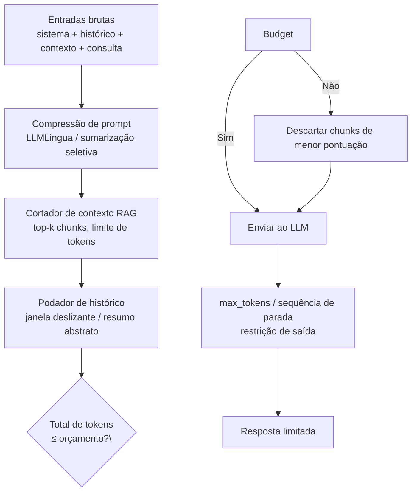

## Definição

**Orçamento de tokens** é a disciplina de limitar o número de tokens enviados para e recebidos de uma API de LLM a fim de reduzir custo e latência. Como a maioria das APIs de LLM cobra por token de entrada e por token de saída, reduzir a contagem de tokens é a alavanca mais direta disponível. Diferente do cache de prompts ou do roteamento de modelos, o orçamento de tokens se aplica a toda requisição, independentemente de o provedor oferecer capacidades de cache ou roteamento.

Tokens de entrada incluem: o prompt de sistema, o histórico de conversa, o contexto RAG recuperado e a mensagem do usuário. Tokens de saída incluem a resposta gerada pelo modelo. Em aplicações RAG com documentos pesados, o contexto recuperado isoladamente pode representar 60–80% dos tokens de entrada — tornando o corte de contexto a otimização de maior alavanca no lado da entrada. No lado da saída, instruir o modelo a ser conciso ou definir `max_tokens` previne geração excessiva em consultas simples.

## Como funciona

### Técnicas no lado da entrada

**Compressão de prompt** remove tokens redundantes do prompt preservando o significado. LLMLingua (Microsoft, 2023–2025) alcança compressão de 2–4× com &lt; 5% de perda de qualidade ao descartar seletivamente tokens classificados como de baixa perplexidade por um pequeno modelo. Abordagens mais simples baseadas em regras — remoção de espaços em branco, eliminação de cabeçalhos padronizados, redução de exemplos few-shot — alcançam redução de 10–30% com zero risco para a qualidade.

**Corte de contexto RAG** limita o número de chunks recuperados passados ao LLM. Classificar chunks por pontuação de relevância e aplicar um limite rígido de N tokens (ex.: 2.000 tokens) em vez de passar todos os resultados top-k pode reduzir tokens de entrada pela metade em cargas de trabalho com documentos longos. O reranqueamento a nível de chunk (cross-encoder) garante que o material mais relevante seja retido ao cortar.

**Poda de histórico** limita o histórico de conversa aos últimos N turnos, ou substitui turnos mais antigos por um resumo abstraído gerado por um modelo pequeno e barato. Uma janela deslizante de 3 turnos reduz tokens de histórico em 60–80% em sessões longas com degradação mínima de qualidade na maioria das tarefas conversacionais.

### Técnicas no lado da saída

**`max_tokens`** define um teto rígido para o comprimento da saída. Para tarefas com comprimento de saída previsível (classificação, respostas curtas, extração de JSON), definir `max_tokens` como 2–3× o comprimento esperado da saída previne supergeração e as cobranças por token que ela incorre.

**Sequências de parada** encerram a geração em um limite conhecido (ex.: `"\n\n"` ou `"###"`) antes que o modelo produza preenchimento ou comentários adicionados após o conteúdo útil.

**Restrições de saída estruturada** (modo JSON, chamada de função com `strict: true`) impedem o modelo de gerar preâmbulos verbosos ("Claro! Aqui está o JSON que você pediu…") antes do conteúdo real.

## Quando usar / Quando NÃO usar

| Cenário | Aplicar orçamento de tokens | Ignorar |
|---|---|---|
| RAG com documentos longos recuperados | Sim — cortar contexto agressivamente | Não — chunks curtos já cabem no orçamento |
| Sessões de chat longo com múltiplos turnos | Sim — poda de histórico previne crescimento linear de custo | Não — sessões curtas (&lt; 5 turnos) |
| Tarefas simples de classificação / extração | Sim — prompt de sistema curto + max_tokens estrito | Não — tarefas de raciocínio complexo precisam do contexto completo |
| Escrita criativa, geração aberta | Parcial — apenas max_tokens | Não — compressão prejudica a coerência |
| Respostas em streaming para usuários | max_tokens ajuda; sequências de parada menos úteis | — |

## Metas práticas

| Tipo de aplicação | Meta de tokens de entrada | Meta de tokens de saída |
|---|---|---|
| FAQ / bot de suporte | &lt; 1.000 | &lt; 200 |
| Q&A com RAG | &lt; 4.000 | &lt; 500 |
| Sumarização de documentos | &lt; 16.000 | &lt; 600 |
| Geração de código | &lt; 8.000 | &lt; 2.000 |
| Agente multi-turno | &lt; 6.000 (podado) | &lt; 1.000 por turno |

## Fontes

- [LLMLingua: prompt compression for efficient LLMs — Microsoft Research](https://www.microsoft.com/en-us/research/project/llmlingua/)
- [LLM token optimization: cut costs and latency in 2026 — Redis](https://redis.io/blog/llm-token-optimization-speed-up-apps/)
- [LLM optimization guide: token budgets, latency, and cost — Medium / QuarkAndCode](https://medium.com/@QuarkAndCode/llm-optimization-guide-token-budgets-latency-and-cost-7ed701283ce5)
- [Token optimization 2026: saving up to 80% LLM costs — ObviousWorks](https://www.obviousworks.ch/en/token-optimization-saves-up-to-80-percent-llm-costs/)

## Veja também

- [Otimização de custos](/docs/cost-optimization)
- [Cache de prompts](/docs/cost-optimization/prompt-caching)
- [Escalonamento de modelos](/docs/cost-optimization/model-tiering)
- [Arquitetura RAG](/docs/rag/architecture)
- [Engenharia de prompts](/docs/prompt-engineering)
