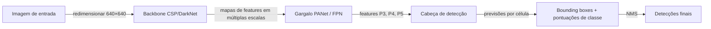
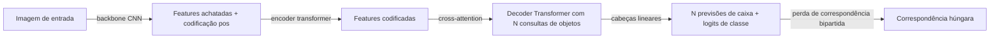

## Definição

Detecção de objetos é a tarefa de visão computacional que consiste em prever bounding boxes e rótulos de classe para todas as instâncias de objetos em uma imagem. Ao contrário da classificação de imagens (um rótulo por imagem), a detecção deve resolver simultaneamente **onde** (localização) e **o quê** (classificação) para um número arbitrário de objetos.

As arquiteturas se dividem em duas famílias principais:

- **Detectores de dois estágios** (Faster R-CNN, Mask R-CNN) primeiro propõem regiões candidatas (propostas de região), depois classificam cada proposta. Maior precisão, inferência mais lenta.
- **Detectores de um estágio** (YOLO, SSD, RetinaNet) preveem caixas e classes em uma única passagem direta sobre uma grade densa. Mais rápidos, precisão competitiva. YOLO (You Only Look Once) se tornou o detector em tempo real dominante — YOLOv8 e YOLOv11 da Ultralytics são amplamente usados em produção.
- **Detectores baseados em transformer** (DETR e suas variantes — Deformable DETR, RT-DETR, DINO-DETR) usam cross-attention entre consultas de objetos e features de imagem para prever um conjunto fixo de caixas fim-a-fim, sem âncoras ou supressão não máxima (NMS) manuais. O DETR simplifica o pipeline ao custo de convergência de treinamento mais lenta.

## Como funciona

### Pipeline YOLO

O YOLO divide a imagem em uma grade; cada célula prevê caixas relativas a âncoras e probabilidades de classe. Uma rede de pirâmide de features (FPN / PANet) funde features em múltiplas escalas para que objetos pequenos sejam detectados em mapas de maior resolução e objetos grandes em mapas de menor resolução. A supressão não máxima remove previsões duplicadas.

### Pipeline DETR

O DETR usa um conjunto fixo de consultas de objetos aprendidas que atendem às features do encoder. O treinamento usa correspondência húngara — uma atribuição bipartida entre previsões e objetos de referência — o que elimina o NMS. O Deformable DETR adiciona atenção deformável para acelerar a convergência; o RT-DETR (Baidu, 2023) alcança velocidades em tempo real comparáveis ao YOLO.

### Métricas principais

| Métrica | Descrição |
|---|---|
| mAP@50 | Precisão média na proporção de IoU de 0,5 |
| mAP@50-95 | Média nos limiares de IoU de 0,5 a 0,95 (padrão COCO) |
| FPS / Latência | Frames por segundo no hardware alvo |

## Quando usar / Quando NÃO usar

| Cenário | Usar | Evitar |
|---|---|---|
| Detecção em tempo real em GPU/CPU de borda | YOLOv8n ou YOLOv11n — inferência mais rápida | DETR — convergência mais lenta, maior latência |
| Máxima precisão, sem restrição de computação | DINO-DETR ou YOLOv8x / YOLOv11x | Modelos pequenos — teto de precisão |
| Sem âncoras ou NMS manuais desejados | Família DETR — sem âncoras, sem NMS | YOLO com ajuste de âncoras |
| Detecção densa de objetos pequenos (satélite, drone) | Deformable DETR + backbone de alta resolução | Grade YOLO em escala única — perde objetos pequenos |
| Domínio personalizado com dados rotulados limitados | Ajuste fino YOLOv8 (transferência dos pesos COCO) | Treinar do zero — requer grande conjunto anotado |

## Fontes

- [YOLOv8 — Documentação Ultralytics](https://docs.ultralytics.com/)
- [DETR — Detecção de objetos fim-a-fim com Transformers (Carion et al., 2020)](https://arxiv.org/abs/2005.12872)
- [Deformable DETR (Zhu et al., 2020)](https://arxiv.org/abs/2010.04159)
- [RT-DETR — DETR em tempo real (Zhao et al., 2023)](https://arxiv.org/abs/2304.08069)
- [Benchmark COCO — Papers With Code](https://paperswithcode.com/sota/object-detection-on-coco)

## Veja também

- [Visão computacional](/docs/cv)
- [Vision Transformers](/docs/cv/vision-transformers)
- [Segmentação](/docs/cv/segmentation)
- [Redes neurais — CNN](/docs/neural-networks/cnn)
