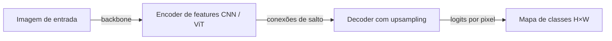
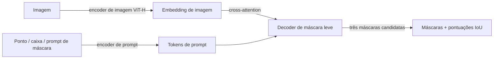

## Definição

A segmentação de imagens atribui um rótulo ou identidade a cada pixel em uma imagem. Três tarefas distintas existem sob este conceito:

- **Segmentação semântica** — atribui um rótulo de classe a cada pixel (por exemplo, estrada, céu, pessoa) sem distinguir instâncias individuais. Usada em direção autônoma, imagens de satélite e imagens médicas.
- **Segmentação de instâncias** — atribui a cada pixel tanto um rótulo de classe quanto um ID de instância único, distinguindo "pessoa 1" e "pessoa 2" na mesma cena. Mask R-CNN é a arquitetura canônica de segmentação de instâncias.
- **Segmentação panóptica** — unifica segmentação semântica e de instâncias: classes de "fundo" (céu, estrada) recebem rótulos semânticos, classes de "objetos" (carros, pessoas) recebem máscaras em nível de instância.

**Segment Anything Model (SAM)**, lançado pela Meta AI em 2023 e estendido para SAM 2 (2024) para vídeo, é um modelo fundacional de segmentação com prompts. Dado um ponto, caixa ou prompt de máscara, o SAM gera uma máscara de alta qualidade para o objeto indicado em zero-shot — sem ajuste fino específico de tarefa. O SAM 2 estende isso para vídeo propagando máscaras entre frames com um banco de memória.

## Como funciona

### Segmentação semântica (encoder-decoder)

Um encoder (ResNet, ViT, Swin) extrai mapas de features hierárquicos. Um decoder (conexões de salto estilo UNet, DPT ou ASPP) faz upsample das features de volta à resolução original e produz uma pontuação de classe por pixel. A perda é entropia cruzada por pixel.

### Segmentação de instâncias (Mask R-CNN)

O Mask R-CNN estende o Faster R-CNN adicionando um ramo de máscara paralelo: após o RoI Align recortar o mapa de features para cada região detectada, uma pequena FCN prevê uma máscara binária para cada classe dentro dessa região. Isso desacopla a predição de máscara da classificação e da regressão de caixa.

### Arquitetura SAM

O encoder de imagem pesado do SAM é executado uma vez por imagem; o decoder de máscara leve é executado em milissegundos por prompt. O SAM 2 adiciona um encoder de memória e um módulo de atenção de memória para que features de frames anteriores informem a segmentação do frame atual em vídeo.

### Métricas principais

| Métrica | Tarefa | Descrição |
|---|---|---|
| mIoU | Semântica | Intersecção sobre União média entre classes |
| AP@50-95 (máscara) | Instância | COCO mask AP |
| PQ | Panóptica | Qualidade Panóptica = SQ × RQ |

## Quando usar / Quando NÃO usar

| Cenário | Usar | Evitar |
|---|---|---|
| Rotular objetos arbitrários interativamente (ferramenta de anotação) | SAM 2 — zero-shot com prompt, sem treinamento | Modelo ajustado — requer dados rotulados |
| Segmentação semântica em tempo real para direção autônoma | DDRNet ou SegFormer-B0 — inferência rápida | SAM — não projetado para segmentação semântica em tempo real |
| Segmentação de imagem médica (anatomia especializada) | MedSAM ajustado ou nnUNet | SAM genérico — necessita adaptação de domínio |
| Segmentação/rastreamento de objetos em vídeo | SAM 2 — propaga máscaras entre frames | SAM por frame — sem consistência temporal |
| Percepção panóptica em robótica | Mask2Former — estado da arte panóptico | Pipelines semânticos + de instância separados — erros se propagam |

## Fontes

- [Segment Anything — Kirillov et al., Meta AI (2023)](https://arxiv.org/abs/2304.02643)
- [SAM 2 — Segment Anything em Imagens e Vídeo (Meta AI, 2024)](https://arxiv.org/abs/2408.00714)
- [Mask R-CNN — He et al. (2017)](https://arxiv.org/abs/1703.06870)
- [Mask2Former — Cheng et al. (2021)](https://arxiv.org/abs/2112.01527)
- [SegFormer — Xie et al. (2021)](https://arxiv.org/abs/2105.15203)

## Veja também

- [Visão computacional](/docs/cv)
- [Detecção de objetos](/docs/cv/object-detection)
- [Vision Transformers](/docs/cv/vision-transformers)
- [Redes neurais — CNN](/docs/neural-networks/cnn)
