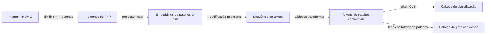

## Definição

Vision Transformers (ViT) adaptam a arquitetura transformer padrão para imagens, tratando a imagem como uma sequência de patches fixos não sobrepostos (tipicamente 16×16 ou 32×32 pixels). Cada patch é projetado linearmente em um vetor de embedding; um token `[CLS]` aprendível é pré-adicionado; e blocos encoder transformer padrão com self-attention multi-cabeça processam a sequência. A self-attention global em todos os patches permite ao ViT modelar dependências espaciais de longo alcance que CNNs aproximam apenas com pilhas profundas de convoluções.

Introduzido por Dosovitskiy et al. (2020), o ViT igualou ou superou o desempenho de CNNs no ImageNet quando pré-treinado no JFT-300M (um grande dataset interno do Google), estabelecendo que o viés indutivo das convoluções (localidade, equivariância de translação) não é necessário em escala suficiente. Variantes menores de ViT (ViT-S, ViT-B) requerem mais dados ou regularização para igualar CNNs em datasets pequenos.

**DINOv2** (Meta AI, 2023) é uma família de modelos ViT treinados com destilação auto-supervisionada (sem rótulos) em um dataset curado de 142 milhões de imagens. Features DINOv2 (congeladas, sem ajuste fino) alcançam desempenho competitivo em estimação de profundidade, segmentação semântica, classificação e recuperação de instâncias — tornando-o a espinha dorsal visual de propósito geral preferida para pesquisa e muitos sistemas de produção em 2024-2025.

## Como funciona

### Embedding de patches

Uma imagem de tamanho H×W é dividida em N = (H/P)×(W/P) patches. Cada patch é achatado e projetado com uma camada linear aprendida para um embedding de D dimensões. Embeddings posicionais 1D aprendíveis ou codificações seno-cosseno 2D são adicionados. O transformer processa a sequência completa com self-attention em cada camada — cada patch pode atender a todos os outros patches, ao contrário das CNNs.

### Treinamento DINOv2

O DINOv2 usa um objetivo de auto-destilação estudante-professor (DINO) combinado com iBOT (modelagem de imagem mascarada) em dados web curados e deduplicados. O professor é uma média móvel exponencial do estudante. Este objetivo combinado produz features com conteúdo semântico global e estrutura espacial local — permitindo que a mesma espinha dorsal congelada se destaque em tarefas de nível de imagem e de nível de pixel.

### Adaptando ViT para predição densa

Tarefas densas (segmentação, profundidade) requerem mapas de features espaciais. As estratégias incluem:

- **DPT (Dense Prediction Transformer)** — remonta tokens de patches em múltiplas escalas em pirâmides de features.
- **ViTDet** — adiciona blocos de atenção em janela e atenção global para detecção de objetos.
- **Registros** (DINOv2 com registros) — adiciona tokens de registro global para limpar ruído de artefatos nos tokens de patches.

## Quando usar / Quando NÃO usar

| Cenário | Usar ViT/DINOv2 | Evitar |
|---|---|---|
| Pré-treinamento ou ajuste fino em grande escala (ImageNet-21k+) | ViT-B/L pré-treinado em dados grandes — forte SOTA | ViT em datasets pequenos sem aumento — CNNs vencem |
| Features visuais de propósito geral (multitarefa) | DINOv2 espinha dorsal congelada — sem ajuste fino necessário | CNN ajustada para tarefa específica — mais estreita mas mais rápida |
| Raciocínio espacial de longo alcance (compreensão de cenas) | ViT — self-attention global em cada camada | CNN — campo receptivo limitado a menos que seja muito profunda |
| Implantação em borda/móvel com orçamento de computação restrito | EfficientViT ou MobileViT — ViT com atenção local | ViT-L completo — muito grande para mobile |
| Compreensão de vídeo | Video ViT (TimeSformer, VideoMAE) | ViT 2D aplicado frame a frame — sem modelagem temporal |

## Fontes

- [An Image is Worth 16×16 Words — Dosovitskiy et al. (2020)](https://arxiv.org/abs/2010.11929)
- [DINOv2 — Aprendendo features visuais robustas sem supervisão (Meta AI, 2023)](https://arxiv.org/abs/2304.07193)
- [Vision Transformer com Registros — Darcet et al. (2023)](https://arxiv.org/abs/2309.16588)
- [DPT — Predição densa com Transformers (Ranftl et al., 2021)](https://arxiv.org/abs/2103.13413)
- [Hub de modelos ViT no Hugging Face](https://huggingface.co/models?other=vit)

## Veja também

- [Visão computacional](/docs/cv)
- [Detecção de objetos](/docs/cv/object-detection)
- [Segmentação](/docs/cv/segmentation)
- [IA Multimodal](/docs/multimodal-ai)
- [Transformers](/docs/transformers)
