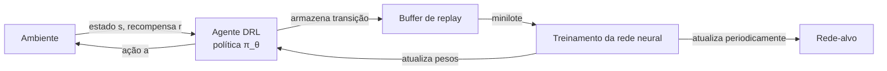

## Definição

O Aprendizado por Reforço Profundo (DRL) combina redes neurais profundas com aprendizado por reforço (RL) para aprender políticas de tomada de decisão diretamente a partir de observações de alta dimensão — pixels, leituras de sensores, embeddings de texto — sem engenharia de features manual. Em RL clássico, uma tabela ou função linear aproxima o valor de estado-ação; em DRL, uma rede neural profunda substitui essa função, permitindo generalização para espaços de estado enormes ou contínuos.

O marco central é o DQN (Deep Q-Network) da DeepMind (2015), que treinou um único agente para jogar dezenas de jogos Atari ao nível humano aprendendo apenas a partir de pixels e pontuação. O DQN introduziu dois truques estabilizadores críticos: **replay de experiência** (armazenar transições e amostrar minilotes para quebrar correlações temporais) e uma **rede-alvo** (uma cópia congelada da rede de valor atualizada periodicamente para estabilizar alvos de treinamento). Avanços subsequentes — Double DQN, Dueling DQN, Rainbow, métodos de gradiente de política como PPO e SAC — refinaram a amostragem, estabilidade e eficiência de dados.

O DRL está subjacente à maioria dos sistemas de IA de alto desempenho: AlphaGo/AlphaZero (jogos de tabuleiro), OpenAI Five (Dota 2), controle de robótica, design de chips, otimização de data centers, e RLHF (Reforço a partir de Feedback Humano) para alinhamento de LLMs. A desvantagem é que o DRL é notoriamente instável, com fome de dados e sensível a hiperparâmetros — requer grande cuidado de engenharia na prática.

## Como funciona

### Configuração do agente-ambiente

Um agente DRL percebe um **estado** do ambiente, seleciona uma **ação** de acordo com sua **política** (parametrizada por uma rede neural), recebe uma **recompensa** e faz a transição para um novo estado. O objetivo é maximizar a recompensa descontada cumulativa ao longo do tempo. A política — mapeamento de estados para distribuições de ações — é parametrizada como uma rede neural cuja saída é diretamente executável (por exemplo, logits de ação discreta, vetor de ação contínua ou ambos na estrutura ator-crítico).

### Deep Q-Network (DQN)

O DQN aproxima a função de valor de ação Q(s,a) com uma rede neural. Dada uma observação de entrada (por exemplo, quadros de pixels empilhados), a rede produz valores-Q para todas as ações. A política greedy seleciona argmax Q(s, ·). O treinamento usa perda de erro quadrático entre valores-Q previstos e alvos Bellman calculados a partir da rede-alvo. O replay de experiência armazena transições (s, a, r, s') em um buffer e amostra minilotes para gradientes.

### Gradientes de política e ator-crítico

Enquanto o DQN aprende implicitamente uma política através de valores-Q, os **métodos de gradiente de política** (REINFORCE, PPO, A3C) otimizam diretamente os parâmetros da política maximizando o retorno esperado via gradiente de política. Os métodos **ator-crítico** combinam ambos: um ator parametriza a política; um crítico estima o valor de estado para reduzir a variância do gradiente. O PPO (Proximal Policy Optimization) é o algoritmo ator-crítico padrão atual por sua robustez.

### SAC para controle contínuo

O Soft Actor-Critic (SAC) maximiza tanto a recompensa quanto a entropia da política, incentivando a exploração e robustez. É off-policy (reutilizando experiência passada), eficiente em dados e estável para tarefas de controle contínuo como manipulação de robôs ou locomoção.



## Quando usar / Quando NÃO usar

| Usar quando | Evitar quando |
|---|---|
| Espaço de estado é de alta dimensão (pixels, sensores) e a engenharia de features manual é impraticável | Dados de treinamento são escassos — o DRL exige muitas interações |
| A tarefa tem sinal de recompensa denso ou você pode projetar um | É necessária interpretabilidade das decisões do agente |
| Você precisa de controle de ação contínuo em ambientes complexos | A tarefa tem solução analítica ou baseada em busca mais eficiente |
| O ambiente pode ser simulado ou os dados são abundantes | Recompensas esparsas dificultam o aprendizado sem recompensas densas adicionais |

## Comparações

| Algoritmo | Espaço de ação | On/Off-policy | Amostras necessárias | Melhor para |
|---|---|---|---|---|
| DQN | Discreto | Off | Alto | Jogos Atari, ações discretas |
| PPO | Ambos | On | Médio | Referência robusta, multi-tarefa |
| SAC | Contínuo | Off | Baixo | Controle de robótica, física |
| A3C | Ambos | On | Alto | Treinamento paralelo |
| Rainbow | Discreto | Off | Médio-baixo | Melhor desempenho em Atari |

## Exemplos de código

```python
import gymnasium as gym
import numpy as np
import torch
import torch.nn as nn
import torch.optim as optim
from collections import deque
import random

# Rede Q simples para ações discretas
class QNetwork(nn.Module):
    def __init__(self, state_dim, action_dim, hidden=128):
        super().__init__()
        self.net = nn.Sequential(
            nn.Linear(state_dim, hidden), nn.ReLU(),
            nn.Linear(hidden, hidden), nn.ReLU(),
            nn.Linear(hidden, action_dim),
        )

    def forward(self, x):
        return self.net(x)


class DQNAgent:
    def __init__(self, state_dim, action_dim, lr=1e-3, gamma=0.99,
                 epsilon=1.0, epsilon_min=0.01, epsilon_decay=0.995):
        self.action_dim = action_dim
        self.gamma = gamma
        self.epsilon = epsilon
        self.epsilon_min = epsilon_min
        self.epsilon_decay = epsilon_decay

        self.q_net = QNetwork(state_dim, action_dim)
        self.target_net = QNetwork(state_dim, action_dim)
        self.target_net.load_state_dict(self.q_net.state_dict())
        self.optimizer = optim.Adam(self.q_net.parameters(), lr=lr)
        self.buffer = deque(maxlen=10_000)

    def act(self, state):
        if random.random() < self.epsilon:
            return random.randrange(self.action_dim)
        with torch.no_grad():
            q = self.q_net(torch.FloatTensor(state))
        return q.argmax().item()

    def store(self, s, a, r, s_, done):
        self.buffer.append((s, a, r, s_, done))

    def train(self, batch_size=64):
        if len(self.buffer) < batch_size:
            return
        batch = random.sample(self.buffer, batch_size)
        s, a, r, s_, done = zip(*batch)
        s = torch.FloatTensor(np.array(s))
        a = torch.LongTensor(a)
        r = torch.FloatTensor(r)
        s_ = torch.FloatTensor(np.array(s_))
        done = torch.FloatTensor(done)

        q_vals = self.q_net(s).gather(1, a.unsqueeze(1)).squeeze()
        with torch.no_grad():
            next_q = self.target_net(s_).max(1)[0]
            target = r + self.gamma * next_q * (1 - done)

        loss = nn.MSELoss()(q_vals, target)
        self.optimizer.zero_grad()
        loss.backward()
        self.optimizer.step()
        self.epsilon = max(self.epsilon_min, self.epsilon * self.epsilon_decay)

    def update_target(self):
        self.target_net.load_state_dict(self.q_net.state_dict())


# Loop de treinamento
env = gym.make("CartPole-v1")
state_dim = env.observation_space.shape[0]
action_dim = env.action_space.n
agent = DQNAgent(state_dim, action_dim)

for episode in range(300):
    state, _ = env.reset()
    total_reward = 0
    for _ in range(500):
        action = agent.act(state)
        next_state, reward, terminated, truncated, _ = env.step(action)
        done = terminated or truncated
        agent.store(state, action, reward, next_state, float(done))
        agent.train()
        state = next_state
        total_reward += reward
        if done:
            break
    if episode % 10 == 0:
        agent.update_target()
    if episode % 50 == 0:
        print(f"Episódio {episode} | Recompensa: {total_reward:.1f} | ε: {agent.epsilon:.3f}")
```

## Recursos práticos

- [Curso de Aprendizado por Reforço Profundo (Spinning Up – OpenAI)](https://spinningup.openai.com/) — Introdução prática com implementações de referência de PPO, SAC e outros
- [Stable-Baselines3](https://stable-baselines3.readthedocs.io/) — Biblioteca Python de produção de algoritmos DRL confiáveis com documentação e exemplos extensos
- [Artigo DQN (Mnih et al., 2015)](https://www.nature.com/articles/nature14236) — Artigo original do DeepMind introduzindo replay de experiência e redes-alvo
- [Artigo PPO (Schulman et al., 2017)](https://arxiv.org/abs/1707.06347) — O algoritmo de gradiente de política proximal mais amplamente utilizado
- [CleanRL](https://github.com/vwxyzjn/cleanrl) — Implementações DRL de arquivo único, legíveis, com logging WandB integrado

## Veja também

- [Aprendizado por Reforço](/docs/rl)
- [Redes Neurais](/docs/neural-networks)
- [Agentes Autônomos](/docs/autonomous-agents)
