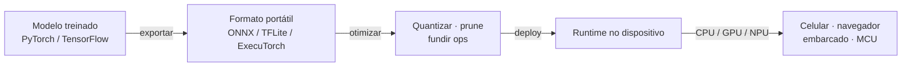

## Definição

**Edge AI** (IA na borda) é a prática de executar inferência de machine learning diretamente no dispositivo que captura os dados — um celular, navegador, câmera, veículo, wearable ou microcontrolador — em vez de enviar esses dados para um servidor remoto. Ao manter a computação local, a IA na borda reduz a latência de rede, funciona offline, corta custos de nuvem e mantém dados sensíveis no dispositivo, preservando a privacidade.

O trade-off é a restrição: o hardware de borda tem muito menos memória, processamento e energia que uma GPU de datacenter. A IA na borda é, portanto, tanto sobre **compressão de modelos** — [quantização](/docs/quantization), pruning e destilação — quanto sobre os runtimes que executam esses modelos comprimidos de forma eficiente em hardware heterogêneo (CPUs, GPUs móveis, NPUs e DSPs).

## Como funciona

Um pipeline de borda típico pega um modelo treinado com um framework completo, exporta para um formato portátil, otimiza para o hardware alvo e o executa através de um runtime leve no dispositivo. Cada runtime desta categoria atende a uma fatia diferente desse cenário.

## Runtimes nesta categoria

- [**ONNX Runtime**](/docs/edge-ai/onnx) — Motor de inferência multiplataforma para modelos ONNX com provedores de execução em CPU, GPU e NPU.
- [**TensorFlow Lite**](/docs/edge-ai/tflite) — Runtime leve para inferência no dispositivo em Android, iOS, sistemas embarcados e microcontroladores.
- [**PyTorch Mobile**](/docs/edge-ai/pytorch-mobile) — Implante modelos PyTorch em dispositivos móveis e de borda usando TorchScript e o runtime de próxima geração ExecuTorch.

## Veja também

- [Quantização](/docs/quantization)
- [Otimização de inferência](/docs/inference-optimization)
- [Inferência local](/docs/local-inference)
- [Frameworks](/docs/frameworks)
