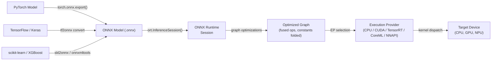

## Definição

ONNX Runtime (ORT) é uma biblioteca de inferência e aceleração de treinamento open-source e multiplataforma desenvolvida pela Microsoft. Seu objetivo principal é executar modelos no formato **Open Neural Network Exchange (ONNX)** — uma representação intermediária independente de framework para modelos de aprendizado de máquina — com alto desempenho em uma ampla gama de alvos de hardware e sistemas operacionais. O ORT não está vinculado a nenhum framework de treinamento único: modelos do PyTorch, TensorFlow, scikit-learn, LightGBM, XGBoost e outros podem ser exportados para ONNX e executados através da mesma API de runtime, tornando-o uma das soluções de inferência mais interoperáveis disponíveis.

Em seu núcleo, o ORT carrega um grafo ONNX, aplica uma extensa série de otimizações em nível de grafo (dobramento de constantes, fusão de nós, transformação de layout) e despacha operações para o melhor provedor de execução disponível para o hardware atual. A abstração do **Provedor de Execução (EP)** permite que o ORT roteie subgrafos para CPUs, GPUs NVIDIA via CUDA ou TensorRT, GPUs AMD via ROCm, hardware Intel via OpenVINO, Apple Silicon via CoreML, Android via NNAPI e Windows via DirectML — tudo através de uma superfície de API unificada. Isso torna o ORT adequado para um espectro de implantação que vai de servidores em nuvem a laptops Windows e dispositivos móveis.

O ONNX Runtime é particularmente valioso em ambientes corporativos e de produção onde um único pipeline de implantação deve servir modelos treinados em diferentes frameworks. É o backend de inferência que alimenta os endpoints do Azure ML, a biblioteca Optimum da Hugging Face, o Windows ML e muitos sistemas de recomendação e classificação em produção.

## Como funciona



### Formato ONNX e interoperabilidade de modelos

O ONNX representa um modelo como um grafo de computação acíclico dirigido onde os nós são operadores padronizados (p. ex. `Conv`, `MatMul`, `LayerNormalization`) definidos na especificação de operadores ONNX, e as arestas carregam tensores tipados. O formato é versionado: cada versão de opset do ONNX (atualmente 21) define o conjunto completo de operadores suportados e suas semânticas. O arquivo `.onnx` serializado em protobuf inclui a topologia do grafo, nomes de operadores, formas de tensores e valores de pesos constantes, tornando o formato autônomo e portátil.

### Otimizações de grafo

Quando uma `InferenceSession` é criada, o ORT aplica três níveis de otimização de grafo controlados pela configuração `GraphOptimizationLevel`. O nível 1 (básico) realiza reescritas seguras: dobramento de constantes, eliminação de nós redundantes, inferência de formas e remoção de identidades. O nível 2 (estendido) adiciona fusão de operações: `Conv + BatchNorm`, `Conv + Relu`, `Transpose + MatMul` e padrões similares são fundidos em kernels únicos. O nível 3 (otimização de layout) reestrutura os layouts de memória de tensores para corresponder ao que os provedores de execução preferem.

### Provedores de execução

O mecanismo de Provedor de Execução é a principal alavanca de extensibilidade e desempenho do ORT. O **EP de CPU** usa MLAS (Microsoft Linear Algebra Subprograms), uma implementação BLAS vetorizada à mão com suporte AVX-512 e NEON. O **EP de CUDA** descarrega convoluções e GEMMs para cuDNN e cuBLAS. O **EP de TensorRT** aplica a fusão de camadas e calibração de precisão do TensorRT para FP16 e INT8. O **EP de CoreML** delega ao Neural Engine da Apple em macOS e iOS. O **EP de DirectML** suporta inferência acelerada por hardware em qualquer GPU compatível com DirectX 12 no Windows.

### Quantização no ONNX Runtime

O ORT suporta inferência INT8 através do padrão de nó **QDQ (Quantize-Dequantize)**: o grafo ONNX contém nós explícitos `QuantizeLinear` e `DequantizeLinear` que representam os limites de precisão. A quantização estática requer um conjunto de dados de calibração para calcular escalas de entrada/saída; o pacote Python `onnxruntime.quantization` fornece as funções `quantize_static` e `quantize_dynamic`.

### Implantação móvel e em borda

ORT Mobile é uma compilação reduzida do ONNX Runtime para Android e iOS que remove operadores não utilizados e bibliotecas EP, reduzindo o tamanho binário para ~1-3 MB comprimido. No Android, o EP de NNAPI delega ao acelerador de hardware. No iOS e macOS, o EP de CoreML usa o Apple Neural Engine.

## Quando usar / Quando NÃO usar

| Usar quando | Evitar quando |
|---|---|
| Você precisa de inferência independente de framework — servir modelos de PyTorch, TF e scikit-learn através de um único runtime | Seu alvo de implantação é um microcontrolador com \<256 KB de RAM (TFLM cobre melhor isso) |
| Você está construindo pipelines de ML corporativos no Windows/Azure onde ferramentas Microsoft já estão em uso | Você precisa de delegação de hardware Android profunda com ferramentas maduras hoje (TFLite é mais testado para Android) |
| Você precisa de aceleração NVIDIA TensorRT sem gerenciar diretamente a API TensorRT | Seu modelo usa ops personalizadas sem equivalente ONNX |
| Você quer inferência em navegador/WASM para o mesmo modelo que executa no servidor | Sua equipe é nativa do PyTorch e quer o ciclo mais apertado possível do treinamento ao mobile |
| Portabilidade multiplataforma é uma preocupação de primeira classe (mesmo modelo no Windows, Linux, macOS, Android, iOS) | Você precisa de treinamento em tempo real ou aprendizado online na borda |

## Comparações

Comparação do ONNX Runtime com TFLite e PyTorch Mobile para cenários de implantação em borda e multiplataforma.

| Critério | ONNX Runtime | TensorFlow Lite | PyTorch Mobile |
|---|---|---|---|
| Suporte de plataforma | Windows, Linux, macOS, Android, iOS, WASM, nuvem — cobertura mais ampla | Android, iOS, Linux embarcado, microcontroladores (TFLM) | Android, iOS; ExecuTorch estende para embarcado e bare-metal |
| Conversão de modelo | Qualquer framework → exportação ONNX (caminho mais interoperável, múltiplos conversores) | TF/Keras → TFLite Converter (maduro, apenas ecossistema TF) | PyTorch → TorchScript ou ExecuTorch (nativo PyTorch, menor fricção para usuários de PT) |
| Desempenho no dispositivo | EP de CPU com MLAS é competitivo; EPs TensorRT/CUDA lideram para GPU; EPs CoreML/NNAPI para mobile | Excelente no Android via NNAPI/delegado GPU; melhor da categoria para microcontroladores | XNNPACK em CPUs ARM; GPU Vulkan; delegação de NPU ExecuTorch |
| Ecossistema | Independente de framework; Hugging Face Optimum; Windows ML; Azure ML; forte adoção empresarial | Maduro: MediaPipe, TF Hub, Model Garden; maior comunidade de ML mobile | Forte em pesquisa; Hugging Face; comunidade ExecuTorch em crescimento |
| Suporte de quantização | INT8 via nós QDQ; PTQ dinâmico e estático; QAT; INT8 de hardware via EP | Abrangente: faixa dinâmica, INT8, FP16, QAT com caminhos INT8 completos | PTQ (INT8 dinâmico + estático) e QAT via torch.ao.quantization |

## Prós e contras

| Prós | Contras |
|---|---|
| Independente de framework: qualquer modelo exportável ONNX funciona com o mesmo runtime | A exportação ONNX pode falhar para modelos com ops não suportadas ou personalizadas |
| Maior cobertura de provedor de execução: CPU, CUDA, TensorRT, DirectML, CoreML, NNAPI, OpenVINO | Depurar grafos ONNX é mais difícil que depurar no framework nativo |
| Forte integração Windows e Azure; cidadão de primeira classe no stack ML da Microsoft | Mais complexidade operacional que TFLite para cenários puros de Android/iOS |
| Hugging Face Optimum fornece quantização e otimização de alto nível para transformers | O versionamento de opset ONNX pode criar fricção de compatibilidade entre exportadores e versões do ORT |
| Desempenho CPU competitivo via MLAS com vetorização AVX-512 e NEON | O tamanho binário mobile é maior que TFLite quando todos os EPs são incluídos |

## Exemplos de código

```python
import numpy as np
import torch
import torch.nn as nn
import onnxruntime as ort

# ── 1. Define a simple model in PyTorch ───────────────────────────────────────
class SimpleClassifier(nn.Module):
    """Minimal classifier for demonstration."""

    def __init__(self, input_dim: int = 784, num_classes: int = 10):
        super().__init__()
        self.net = nn.Sequential(
            nn.Linear(input_dim, 128),
            nn.ReLU(),
            nn.Linear(128, 64),
            nn.ReLU(),
            nn.Linear(64, num_classes),
        )

    def forward(self, x: torch.Tensor) -> torch.Tensor:
        return self.net(x)


model = SimpleClassifier()
# Switch to inference mode: disables dropout, BatchNorm uses running statistics
model.train(False)

# ── 2. Export PyTorch model to ONNX ──────────────────────────────────────────
dummy_input = torch.randn(1, 784)  # batch=1, flattened 28x28 image

torch.onnx.export(
    model,
    dummy_input,
    "model.onnx",
    opset_version=17,                         # target ONNX opset
    input_names=["input"],
    output_names=["logits"],
    dynamic_axes={
        "input":  {0: "batch_size"},          # allow variable batch size
        "logits": {0: "batch_size"},
    },
    do_constant_folding=True,                 # fold constant sub-expressions during export
)
print("Exported model.onnx")

# ── 3. Apply INT8 post-training dynamic quantization ─────────────────────────
from onnxruntime.quantization import quantize_dynamic, QuantType

quantize_dynamic(
    "model.onnx",
    "model_int8.onnx",
    weight_type=QuantType.QInt8,              # quantize weights to INT8
)
print("Quantized model saved as model_int8.onnx")

# ── 4. Run inference with ONNX Runtime ───────────────────────────────────────
# SessionOptions allow controlling graph optimization level and thread counts
sess_options = ort.SessionOptions()
sess_options.graph_optimization_level = ort.GraphOptimizationLevel.ORT_ENABLE_ALL

# Providers list is checked in order; falls back to CPU if GPU is unavailable
providers = ["CUDAExecutionProvider", "CPUExecutionProvider"]
session = ort.InferenceSession("model_int8.onnx", sess_options, providers=providers)

print(f"Active execution provider: {session.get_providers()[0]}")

# Prepare a batch of random inputs as float32 numpy arrays
batch = np.random.randn(4, 784).astype(np.float32)
input_name = session.get_inputs()[0].name
output_name = session.get_outputs()[0].name

outputs = session.run([output_name], {input_name: batch})
logits = outputs[0]                          # shape (4, 10)
predicted_classes = np.argmax(logits, axis=1)
print(f"Batch predictions: {predicted_classes}")
```

## Recursos práticos

- [Documentação do ONNX Runtime](https://onnxruntime.ai/docs/) — referência oficial cobrindo instalação, provedores de execução, otimização de grafos, quantização e implantação mobile para todas as plataformas suportadas.
- [Referência da API Python do ONNX Runtime](https://onnxruntime.ai/docs/api/python/api_summary.html) — documentação detalhada da API para `InferenceSession`, `SessionOptions`, provedores de execução e o subpacote de quantização.
- [Hugging Face Optimum](https://huggingface.co/docs/optimum/onnxruntime/overview) — biblioteca de alto nível que envolve o ORT para otimização de modelos transformer, fornecendo classes `ORTModelForXxx` e `ORTQuantizer`.
- [ONNX Model Zoo](https://github.com/onnx/models) — repositório curado de modelos ONNX pré-treinados abrangendo visão computacional, NLP, fala e ML clássico.
- [Guia de implantação mobile do ONNX Runtime](https://onnxruntime.ai/docs/tutorials/mobile/) — tutorial passo a passo para construir um aplicativo ORT mínimo para Android ou iOS.

## Veja também

- [TensorFlow Lite](/docs/edge-ai/tflite)
- [PyTorch Mobile](/docs/edge-ai/pytorch-mobile)
- [PyTorch](/docs/frameworks/pytorch)
- [TensorFlow](/docs/frameworks/tensorflow)
