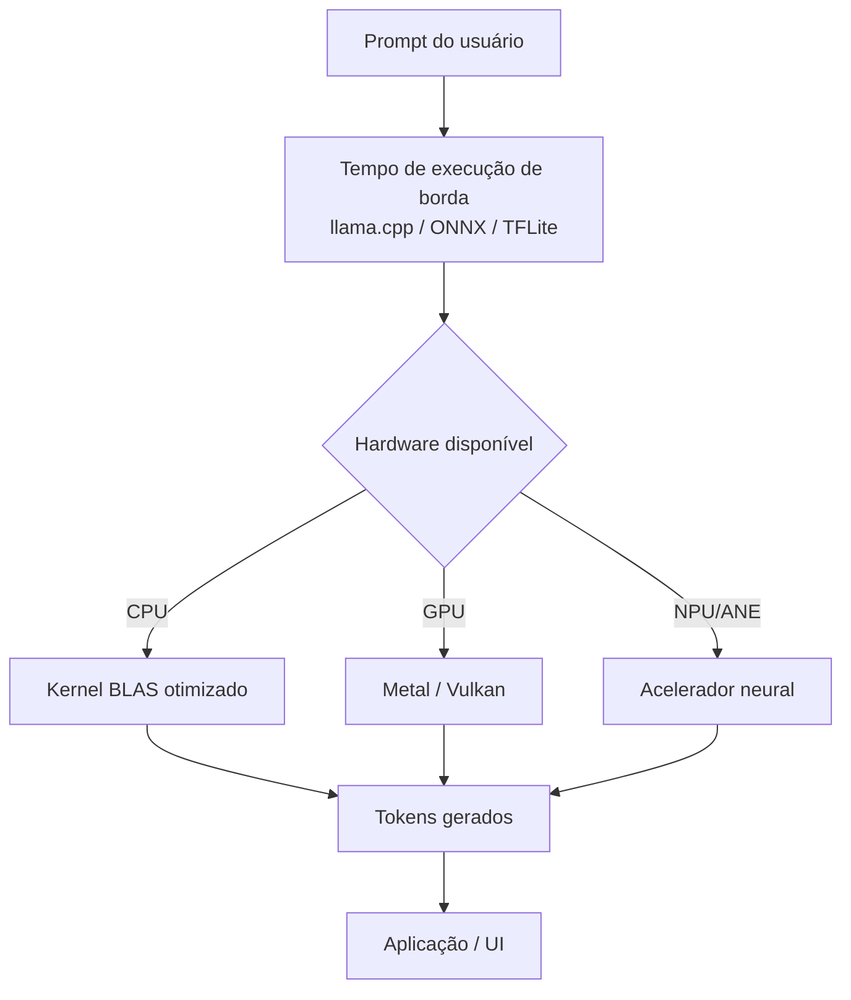

## Definição

Raciocínio de borda refere-se à execução de modelos de linguagem — ou qualquer modelo de ML de propósito geral — diretamente em hardware do dispositivo (smartphones, laptops, dispositivos IoT, gateways de borda) em vez de enviar dados para um servidor em nuvem. A mudança é motivada por quatro forças: **privacidade** (dados pessoais nunca saem do dispositivo), **latência** (nenhuma ida e volta de rede, resposta em \<100ms), **custo** (sem taxas de API por token) e **disponibilidade offline** (funciona sem conectividade). À medida que LLMs shrink abaixo de 7 bilhões de parâmetros e técnicas de quantização os comprimem para 4-8 bits, um smartphone moderno ou MacBook consegue executar modelos que antes exigiam uma GPU de data center.

A pilha técnica para raciocínio de borda combina três elementos: **modelos quantizados** (GGUF via llama.cpp, ONNX, TFLite, Core ML), **tempos de execução otimizados** que exploram aceleração de hardware específica do dispositivo (Metal/ANE da Apple, Vulkan/NNAPI do Android, NPUs no Silicon da Apple e Snapdragon), e **seleção de modelo** equilibrando capacidade versus budget de memória. Ferramentas como Ollama e LM Studio abstraem a complexidade de execução, enquanto o llama.cpp e o MLC LLM fornecem controle de baixo nível. Para modelos não-LLM (classificação de imagem, detecção de objetos), o ONNX Runtime e o TFLite Delegate são os tempos de execução padrão da indústria.

O raciocínio de borda não substitui a inferência em nuvem universalmente — modelos frontier grandes (GPT-4, Claude 3 Opus) excedem em muito as capacidades de dispositivos edge — mas é a escolha correta para aplicações sensíveis à privacidade, implantações offline, protótipos de baixo custo e integração em produtos de consumo onde APIs de terceiros introduzem dependências inaceitáveis.

## Como funciona

### Preparação do modelo

Os modelos de peso completo (float32 ou bfloat16) são preparados para edge via **quantização** (reduzindo para int8 ou int4, frequentemente 4-bit GGUF para LLMs), **poda** (removendo pesos com zero), **destilação de conhecimento** (treinando um modelo menor para imitar um maior), e conversão para um formato de tempo de execução de dispositivo (ONNX, TFLite, GGUF, Core ML). Cada etapa troca precisão por tamanho/velocidade.

### Tempo de execução e aceleração de hardware

O modelo preparado é carregado por um **tempo de execução de inferência** que mapeia operações para unidades de hardware disponíveis: CPU (geralmente via BLAS), GPU (Metal, Vulkan, CUDA), ou NPU/ANE. Tempos de execução modernos otimizam o agendamento de kernels, gerenciamento de memória e formatos de tensor para o hardware-alvo. llama.cpp, por exemplo, usa código GGML otimizado para manter toda a atenção multi-cabeça na memória de CPU/GPU sem precisar de bibliotecas CUDA.

### Caching e KV-store

Para conversas longas, os estados de chave-valor de atenção são armazenados em cache entre turnos para evitar recomputação. Na borda, o tamanho do cache KV é um recurso escasso — modelos com janelas de contexto menores e atenção agrupada por consulta (GQA) gerenciam melhor os budgets de memória.



## Quando usar / Quando NÃO usar

| Usar quando | Evitar quando |
|---|---|
| Privacidade exige que dados permaneçam no dispositivo | O modelo requerido é muito grande para hardware de borda (\>30B parâmetros) |
| Uso offline ou conectividade de rede não confiável | Tarefas que exigem capacidade de raciocínio de modelo frontier |
| Latência é crítica e a ida e volta de rede é inaceitável | Custo de desenvolvimento de uma pipeline edge bem otimizada é proibitivo |
| Custo de API por token é muito alto em escala | Atualizações frequentes de modelo são necessárias (re-implantação em dispositivo é lenta) |

## Comparações

| Critério | Inferência em nuvem | Raciocínio de borda |
|---|---|---|
| **Latência** | 200-2000ms (depende da rede) | \<100ms (CPU), \<50ms (GPU/NPU) |
| **Privacidade** | Dados enviados para servidor | Dados permanecem no dispositivo |
| **Tamanho do modelo** | Modelos frontier ilimitados | Limitado por RAM do dispositivo (tipicamente \<7B) |
| **Custo** | Taxa de API por token | Custo único de hardware |
| **Disponibilidade offline** | Não | Sim |
| **Complexidade de implantação** | Baixa (chamada de API) | Alta (otimização de tempo de execução) |

## Exemplos de código

```python
# Inferência llama.cpp via Python com llama-cpp-python
# pip install llama-cpp-python

from llama_cpp import Llama

# Carregar modelo GGUF quantizado localmente (baixar de HuggingFace primeiro)
# Exemplo: Llama-3.2-3B-Instruct-Q4_K_M.gguf (~2GB)
llm = Llama(
    model_path="./models/Llama-3.2-3B-Instruct-Q4_K_M.gguf",
    n_ctx=4096,       # tamanho da janela de contexto
    n_gpu_layers=-1,  # offload todas as camadas para GPU se disponível
    verbose=False,
)

# Inferência de completação de chat
response = llm.create_chat_completion(
    messages=[
        {"role": "system", "content": "Você é um assistente útil."},
        {"role": "user", "content": "Explique quantização de modelo em 2 frases."},
    ],
    max_tokens=256,
    temperature=0.7,
)
print(response["choices"][0]["message"]["content"])
```

```python
# Inferência ONNX Runtime para modelos de visão de borda
# pip install onnxruntime numpy pillow

import onnxruntime as ort
import numpy as np
from PIL import Image

# Carregar sessão ONNX (por exemplo, MobileNetV3 exportado)
sess = ort.InferenceSession(
    "mobilenetv3_small.onnx",
    providers=["CPUExecutionProvider"],  # ou "CoreMLExecutionProvider" em macOS
)

# Pré-processar imagem de entrada
img = Image.open("test_image.jpg").resize((224, 224))
x = np.array(img, dtype=np.float32) / 255.0
x = (x - [0.485, 0.456, 0.406]) / [0.229, 0.224, 0.225]  # normalizar ImageNet
x = x.transpose(2, 0, 1)[np.newaxis]  # HWC -> NCHW

# Executar inferência
input_name = sess.get_inputs()[0].name
logits = sess.run(None, {input_name: x})[0]
predicted_class = np.argmax(logits)
print(f"Classe prevista: {predicted_class}")
```

## Recursos práticos

- [llama.cpp](https://github.com/ggerganov/llama.cpp) — Inferência C++ de alto desempenho para LLMs com suporte GGUF; backend para Ollama e LM Studio
- [Ollama](https://ollama.com/) — Gerenciador de modelos de borda CLI que abstrai llama.cpp com servidor REST simples
- [MLC LLM](https://llm.mlc.ai/) — Compilação de modelos via TVM para iPhone, Android e WebGPU com backends Metal/Vulkan
- [ONNX Runtime](https://onnxruntime.ai/) — Tempo de execução de inferência de modelos multiplataforma com provedores de execução CPU/GPU/NPU
- [HuggingFace – Hub de modelos GGUF](https://huggingface.co/models?library=gguf) — Repositório de modelos quantizados prontos para inferência edge

## Veja também

- [Inferência local](/docs/local-inference)
- [Quantização](/docs/quantization)
- [Compressão de modelos](/docs/model-compression)
- [Edge AI](/docs/edge-ai/onnx)
