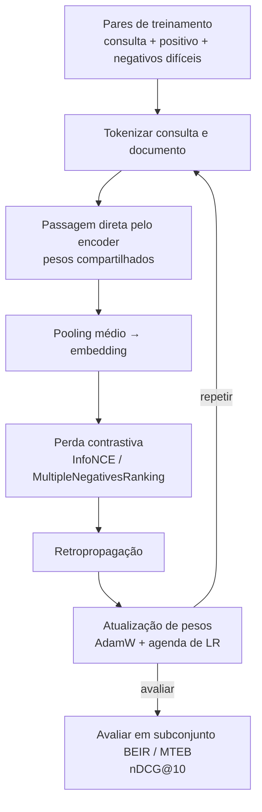

## Definição

**Ajustar fino um modelo de embedding** adapta um encoder de propósito geral pré-treinado a um domínio ou tarefa específica continuando o treinamento em pares (consulta, documento) relevantes para o domínio. Modelos prontos para uso treinados em texto geral da web frequentemente têm desempenho inferior em corpora especializados (jurídico, biomédico, financeiro, código) porque o vocabulário e as relações semânticas diferem da distribuição de treinamento. O ajuste fino pode fechar essa lacuna substancialmente: um modelo BGE ou Nomic ajustado ao domínio frequentemente iguala ou supera um modelo geral maior no benchmark de recuperação do domínio-alvo.

O objetivo de treinamento padrão é a **perda contrastiva** (InfoNCE / NT-Xent): para cada consulta âncora, o modelo aprende a atribuir uma pontuação de similaridade maior ao documento positivo verdadeiro do que aos documentos negativos (negativos aleatórios ou, mais efetivamente, negativos difíceis que são semanticamente similares mas não são a resposta correta).

## Como funciona

### Dados de treinamento

O ajuste fino requer pares (consulta, documento_positivo). Fontes:

| Fonte | Tamanho necessário | Notas |
|---|---|---|
| Pares consulta-passagem rotulados por humanos | 1.000–10.000 | Maior qualidade; caro de coletar |
| Positivos minerados por BM25 do corpus do domínio | 10.000–100.000 | Rápido; menor precisão — filtrar pares ruidosos |
| Sintéticos (consultas geradas por LLM para cada passagem) | 5.000–50.000 | GPT-4o / Claude gera consultas realistas por chunk |
| Conjuntos de dados públicos de IR existentes (MS-MARCO, NQ) | N/A | Domínio geral; útil para aquecimento |

Gerar consultas sintéticas com um LLM por chunk de documento é a abordagem mais prática para novos domínios: solicitar ao modelo professor o documento e pedir que gere 3–5 consultas plausíveis de usuário.

### Mineração de negativos difíceis

Negativos aleatórios (documentos extraídos uniformemente do corpus) são fáceis demais — o modelo aprende trivialmente a separá-los. Negativos difíceis são documentos topicamente similares à consulta, mas que não são a resposta verdadeira. Eles forçam o modelo a aprender distinções refinadas.

Negativos difíceis podem ser minerados por:
1. Executar recuperação BM25 e usar documentos não relevantes classificados no topo.
2. Executar o modelo de embedding atual e usar resultados top-k que não são o positivo.
3. Usar pontuações de cross-encoder para identificar pares de alta similaridade mas não relevantes.

### Treinamento Matryoshka

Para produzir embeddings compatíveis com MRL, adicionar um termo de perda Matryoshka que computa a perda contrastiva em múltiplas dimensões truncadas (ex.: 768, 512, 256, 128) simultaneamente durante o treinamento. O modelo resultante suporta truncamento flexível em produção com perda mínima de qualidade por nível de dimensão. `sentence-transformers` (v3.3+) suporta nativamente o treinamento Matryoshka via `MatryoshkaLoss`.

### Avaliação

Avaliar em um conjunto de recuperação reservado usando nDCG@10 (Normalized Discounted Cumulative Gain). Para tarefas específicas de domínio, construir um pequeno conjunto de avaliação no estilo BEIR (100–500 consultas com documentos relevantes anotados) antes e depois do ajuste fino para medir a melhoria.

## Quando usar / Quando NÃO usar

| Cenário | Ajustar fino embeddings | Usar pronto para uso |
|---|---|---|
| Domínio tem vocabulário especializado (jurídico, biomédico, código) | Sim — modelos gerais têm desempenho inferior em texto OOD | Não — domínio de texto geral da web |
| Precisão do RAG está abaixo do limiar aceitável | Sim — ajuste ao domínio melhora o recall de recuperação | Não — verificar chunking e reranqueamento primeiro |
| Tem > 1.000 pares rotulados ou gerados por LLM | Sim — dados suficientes para ganhos significativos | Não — conjuntos de dados muito pequenos podem ter overfitting |
| Recuperação específica de domínio multilíngue | Sim — ajuste fino a partir de base multilíngue (Qwen3, Jina v5) | Não — se somente em inglês |
| Tempo para produção é &lt; 1 semana | Não — usar pronto para uso; ajustar fino depois | Sim — pronto para uso é rápido |

## Fontes

- [Sentence-Transformers: fine-tuning guide](https://www.sbert.net/docs/training/overview.html)
- [BEIR: a heterogeneous benchmark for zero-shot evaluation — arXiv 2104.08663](https://arxiv.org/abs/2104.08663)
- [Matryoshka representation learning — arXiv 2205.13147](https://arxiv.org/abs/2205.13147)
- [Best embedding models 2025: MTEB scores and leaderboard — Ailog RAG](https://app.ailog.fr/en/blog/guides/choosing-embedding-models)

## Veja também

- [Embeddings](/docs/embeddings)
- [Interação tardia — ColBERT](/docs/embeddings/late-interaction-colbert)
- [Embeddings RAG](/docs/rag/embeddings)
- [Ajuste fino de LLMs](/docs/llms/fine-tuning)
- [Busca semântica](/docs/semantic-search)
