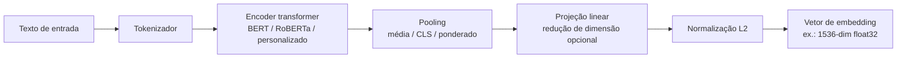

## Definição

Um **modelo de embedding** mapeia texto (tokens, sentenças ou documentos) para um vetor denso de comprimento fixo em um espaço de alta dimensão onde textos semanticamente similares estão geometricamente próximos. Esses vetores são a base da busca semântica, recuperação RAG, agrupamento e classificação — qualquer tarefa que exige comparar ou organizar texto por significado em vez de sobreposição exata de palavras-chave.

As propriedades-chave de um modelo de embedding são:

- **Dimensionalidade** — número de floats por vetor; valores comuns são 384, 768, 1.536 e 3.072. Maior dimensionalidade frequentemente, mas não sempre, significa melhor qualidade.
- **Comprimento máximo de sequência** — a janela de contexto que o modelo pode codificar; modelos variam de 512 tokens (era BERT) a 32.000+ tokens (embeddings modernos de longo contexto).
- **Normalização** — a maioria dos modelos modernos produz vetores normalizados por L2, permitindo que a similaridade de cosseno seja calculada como um produto escalar (mais rápido em escala).
- **Suporte multilíngue** — modelos variam de suporte apenas ao inglês a 100+ idiomas.

**Matryoshka Representation Learning (MRL)** é agora o padrão da indústria para embeddings de tamanho flexível (2026): as primeiras N dimensões de um vetor MRL formam por si só um embedding de menor dimensão significativo, permitindo armazenamento e busca em dimensões truncadas (ex.: 256 em vez de 3.072) com apenas 2–3% de perda de qualidade, reduzindo os custos de armazenamento em 4×.

## Como funciona

**Tokenizar:** o texto é dividido em subtokens. **Codificar:** um transformer processa todos os tokens em paralelo, produzindo representações contextuais dos tokens. **Fazer pooling:** as representações de tokens são agregadas em um único vetor de sentença (pooling médio é o mais comum para embeddings de sentença). **Projetar:** uma camada linear opcional reduz a dimensão (ex.: 768→256 para truncamento MRL). **Normalizar:** a normalização L2 permite que a similaridade de cosseno seja calculada como produto escalar.

## Benchmark MTEB

O **Massive Text Embedding Benchmark (MTEB)** é o conjunto de avaliação padrão para modelos de embedding, cobrindo 56+ tarefas em recuperação, agrupamento, classificação, reranqueamento e similaridade semântica em múltiplos idiomas. O MTEB v2 (2026) expandiu a cobertura para 100+ idiomas e adicionou faixas multimodais.

Principais modelos no MTEB em março de 2026:

| Modelo | Pontuação MTEB | Dim | Máx. tokens | MRL | Custo |
|---|---|---|---|---|---|
| Qwen3-Embedding-8B | 70,6 | 4.096 | 32.768 | Sim | Peso aberto |
| Gemini Embedding 2 (preview) | 68,3 | 3.072 | 32.000 | Sim | API ($) |
| OpenAI text-embedding-3-large | 64,6 | 3.072 | 8.191 | Sim | API ($) |
| Cohere Embed v4 | ~64 | 1.536 | 512 | Sim | API ($) |
| Nomic Embed v1.5 | ~62 | 768 | 8.192 | Sim | Peso aberto |

**Insight-chave (2026):** modelos de peso aberto (Qwen3-Embedding-8B) agora superam modelos de API fechados no MTEB, uma reversão em relação a 2024 quando a OpenAI liderava.

## Quando usar / Quando NÃO usar

| Cenário | Usar embeddings densos | Evitar |
|---|---|---|
| Busca semântica em um corpus grande | Sim — embeddings capturam significado além de palavras-chave | Não — BM25 apenas por palavras-chave perde paráfrases |
| Recuperação RAG | Sim — embutir consultas e chunks; recuperar por similaridade | Não — para busca por correspondência exata, use busca em texto completo |
| Recuperação entre idiomas | Sim — modelos multilíngues (Qwen3, Jina v5) | Não — modelos somente em inglês para corpora em outros idiomas |
| Dados estruturados curtos (SKUs, códigos) | Não — busca por palavras-chave é mais rápida e precisa | Sim — usar BM25 ou correspondência exata em vez disso |
| Documentos muito longos (> 32 k tokens) | Com chunking — nenhum modelo codifica um livro inteiro | Modelos de interação tardia (ColBERT) lidam com documentos mais longos |

## Fontes

- [MTEB leaderboard — HuggingFace](https://huggingface.co/spaces/mteb/leaderboard)
- [Embedding model leaderboard: MTEB rankings March 2026 — AwesomeAgents](https://awesomeagents.ai/leaderboards/embedding-model-leaderboard-mteb-march-2026/)
- [Best embedding models 2026: MTEB benchmarks + pricing — PEC Collective](https://pecollective.com/tools/best-embedding-models/)
- [Which embedding model should you actually use in 2026? — DEV Community](https://dev.to/chen_zhang_bac430bc7f6b95/which-embedding-model-should-you-actually-use-in-2026-i-benchmarked-10-models-to-find-out-58bc)
- [Top embedding models on the MTEB leaderboard — Modal](https://modal.com/blog/mteb-leaderboard-article)

## Veja também

- [Ajuste fino de embeddings](/docs/embeddings/fine-tuning-embeddings)
- [Interação tardia — ColBERT](/docs/embeddings/late-interaction-colbert)
- [Embeddings RAG](/docs/rag/embeddings)
- [Busca semântica](/docs/semantic-search)
- [Bancos de dados vetoriais](/docs/rag/vector-databases)
