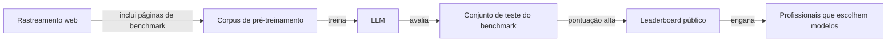

## Definição

**Contaminação de benchmark** (também chamada de **contaminação de dados** ou **vazamento de conjunto de teste**) ocorre quando exemplos do split de teste de um benchmark aparecem — verbatim ou quase verbatim — no corpus de pré-treinamento ou fine-tuning de um modelo. Quando um modelo "viu" as respostas durante o treinamento, suas pontuações no benchmark não refletem mais a verdadeira generalização; elas refletem memorização.

A contaminação é um problema difundido na era dos LLMs porque os corpora de pré-treinamento são rastreados da web em uma escala que torna praticamente impossível garantir que nenhuma questão de benchmark tenha sido indexada. Benchmarks populares como MMLU, HumanEval, GSM8K e BIG-Bench foram todos encontrados em conjuntos de dados de treinamento amplamente usados.

A consequência é que os rankings de leaderboard se tornam sinais não confiáveis de capacidade no mundo real. Um modelo que obtém 90% em um benchmark contaminado pode ter desempenho significativamente pior em uma versão nova e não vista da mesma tarefa.

## Como funciona

O caminho de contaminação é tipicamente indireto: problemas de benchmark são publicados na web (GitHub, Kaggle, ArXiv, datasets do HuggingFace), raspados em conjuntos de dados estilo common-crawl, e então incluídos no pré-treinamento. A deduplicação remove duplicatas exatas, mas não detecta contaminação por paráfrase.

## Métodos de detecção

| Método | Descrição | Ponto forte |
|---|---|---|
| Sobreposição de N-gramas | Verifica se n-gramas longos das questões de teste aparecem nos dados de treinamento | Rápido, mas não detecta paráfrases |
| Min-K% prob | Mede se o modelo atribui probabilidade incomumente alta aos tokens do benchmark | Agnóstico ao modelo, requer logprobs |
| Inserção de canário | Planta questões de teste sintéticas; verifica se o modelo as reproduz | Controlado, orientado ao futuro |
| Teste de variantes da tarefa | Testa versões levemente reformuladas; queda de pontuação revela memorização | Prático para profissionais |
| Inferência de membros | Treina um classificador binário para distinguir exemplos vistos de não vistos | Nível de pesquisa, alta precisão |

## Estratégias de mitigação

- **Benchmarks dinâmicos**: Use benchmarks que são continuamente atualizados com novas questões (ex: LiveCodeBench, LMSys Arena) em vez de conjuntos de teste estáticos.
- **Avaliação consciente de contaminação**: Reporte resultados tanto no benchmark padrão quanto em um subconjunto sabidamente limpo.
- **Filtragem por descontaminação**: Antes do treinamento, remova exemplos cuja sobreposição de n-gramas com conjuntos de teste de benchmark exceda um limiar (ex: sobreposição de 13-gramas).
- **Conjuntos de avaliação retidos**: Mantenha conjuntos de teste internos privados e não divulgados; compartilhe apenas métricas agregadas.
- **Sondagem comportamental**: Complemente benchmarks com variantes adversariais, contrafactuais e cadeias de raciocínio em múltiplas etapas que são mais difíceis de memorizar.

## Quando se preocupar com contaminação

| Situação | Nível de risco |
|---|---|
| Usar um modelo treinado em dados públicos para um benchmark público | Alto — assuma alguma contaminação |
| Fine-tuning em dados do usuário para uma tarefa privada | Baixo — a menos que os dados de fine-tuning contenham exemplos de benchmark |
| Comparar modelos em um benchmark em que ambos foram treinados | Alto — diferenças podem refletir grau de contaminação |
| Usar um benchmark dinâmico ao vivo (Arena, LiveCodeBench) | Baixo — questões são rotacionadas antes do treinamento |
| Construir evals internas com casos de teste proprietários | Baixo — não indexados publicamente |

## Fontes

- [Survey de contaminação — Arxiv 2024](https://arxiv.org/abs/2311.04850) — análise sistemática de contaminação de benchmark em grandes LLMs
- [Paper do método Min-K% Prob](https://arxiv.org/abs/2310.16789) — detecção de contaminação sem treinamento via análise de probabilidade de tokens
- [LiveCodeBench](https://livecodebench.github.io/) — benchmark de programação atualizado continuamente para reduzir contaminação
- [Descontaminação no relatório técnico do GPT-4](https://arxiv.org/abs/2303.08774) — metodologia de descontaminação da OpenAI para avaliação do GPT-4

## Veja também

- [Evals](/docs/evals)
- [LLM-as-judge](/docs/evals/llm-as-judge)
- [Frameworks de eval](/docs/evals/eval-frameworks)
- [Benchmarks](/docs/benchmarks)
