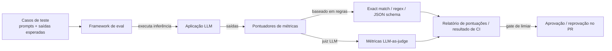

## Definição

**Frameworks de eval para LLM** fornecem as ferramentas para definir casos de teste, executar métricas, coletar resultados e integrar a avaliação aos fluxos de desenvolvimento. Eles diferem principalmente pelo artefato-alvo (prompt, pipeline de RAG, agente), pela filosofia de métricas (baseadas em regras vs. LLM-as-judge) e pelo modelo de implantação (CLI, biblioteca Python ou plataforma SaaS).

A escolha do framework correto depende do que está sendo avaliado: um template de prompt, um pipeline de recuperação, um agente ou uma aplicação completa — e se você precisa de avaliação offline em batch, testes de regressão com gate de CI ou monitoramento de produção online.

## Como funciona

## Comparação de frameworks

| Critério | RAGAS | promptfoo | DeepEval | Braintrust |
|---|---|---|---|---|
| **Alvo principal** | Pipelines de RAG | Teste de prompts e red-teaming | Apps e agentes LLM | Eval full-stack + observabilidade |
| **Estilo de métrica** | Métricas RAG sem referência | Baseadas em regras + LLM-as-judge | LLM-as-judge (G-Eval, métrica DAG) | LLM-as-judge + Python customizado |
| **Interface** | Python SDK | CLI (config YAML/JSON) | Python SDK (estilo pytest) | UI web + Python SDK |
| **CI/CD** | Via Python | Integração CLI de primeira classe | De primeira classe (saída pytest) | Integração com GitHub Actions |
| **Tracing** | Parcial | Não | Não | Sim — built-in |
| **Revisão humana** | Não | Não | Não | Sim — fila de anotação |
| **Implantação** | Open source | Open source | Open source + cloud | SaaS (nível gratuito disponível) |
| **Destaques** | Fidelidade, relevância de resposta, recall de contexto | Specs de teste declarativas em YAML, plugins de red-team | 50+ métricas, eval de DAG de agentes, 3M+ downloads mensais | Loga cada chamada; compara distribuições de pontuações entre versões |

## RAGAS

RAGAS (Retrieval-Augmented Generation Assessment) fornece métricas sem referência para pipelines de RAG. As métricas principais incluem:
- **Fidelidade**: A resposta contém apenas afirmações suportadas pelo contexto recuperado?
- **Relevância da resposta**: A resposta aborda a questão feita?
- **Recall do contexto**: O contexto recuperado contém a informação necessária para responder?
- **Precisão do contexto**: Quanto do contexto recuperado é realmente relevante?

O RAGAS avalia sem exigir respostas de ground truth, tornando-o prático para conjuntos de dados de produção onde a rotulagem é cara.

## promptfoo

O promptfoo é um framework CLI-first para engenheiros de prompt e desenvolvedores que querem testar prompts como testes unitários. As specs de teste são YAML ou JSON declarativos: defina prompts, variáveis, provedores e asserções. As asserções incluem contains, regex, JSON schema, limite de custo e plugins de juiz LLM. Possui forte suporte a red-teaming (injeção de prompt, sondas de jailbreak) integrado.

## DeepEval

O DeepEval é Python-nativo e se integra com pytest, tornando-o familiar para engenheiros de back-end. Inclui 50+ métricas (a partir de 2025), incluindo G-Eval, alucinação, relevância de resposta, fidelidade, toxicidade e uma métrica DAG para avaliar árvores de decisão de agentes. Tem como alvo a disciplina de testes unitários: cada métrica tem um limiar, e métricas que falham reprovam o teste.

## Braintrust

O Braintrust combina avaliação com tracing e revisão humana em uma plataforma única. Cada chamada LLM é registrada como um trace, funções de eval rodam sobre os traces armazenados, e distribuições de pontuação podem ser comparadas entre versões de prompt em uma UI web. É particularmente útil para equipes que querem uma única ferramenta de observabilidade + eval em vez de combinar várias ferramentas.

## Fontes

- [Documentação do RAGAS](https://docs.ragas.io/en/latest/) — métricas de avaliação de RAG sem referência
- [Documentação do promptfoo](https://www.promptfoo.dev/docs/intro) — teste de prompts e red-teaming via CLI
- [GitHub do DeepEval](https://github.com/confident-ai/deepeval) — framework open-source de avaliação de LLM com integração pytest
- [Documentação do Braintrust](https://www.braintrust.dev/docs) — plataforma integrada de eval, tracing e revisão humana
- [Comparação RAGAS vs TruLens vs DeepEval — Atlan](https://atlan.com/know/llm-evaluation-frameworks-compared/) — comparação de funcionalidades atualizada em 2026

## Veja também

- [Evals](/docs/evals)
- [LLM-as-judge](/docs/evals/llm-as-judge)
- [Contaminação de benchmark](/docs/evals/benchmark-contamination)
- [Observabilidade](/docs/observability)
- [RAG](/docs/rag)
