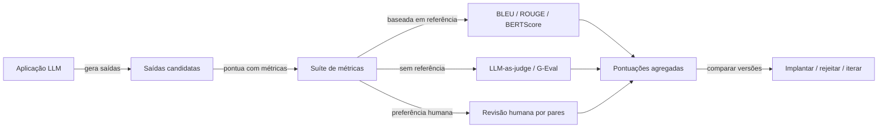

## Definição

**Avaliação de LLMs** (evals) é a disciplina de medir sistematicamente o desempenho de um modelo de linguagem ou sistema de IA em uma tarefa definida. Diferente dos testes tradicionais de software com critérios determinísticos de aprovação/reprovação, as saídas de LLMs são probabilísticas, abertas e dependentes de contexto — exigindo técnicas de avaliação específicas.

As evals operam em dois níveis. **Evals offline** são executadas sobre um conjunto de dados curado antes da implantação, detectando regressões em acurácia, coerência e segurança. **Evals online** rodam em produção, amostrando tráfego real para identificar desvios de distribuição e casos extremos que escaparam do conjunto de testes. Ambos os níveis dependem de um conjunto compartilhado de métodos de pontuação: métricas baseadas em referência (comparando com uma resposta correta), métricas sem referência (avaliando sem ground truth) e sinais de preferência humana.

Uma boa prática de avaliação começa com uma **especificação clara da tarefa**: o que significa "correto" para esse caso de uso? Só com isso definido é possível escolher as métricas e frameworks adequados. A avaliação também é iterativa — à medida que modelos e prompts mudam, as suítes de evals precisam crescer para evitar o overfitting de benchmarks.

## Como funciona

Um pipeline de eval ingere **entradas** (prompts de usuário ou casos de teste), passa-as pela aplicação para obter **saídas**, e então pontua essas saídas por meio de uma **suíte de métricas**. Os resultados são agregados em um scorecard que compara a versão candidata com uma baseline. Se as pontuações regredirem além de um limiar, a mudança é bloqueada ou sinalizada para revisão.

## Quando usar / Quando NÃO usar

| Cenário | Usar evals | Pular ou adiar |
|---|---|---|
| Implantando uma mudança de modelo em produção | Sim — detecte regressões antes dos usuários | Não — pular evals aumenta o risco de degradação silenciosa |
| Comparando duas versões de prompt | Sim — use LLM-as-judge por pares ou A/B | Não — avaliar algumas saídas manualmente não é confiável |
| Tarefas criativas altamente subjetivas | Sim — com pontuação de preferência humana | Não — métricas automáticas correlacionam mal com o gosto humano |
| Protótipo de pesquisa / demo descartável | Talvez — apenas verificações básicas de sanidade | Sim — o overhead de um harness completo de evals não vale a pena |
| Aplicações de segurança crítica | Sim — obrigatório, incluindo red-teaming adversarial | Não — nunca implante sem evals de segurança |

## Taxonomia de métricas de avaliação

| Categoria | Exemplos | Ground truth necessário | Ponto forte |
|---|---|---|---|
| Sobreposição lexical | BLEU, ROUGE-L | Sim | Rápido, barato |
| Similaridade semântica | BERTScore, similaridade cosseno | Sim (ou referência) | Ciente de linguagem |
| LLM-as-judge | G-Eval, por pares, ArenaGEval | Não | Flexível, alinhado ao humano |
| Específico para tarefa | EM, F1, code pass@k | Sim | Alto sinal para tarefas específicas |
| Específico para RAG | Fidelidade, relevância de resposta (RAGAS) | Não | Cobre recuperação + geração |

## Armadilhas comuns

- **Viés do juiz**: LLMs juízes inflam pontuações para saídas mais longas, bem formatadas ou geradas por si mesmos. Sempre valide seu juiz em uma amostra rotulada antes de confiar nele em escala.
- **Contaminação de benchmark**: Modelos podem ter visto perguntas de benchmark durante o pré-treinamento, inflando artificialmente as pontuações. Veja [contaminação de benchmark](/docs/evals/benchmark-contamination).
- **Desalinhamento métrica-objetivo**: Otimizar ROUGE não melhora a satisfação do usuário. Escolha métricas que se correlacionem com seu critério real de sucesso.
- **Conjuntos de dados estáticos**: Um conjunto de eval congelado torna-se explorável ao longo do tempo. Adicione continuamente casos difíceis vindos de falhas em produção.

## Fontes

- [DeepEval — framework de avaliação de LLM](https://github.com/confident-ai/deepeval) — biblioteca de testes unitários open-source para apps LLM com mais de 20M de avaliações diárias
- [RAGAS — framework de avaliação de RAG](https://docs.ragas.io/en/latest/) — avaliação sem referência para pipelines de geração aumentada por recuperação
- [Promptfoo — CLI de teste de prompts](https://www.promptfoo.dev/docs/intro) — teste de prompts e red-teaming declarativo baseado em YAML
- [Braintrust — plataforma de avaliação de IA](https://www.braintrust.dev/docs) — tracing, funções de eval e revisão humana em uma única plataforma
- [Paper G-Eval — avaliação de NLG usando GPT-4](https://arxiv.org/abs/2303.16634) — paper original do G-Eval com LLM juiz baseado em critérios

## Veja também

- [LLM-as-judge](/docs/evals/llm-as-judge)
- [Frameworks de eval](/docs/evals/eval-frameworks)
- [Contaminação de benchmark](/docs/evals/benchmark-contamination)
- [Métricas de avaliação](/docs/evaluation-metrics)
- [RAG](/docs/rag)
