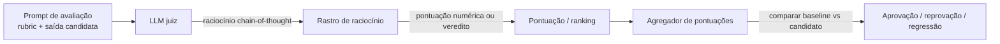

## Definição

**LLM-as-judge** é uma metodologia de avaliação na qual um modelo de linguagem poderoso (o "juiz") pontua ou classifica as saídas de outro modelo (o "candidato"). Como a anotação humana é cara e lenta, os juízes LLM oferecem uma alternativa escalável que se correlaciona surpreendentemente bem com a preferência humana — desde que o juiz e seus vieses sejam devidamente compreendidos.

O juiz recebe um rubric — um conjunto de critérios como acurácia, coerência, utilidade ou segurança — e produz uma pontuação escalar, um veredito de aprovação/reprovação ou um ranking. O rubric pode ser genérico (essa resposta é útil?) ou específico para a tarefa (essa query SQL retorna as linhas corretas?).

Três padrões dominantes emergiram:
- **G-Eval**: Pontuação baseada em critérios com chain-of-thought; o juiz raciocina sobre cada critério antes de produzir uma pontuação numérica em uma escala de 1–5 ou 1–10.
- **Comparação por pares**: Duas respostas são exibidas lado a lado; o juiz escolhe a melhor. Agregado em muitos pares, isso produz um ranking análogo a um ladder de Elo.
- **Pontuação guiada por referência**: O juiz compara a saída candidata com uma resposta de referência correta e pontua fidelidade ou completude.

## Como funciona

O prompt de avaliação empacota o rubric, a saída candidata e, opcionalmente, uma resposta de referência. O juiz raciocina passo a passo (chain-of-thought) antes de produzir uma pontuação, o que reduz erros de ancoragem. As pontuações em um conjunto de dados de teste são agregadas em uma métrica de média ou taxa de aprovação e comparadas com uma versão baseline.

## Quando usar / Quando NÃO usar

| Cenário | Usar LLM-as-judge | Usar outro método |
|---|---|---|
| Nenhuma referência de ground truth disponível | Sim — LLM juízes se destacam em tarefas abertas | Não — se você tem referências, BERTScore ou exact match são mais baratos |
| Necessidade de avaliar em escala (\>1K amostras/dia) | Sim — muito mais barato que anotação humana | Não — para conjuntos pequenos, revisão humana é mais confiável |
| Avaliando qualidade de escrita criativa | Sim — rubrics detalhados capturam estilo e tom | Não — métricas lexicais (BLEU) são inúteis para criatividade |
| Avaliação de segurança (conteúdo prejudicial) | Sim — juízes especializados em segurança (Llama Guard) | Não — juízes de uso geral perdem violações sutis de política |
| O candidato e o juiz são o mesmo modelo | Não — viés de auto-preferência infla pontuações | Sim — use um modelo de juiz diferente |

## Vieses conhecidos e mitigações

| Viés | Descrição | Mitigação |
|---|---|---|
| Viés de verbosidade | Juízes preferem respostas mais longas e detalhadas independentemente da qualidade | Normalize prompts por comprimento; use rubric que penalize explicitamente o padding |
| Auto-preferência | Um modelo avalia suas próprias saídas de forma mais favorável | Sempre use um modelo diferente como juiz |
| Viés de posição | Em avaliações por pares, a primeira resposta é favorecida | Execute ambas as ordens (A vs B e B vs A) e faça a média |
| Sycophancy | Juiz infla pontuações quando o candidato parece confiante | Use casos de teste adversariais onde saídas confiantes estão erradas |
| Ancoragem em referência | Se uma referência correta é exibida, o juiz ancora excessivamente nela | Avalie sem referência e com referência separadamente |

## Checklist de validação

Antes de implantar um LLM juiz em produção:
1. Amostre 100–200 exemplos e peça para humanos anotá-los.
2. Calcule a correlação (Spearman ou Kendall-τ) entre as pontuações do juiz e as humanas.
3. Verifique se não há viés significativo de posição ou verbosidade no seu rubric específico.
4. Defina um limiar mínimo de correlação (ex: ρ \> 0,7) antes de confiar no juiz em escala.

## Fontes

- [Paper G-Eval — avaliação de NLG com GPT-4](https://arxiv.org/abs/2303.16634) — paper original do G-Eval com critérios e juiz chain-of-thought (Yang et al., 2023)
- [DeepEval — guia LLM-as-a-judge](https://deepeval.com/guides/guides-llm-as-a-judge) — guia prático sobre G-Eval e julgamento por pares ArenaGEval
- [Evals baseadas em rubric e viés do juiz — Adnan Masood](https://medium.com/@adnanmasood/rubric-based-evals-llm-as-a-judge-methodologies-and-empirical-validation-in-domain-context-71936b989e80) — survey de 2026 sobre tipos de viés e abordagens de validação empírica
- [Chatbot Arena — LMSYS](https://lmsys.org/blog/2023-05-03-arena/) — avaliação por pares em escala produzindo rankings de Elo

## Veja também

- [Evals](/docs/evals)
- [Frameworks de eval](/docs/evals/eval-frameworks)
- [Contaminação de benchmark](/docs/evals/benchmark-contamination)
- [Métricas de avaliação](/docs/evaluation-metrics)
