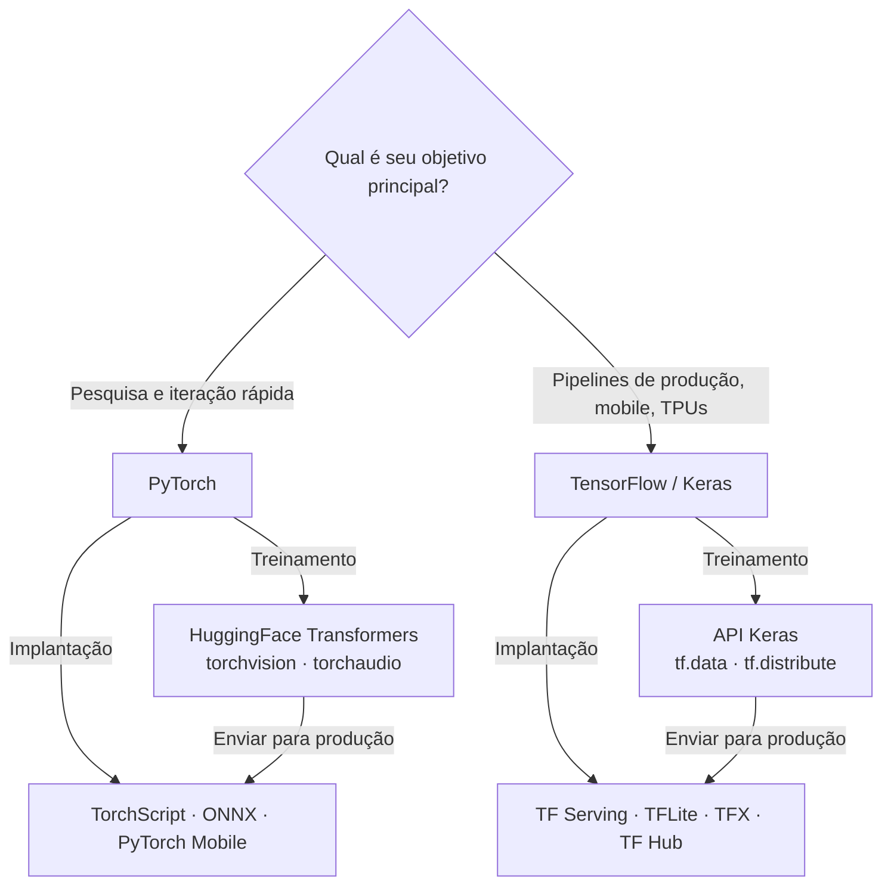

## Definição

Um **framework de aprendizado profundo** é uma biblioteca de software que fornece abstrações para construir, treinar e implantar redes neurais. Os dois frameworks dominantes são **PyTorch** (Meta AI, 2016) e **TensorFlow** (Google, 2015). Ambos suportam diferenciação automática, aceleração por GPU e treinamento distribuído, mas têm diferentes filosofias de design, pontos fortes e ecossistemas que os tornam adequados para diferentes contextos.

O PyTorch usa um grafo de computação dinâmico que é construído dinamicamente durante o passo de avanço, facilitando a depuração e a iteração com ferramentas Python padrão. O TensorFlow originalmente usava grafos estáticos (definir-então-executar), embora o TensorFlow 2.x tenha adotado a execução ansiosa como padrão. Apesar da convergência na experiência do dia-a-dia, os ecossistemas mais amplos — ferramentas, alvos de implantação e foco da comunidade — permanecem significativamente diferentes.

## Como funciona

### Panorama dos frameworks



### Abstrações de treinamento compartilhadas

Ambos os frameworks compartilham o mesmo loop de treinamento conceitual:

1. **Definir** um modelo (camadas, pesos).
2. **Passo de avanço** — computar previsões a partir das entradas.
3. **Perda** — medir o erro entre previsões e rótulos.
4. **Passo de retrocesso** — computar gradientes via diferenciação automática.
5. **Passo do otimizador** — atualizar os pesos usando os gradientes.

A diferença está no estilo da API: o PyTorch usa um loop Python explícito; o TensorFlow encapsula isso em `model.fit()` via Keras, ou expõe `tf.GradientTape` para loops personalizados.

## Quando usar / Quando NÃO usar

| Cenário | Usar PyTorch | Usar TensorFlow |
|---|---|---|
| Pesquisa e experimentos com novas arquiteturas | Sim — modo ansiosa, depuração Python nativa | — |
| Ajuste fino de modelos HuggingFace | Sim — backend padrão | — |
| Treinamento e inferência de LLMs | Sim — dominante no ecossistema LLM | — |
| Implantação mobile / borda (iOS, Android, MCUs) | — | Sim — TFLite é de primeira classe |
| Treinamento no Google Cloud e TPU | — | Sim — suporte TPU de primeira classe |
| Pipelines de produção com serving versionado | — | Sim — TF Serving + SavedModel + TFX |
| Reprodução de artigos acadêmicos | Sim — a maioria dos artigos fornece código PyTorch | — |
| Equipes ML multilíngues e regionais em escala Google | — | Sim — ferramentas empresariais maduras |

## Comparações

| Feature | PyTorch | TensorFlow / Keras |
|---|---|---|
| Modo de execução | Ansiosa (padrão) + TorchScript | Ansiosa (padrão) + `tf.function` |
| API de alto nível | Lightning, Ignite (terceiros) | Keras (integrado) |
| Mobile / borda | PyTorch Mobile (experimental) | TFLite (de primeira classe) |
| Suporte TPU | Via PyTorch/XLA | De primeira classe |
| Ecossistema HuggingFace | Backend padrão | Suportado, mas secundário |
| Adoção em pesquisa | Dominante | Decrescente |
| Serving em produção | TorchServe (crescendo) | TF Serving (maduro) |
| Serialização de modelo | TorchScript, ONNX | SavedModel (portátil, versionado) |

## Prós e contras

| | PyTorch | TensorFlow |
|---|---|---|
| **Pontos fortes** | Depuração Python nativa; dominante em pesquisa e ecossistema LLM; padrão HuggingFace | Stack de produção maduro (TF Serving, TFX, TFLite); suporte TPU de primeira classe; simplicidade Keras |
| **Pontos fracos** | Implantação mobile menos madura; sem API de treinamento de alto nível integrada | `tf.function` pode ocultar erros; ecossistema HuggingFace prefere PyTorch; mais difícil para pesquisa personalizada |

## Exemplos de código

```python
# --- PyTorch: loop de treinamento mínimo ---
import torch
import torch.nn as nn

model = nn.Linear(10, 1)
optimizer = torch.optim.Adam(model.parameters(), lr=1e-3)
loss_fn = nn.MSELoss()

x = torch.randn(32, 10)
y = torch.randn(32, 1)

optimizer.zero_grad()
pred = model(x)
loss = loss_fn(pred, y)
loss.backward()
optimizer.step()

# --- TensorFlow / Keras: loop de treinamento mínimo equivalente ---
import tensorflow as tf

model = tf.keras.Sequential([tf.keras.layers.Dense(1, input_shape=(10,))])
model.compile(optimizer="adam", loss="mse")

import numpy as np
x = np.random.randn(32, 10).astype("float32")
y = np.random.randn(32, 1).astype("float32")
model.fit(x, y, epochs=1, verbose=0)
```

## Fontes

- [PyTorch: Uma biblioteca de aprendizado profundo de alto desempenho e estilo imperativo (Paszke et al., 2019)](https://arxiv.org/abs/1912.01703) — Artigo original do PyTorch descrevendo os objetivos de design dos grafos de computação dinâmicos.
- [TensorFlow: Um sistema para aprendizado de máquina em larga escala (Abadi et al., 2016)](https://arxiv.org/abs/1605.08695) — White paper original do TensorFlow do Google descrevendo o modelo de execução de grafo de fluxo de dados.
- [Documentação oficial do PyTorch](https://pytorch.org/docs/stable/) — Referência de API e tutoriais autoritativos.
- [Documentação oficial do TensorFlow](https://www.tensorflow.org/guide) — Guia completo para Keras, tf.data, tf.distribute e TFLite.
- [Documentação do Keras](https://keras.io/) — Referência de API de alto nível para construção e treinamento de modelos no TensorFlow.

## Veja também

- [PyTorch](/docs/frameworks/pytorch)
- [TensorFlow](/docs/frameworks/tensorflow)
- [Aprendizado profundo](/docs/fundamentals/deep-learning)
- [Hugging Face](/docs/tools/huggingface)
- [IA na borda](/docs/edge-ai)
