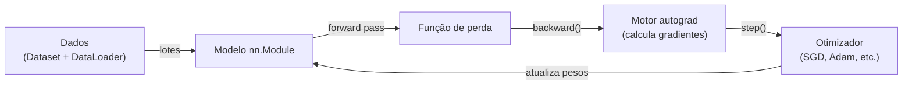

## Definição

PyTorch é um framework de deep learning de código aberto desenvolvido pelo Facebook AI Research (FAIR). Ele usa um grafo de computação dinâmico (define-by-run), o que significa que o grafo é construído em tempo de execução, tornando a depuração mais intuitiva e permitindo fluxos de controle dinâmicos como laços e condicionais dentro de modelos.

PyTorch é a escolha dominante em pesquisa e se tornou amplamente adotado na produção também. Sua API `torch.nn` fornece camadas de redes neurais composáveis, `torch.optim` inclui otimizadores comuns, e `torch.utils.data` fornece utilitários de carregamento de dados. A autodiferenciação (`autograd`) rastreia operações em tensores e calcula gradientes automaticamente para retropropagação. O PyTorch suporta execução em CPU e GPU (CUDA) com alterações mínimas de código.

O ecossistema do PyTorch inclui o TorchVision (modelos de visão computacional e transformações de dados), TorchText (utilitários de NLP), TorchAudio e a biblioteca de distribuição para treinamento distribuído. O `torch.compile` (PyTorch 2.0+) pode compilar modelos para melhorar o throughput de inferência com uma linha de código.

## Funcionamento



### Tensores e autograd

**Tensores** são o tipo de dado fundamental — arrays n-dimensionais que podem residir em CPU ou GPU. Defina `requires_grad=True` em um tensor e o PyTorch rastreia todas as operações sobre ele. Chame `.backward()` na saída escalar e os gradientes são populados nos campos `.grad` dos parâmetros.

### nn.Module

**`nn.Module`** é a classe base para todos os modelos. Você define `__init__` (registra camadas como atributos) e `forward` (descreve a passagem forward). Módulos podem ser aninhados — um `Sequential` é um módulo que contém outros módulos.

### DataLoader

**`DataLoader`** envolve um `Dataset` e fornece lotes embaralhados, opcionalmente carregados em paralelo com múltiplos workers. Você implementa `__len__` e `__getitem__` em seu `Dataset`; o `DataLoader` cuida do restante.

## Quando usar / Quando NÃO usar

| Cenário | Usar PyTorch | NÃO usar PyTorch |
|---------|-------------|-----------------|
| Pesquisa de deep learning requerendo modelos personalizados | Sim — grafos dinâmicos tornam a experimentação fácil | |
| Fine-tuning de LLMs e modelos de transformers | Sim — maioria dos modelos HuggingFace são baseados em PyTorch | |
| Protótipos rápidos com loops de treinamento flexíveis | Sim — código Python idiomático, fácil depuração | |
| Implantação em produção em larga escala no Google Cloud | | O TensorFlow/Keras pode integrar melhor com TFX e serviços Google |
| Modelos para TFLite / dispositivos móveis Google | | TensorFlow tem melhor suporte nativo para TFLite |

## Comparações

| Funcionalidade | PyTorch | TensorFlow / Keras |
|---------|---------|-------------------|
| Grafo de computação | Dinâmico (define-by-run) | Estático (define-and-run) via tf.function |
| Facilidade de depuração | Alta — comportamento Pythônico padrão | Moderada — tf.function cria um grafo compilado |
| Popularidade em pesquisa | Dominante | Menor desde 2019 |
| Implantação de produção | TorchServe, ONNX, torch.compile | TFServing, TFLite, TFX |
| Ecossistema de modelos pré-treinados | Enorme (HuggingFace, torchvision) | Menor (TF Hub) |
| Mobile / edge | ExecuTorch (em desenvolvimento) | TFLite |

## Vantagens e desvantagens

| Vantagens | Desvantagens |
|---------|------------|
| API Pythônica intuitiva e estilo imperativo | Loop de treinamento personalizado requer mais código boilerplate do que Keras |
| Grafos dinâmicos facilitam debugging e modelos dinâmicos | Inferência de produção menos madura do que TensorFlow historicamente |
| Ecossistema de pesquisa dominante | Consumo de memória GPU pode ser maior sem cuidado |
| Excelente suporte para HuggingFace Transformers | torch.compile ainda madurando para casos extremos |

## Exemplos de código

```python
import torch
import torch.nn as nn
import torch.optim as optim
from torch.utils.data import DataLoader, TensorDataset

# Define a simple feedforward network
class SimpleNet(nn.Module):
    def __init__(self, input_dim: int, hidden_dim: int, output_dim: int):
        super().__init__()
        self.net = nn.Sequential(
            nn.Linear(input_dim, hidden_dim),
            nn.ReLU(),
            nn.Linear(hidden_dim, output_dim),
        )

    def forward(self, x: torch.Tensor) -> torch.Tensor:
        return self.net(x)

# Synthetic binary classification data
X = torch.randn(200, 10)
y = (X[:, 0] > 0).long()

dataset    = TensorDataset(X, y)
dataloader = DataLoader(dataset, batch_size=32, shuffle=True)

model     = SimpleNet(10, 32, 2)
criterion = nn.CrossEntropyLoss()
optimizer = optim.Adam(model.parameters(), lr=1e-3)

for epoch in range(5):
    for xb, yb in dataloader:
        optimizer.zero_grad()
        loss = criterion(model(xb), yb)
        loss.backward()
        optimizer.step()
    print(f"Época {epoch+1}, Perda: {loss.item():.4f}")
```

## Recursos práticos

- [Documentação do PyTorch](https://pytorch.org/docs/) — Referência de API completa e tutoriais
- [Tutoriais do PyTorch](https://pytorch.org/tutorials/) — Guias passo a passo de iniciante a avançado
- [PyTorch no HuggingFace](https://huggingface.co/docs/transformers/index) — Como os Transformers usam o PyTorch por baixo dos panos

## Veja também

- [TensorFlow](/docs/frameworks/tensorflow)
- [Redes Neurais](/docs/neural-networks)
- [Deep Learning](/docs/fundamentals/deep-learning)
