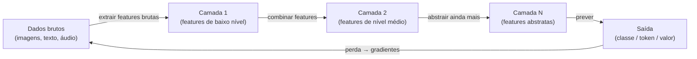

## Definição

Aprendizado Profundo (Deep Learning) é um subcampo do [aprendizado de máquina](/docs/fundamentals/machine-learning) que usa **redes neurais com muitas camadas** (redes "profundas") para aprender representações hierárquicas de dados. Em vez de engenharia manual de features, as redes profundas aprendem automaticamente representações brutas a partir de dados brutos — pixels, tokens ou formas de onda — empilhando transformações progressivamente mais abstratas.

A revolução do deep learning foi impulsionada por três fatores: **grandes conjuntos de dados** (ImageNet, Common Crawl), **hardware** (GPUs com operações de tensor em paralelo massivo) e **novas técnicas de algoritmos** (ReLU, normalização em lote, dropout, atenção). [Redes neurais](/docs/neural-networks) existiam desde os anos 1980, mas somente nessa combinação elas se tornaram práticas em escala.

As arquiteturas de deep learning abrangem CNNs para visão, RNNs para sequências, [Transformers](/docs/transformers) para texto e áudio, e GAN/modelos de difusão para geração. O termo "profundo" refere-se ao número de camadas — modelos modernos podem ter dezenas a centenas delas. Modelos pré-treinados (treinados em dados massivos e ajustados para tarefas específicas) tornaram o deep learning acessível sem hardware ou dados especialistas.

## Funcionamento



### Aprendizado de representações

**Camadas iniciais** capturam features de baixo nível: bordas em imagens, subpalavras em texto. **Camadas médias** combinam essas em partes: formas, frases. **Camadas profundas** formam conceitos: rostos, intenção semântica. Essa hierarquia é aprendida dos dados, não codificada à mão.

### Treinamento

O treinamento usa **retropropagação** e **descida de gradiente estocástico** (SGD) ou variantes adaptativas (Adam, AdamW). Uma **função de perda** mede a discrepância entre saída do modelo e alvo. Os gradientes fluem para trás pelas camadas e os pesos são atualizados por um pequeno passo na direção que reduz a perda. Técnicas de regularização como **dropout** (zerando aleatoriamente neurônios), **normalização em lote** e **weight decay** previnem overfitting.

### Hardware

GPUs aceleram o deep learning por vários fatores de magnitude sobre CPUs para operações de tensor. Os fluxos de trabalho de treinamento moderno usam **precisão mista** (float16 + float32) e **paralelismo de dados** para distribuir minilotes por múltiplas GPUs.

## Quando usar / Quando NÃO usar

| Cenário | Usar Deep Learning | NÃO usar |
|---------|------------------|---------|
| Dados não estruturados de alta dimensão (imagens, texto, áudio) | Sim — DL supera features manuais aqui | |
| Grandes conjuntos de dados com \>100k amostras | Sim — DL escala bem com dados | |
| Dados tabulares estruturados com \<50k linhas | Com cautela | Gradient boosting (XGBoost) frequentemente ganha |
| Quando a interpretabilidade é crítica | Com cautela | Modelos mais simples e explicáveis preferidos |
| Hardware limitado / orçamento de inferência restrito | Com cautela | Modelos clássicos têm custo de inferência muito menor |

## Comparações

| Aspecto | Deep Learning | ML Clássico |
|---------|--------------|-------------|
| Engenharia de features | Automática (aprendida) | Manual (especialista) |
| Dados necessários | Muito | Moderado a pouco |
| Poder computacional | Alto (GPU/TPU) | Baixo a médio |
| Interpretabilidade | Baixa | Alta a moderada |
| Melhor para | Imagens, texto, áudio, jogos | Tabular, dados estruturados |

## Vantagens e desvantagens

| Vantagens | Desvantagens |
|---------|------------|
| Aprende features automaticamente a partir de dados brutos | Requer grandes quantidades de dados rotulados |
| State-of-the-art em visão, texto, fala | Computacionalmente caro para treinar |
| Modelos pré-treinados reduzem dados/computação necessários | Difícil de interpretar e depurar |
| Escalável para tarefas muito complexas | Sensível a escolhas de hiperparâmetros |

## Exemplos de código

```python
import torch
import torch.nn as nn
import torch.optim as optim

# Minimal deep network for binary classification
class DeepNet(nn.Module):
    def __init__(self):
        super().__init__()
        self.net = nn.Sequential(
            nn.Linear(20, 128), nn.ReLU(), nn.Dropout(0.3),
            nn.Linear(128, 64), nn.ReLU(), nn.Dropout(0.3),
            nn.Linear(64,  32), nn.ReLU(),
            nn.Linear(32,   1),
        )

    def forward(self, x):
        return self.net(x).squeeze(1)

model     = DeepNet()
optimizer = optim.AdamW(model.parameters(), lr=1e-3, weight_decay=1e-4)
criterion = nn.BCEWithLogitsLoss()

# One training step
X = torch.randn(32, 20)
y = torch.randint(0, 2, (32,)).float()

optimizer.zero_grad()
loss = criterion(model(X), y)
loss.backward()
optimizer.step()
print(f"Perda: {loss.item():.4f}")
```

## Recursos práticos

- [Deep Learning (Goodfellow, Bengio, Courville)](https://www.deeplearningbook.org/) — Textbook online gratuito: o livro canônico de deep learning
- [fast.ai — Curso prático de deep learning](https://course.fast.ai/) — Abordagem top-down com PyTorch, focada em aplicações práticas
- [cs231n: CNNs para Reconhecimento Visual (Stanford)](https://cs231n.github.io/) — Notas do curso detalhando backpropagation e arquiteturas CNN

## Veja também

- [Aprendizado de Máquina](/docs/fundamentals/machine-learning)
- [Redes Neurais](/docs/neural-networks)
- [Transformers](/docs/transformers)
- [LLMs](/docs/llms)
