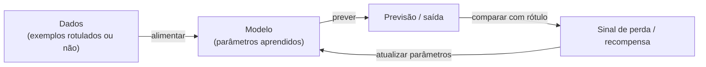

## Definição

Aprendizado de Máquina (Machine Learning, ML) é um subcampo da inteligência artificial onde **sistemas aprendem a realizar tarefas a partir de dados** sem serem explicitamente programados com regras. Em vez de codificar lógica à mão, você fornece exemplos e o sistema deduz padrões.

O ML pode ser dividido em três grandes paradigmas com base em como o aprendizado acontece:

- **Supervisionado** — aprende a partir de pares (entrada, rótulo). Objetivo: prever o rótulo correto para novas entradas.
- **Não supervisionado** — aprende a partir de entradas não rotuladas. Objetivo: descobrir estruturas, clusters ou representações.
- **Por reforço** — um agente aprende por tentativa e erro em um ambiente, maximizando recompensas.

A maioria dos casos de uso de ML do dia a dia (spam, reconhecimento de imagens, recomendações) é supervisionada. O aprendizado não supervisionado aparece na descoberta de tópicos, compressão e dados de pré-treinamento. O aprendizado por reforço alimenta robótica e sistemas de tomada de decisão.

## Funcionamento



### Aprendizado supervisionado

**Classificação** — prever uma categoria discreta (spam/não spam, gato/cão). **Regressão** — prever um valor contínuo (preço, temperatura). O modelo aprende mapeando entradas para saídas usando pares (X, y) rotulados. Generalização (desempenho em dados não vistos) é medida por um **conjunto de validação/teste** separado.

### Aprendizado não supervisionado

**Clustering** (K-Means, DBSCAN) — agrupar pontos similares. **Redução de dimensionalidade** (PCA, UMAP) — compactar representações de alta dimensão. **Modelos gerativos** — aprender a distribuição de dados para gerar novas amostras.

### Aprendizado por reforço

Um **agente** interage com um **ambiente**, recebendo **recompensas** pelas ações tomadas. O objetivo é aprender uma **política** — um mapeamento de estados para ações — que maximiza a recompensa acumulada ao longo do tempo (Q-learning, PPO).

## Conceitos fundamentais

**Overfitting** — o modelo memoriza dados de treinamento mas falha em generalizar. Solução: mais dados, regularização, simplificação do modelo. **Underfitting** — o modelo é muito simples para capturar o padrão subjacente. Solução: modelo mais complexo ou mais features. **Bias-Variance Tradeoff** — modelos de alta complexidade têm baixo bias mas alta variância; modelos simples têm alta bias mas baixa variância. **Validação cruzada** — avaliar o modelo em múltiplos folds dos dados para estimar o desempenho de generalização.

## Quando usar / Quando NÃO usar

| Cenário | Usar ML | NÃO usar ML |
|---------|---------|------------|
| Padrão muito complexo para codificar à mão | Sim — ML descobre padrões automaticamente | |
| Grandes volumes de dados disponíveis | Sim — mais dados geralmente → melhor modelo | |
| Precisa de regras explícitas e auditáveis | | Considerar sistemas especialistas ou lógica programada |
| Dados muito escassos (\<100 exemplos) | Com cautela | Modelos simples ou heurísticas funcionam melhor |
| Resultado de altíssimo impacto precisa de 100% de precisão | Com cautela | ML tem incerteza inerente |

## Comparações

| Paradigma | Supervisionado | Não supervisionado | Por reforço |
|-----------|---------------|-------------------|-------------|
| Tipo de dados | Rotulado (X, y) | Não rotulado (somente X) | Estados, ações, recompensas |
| Objetivo | Prever rótulos | Descobrir estrutura | Maximizar recompensa |
| Exemplos | Classificação, regressão | Clustering, embeddings | Robótica, jogos |
| Dados necessários | Moderado a muito | Moderado | Muito (simulação) |

## Vantagens e desvantagens

| Vantagens | Desvantagens |
|---------|------------|
| Aprende padrões complexos que seriam impossíveis de codificar à mão | Requer dados de qualidade (GIGO) |
| Escalável com mais dados | Caixa preta — difícil de depurar |
| Flexível para muitos tipos de problema | Risco de bias dos dados de treinamento |
| Melhora automaticamente com mais dados | Pode ser computacionalmente caro |

## Exemplos de código

```python
from sklearn.datasets import load_iris
from sklearn.model_selection import train_test_split
from sklearn.ensemble import RandomForestClassifier
from sklearn.metrics import accuracy_score

# Load a classic multi-class classification dataset
X, y = load_iris(return_X_y=True)
X_train, X_test, y_train, y_test = train_test_split(X, y, test_size=0.2, random_state=42)

# Train a supervised model
model = RandomForestClassifier(n_estimators=100, random_state=42)
model.fit(X_train, y_train)

# Evaluate on held-out test set
predictions = model.predict(X_test)
print(f"Acurácia: {accuracy_score(y_test, predictions):.2%}")
```

## Recursos práticos

- [Scikit-learn: Aprendizado de Máquina em Python](https://scikit-learn.org/stable/user_guide.html) — Documentação completa dos algoritmos ML clássicos
- [Google Machine Learning Crash Course](https://developers.google.com/machine-learning/crash-course) — Visão geral rápida e gratuita dos conceitos ML com TensorFlow
- [Hands-On Machine Learning (Géron)](https://www.oreilly.com/library/view/hands-on-machine-learning/9781492032632/) — Livro prático amplamente recomendado cobrindo scikit-learn e TensorFlow

## Veja também

- [Deep Learning](/docs/fundamentals/deep-learning)
- [Redes Neurais](/docs/neural-networks)
- [LLMs](/docs/llms)
