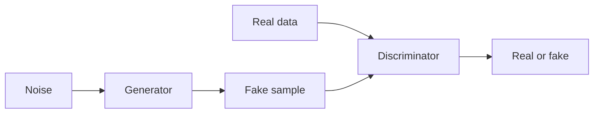

## Definição

GANs treinam um gerador e um discriminador em um jogo: o gerador produz amostras; o discriminador tenta distinguiguish them from real data. Training pushes the generator toward realistic outputs.

They eram a abordagem generativa dominante antes de [diffusion models](/docs/diffusion-models). Compared to [VAEs](/docs/vaes), GANs often produce sharper images but training can be unstable (mode collapse, discriminator/generator balance). Still used for style transfer, data augmentation, and some image editing.

## Como funciona

**Gerador:** Recebe **ruído** (vetor aleatório) e produz uma **amostra falsa** (por ex. imagem). **Discriminador:** Recebes **real data** and **fake sample**, outputs **real or fake** (or a score). Training is a **min-max game**: the generator tries to maximize the discriminator’s loss (fool it), the discriminator tries to minimize it (tell real from fake). In practice you alternate gradient steps. Variants (DCGAN, StyleGAN, etc.) use better architectures and training tricks (por ex. spectral norm, progressive growing) for stability and quality.

## Casos de uso

GANs are used for generative and discriminative tasks when you want adversarial training and sharp samples (images, audio, data aug).

- Image generation and editing (por ex. StyleGAN, face synthesis)
- Data augmentation and synthetic data for training
- Domain adaptation and style transfer

## Documentação externa

- [Generative Adversarial Networks (Goodfellow et al.)](https://arxiv.org/abs/1406.2661)
- [PyTorch – DCGAN tutorial](https://pytorch.org/tutorials/beginner/dcgan_faces_tutorial.html)

## Veja também

- [Diffusion models](/docs/diffusion-models)
- [VAEs](/docs/vaes)
