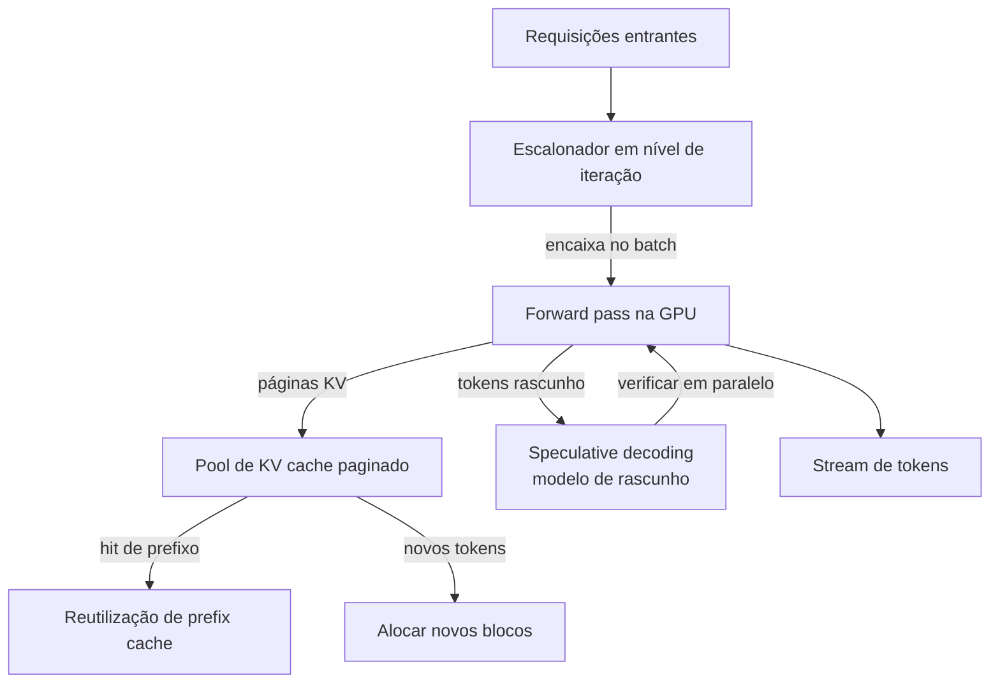

## Definição

**Otimização de inferência de LLM** é a disciplina de engenharia de reduzir a latência, o footprint de memória e o custo de executar grandes modelos de linguagem no momento de serving — sem retreinar ou degradar substancialmente a qualidade. Diferente da otimização de treinamento (que foca no throughput de gradientes), a otimização de inferência tem como alvo o loop de decode: cada forward pass que produz um novo token.

A restrição fundamental é a memória GPU. Um modelo de 70B parâmetros em FP16 requer ~140 GB de VRAM apenas para os pesos, e o **KV cache** — os tensores de chave/valor que se acumulam para cada token no contexto — cresce linearmente com o comprimento da sequência e o tamanho do batch. Gerenciar essa memória de forma eficiente é o desafio central.

Os servidores de inferência modernos abordam isso por meio de quatro técnicas interligadas:
1. **PagedAttention** — memória virtual inspirada em SO para o KV cache
2. **Continuous batching** — escalonamento em nível de iteração para maximizar a utilização da GPU
3. **Speculative decoding** — modelos de rascunho que propõem múltiplos tokens por etapa
4. **Reutilização de KV-cache** — prefix caching para pular recomputação para prefixos de prompt compartilhados

Essas técnicas são implementadas em servidores de serving open-source — mais notavelmente **vLLM**, **SGLang** e **TensorRT-LLM** — que envolvem pesos de modelos Hugging Face e expõem uma API compatível com OpenAI.

## Como funciona

O escalonador roda após cada forward pass, despejando sequências finalizadas e inserindo as que estão aguardando — habilitando máxima ocupação da GPU. O KV cache é particionado em blocos de tamanho fixo (páginas) e alocado sob demanda, eliminando fragmentação. O prefix caching reutiliza páginas para prefixos de prompt repetidos entre requisições.

## Quando usar / Quando NÃO usar

| Cenário | Usar | Evitar |
|---|---|---|
| API de produção de alta concorrência (\>10 req/s) | Sim — continuous batching + PagedAttention são essenciais | Não — inferência ingênua de requisição única subutilizará a GPU |
| Prompts de sistema longos compartilhados entre usuários | Sim — prefix caching elimina prefill redundante | Não — sem prefix caching, toda requisição recomputa o prompt do sistema |
| Chatbot de baixa latência para usuário único | Sim — speculative decoding reduz TTFT e latência entre tokens | Não — speculative decoding adiciona complexidade; decode greedy simples pode ser suficiente |
| Modelo pequeno em hardware de commodity | Talvez — quantização + batching ajudam; serving estilo OTel é opcional | Sim — um pipeline simples de `transformers` pode ser suficiente |
| Experimentos de pesquisa / fine-tuning | Não — servidores de inferência não são projetados para treinamento ou LoRA | Sim — use ferramentas focadas em treinamento (FSDP, DeepSpeed) |

## Conceitos-chave

| Conceito | Descrição |
|---|---|
| KV cache | Tensores de chave/valor armazenados por camada por token para evitar recomputação |
| PagedAttention | Alocação de blocos não-contíguos para KV cache, eliminando fragmentação |
| Continuous batching | Entrada/saída de requisições a cada iteração, não em limites de batch |
| Speculative decoding | Modelo de rascunho pequeno propõe k tokens; modelo alvo verifica em um pass |
| Prefix caching | Reutiliza blocos KV para prefixos de prompt idênticos entre requisições |
| Chunked prefill | Divide prompts longos em chunks para intercalar prefill e decode |

## Fontes

- [GitHub do vLLM](https://github.com/vllm-project/vllm) — principal engine de serving de LLM open-source; implementação de referência do PagedAttention
- [Paper PagedAttention — SOSP 2023](https://arxiv.org/abs/2309.06180) — paper original da UC Berkeley introduzindo gerenciamento paginado de KV cache
- [Blog de decodificação estruturada do vLLM](https://blog.vllm.ai/2025/01/14/struct-decode-intro.html) — abordagem do vLLM para geração constrangida por gramática
- [RunPod — guia vLLM PagedAttention](https://www.runpod.io/articles/guides/vllm-pagedattention-continuous-batching) — guia prático de implantação para PagedAttention e continuous batching
- [Arxiv — vLLM vs HuggingFace TGI performance](https://arxiv.org/html/2511.17593v1) — benchmarks comparativos entre sistemas de serving

## Veja também

- [vLLM](/docs/inference-optimization/vllm)
- [Speculative decoding](/docs/inference-optimization/speculative-decoding)
- [KV cache](/docs/inference-optimization/kv-cache)
- [Quantização](/docs/quantization)
- [MLOps](/docs/mlops)
