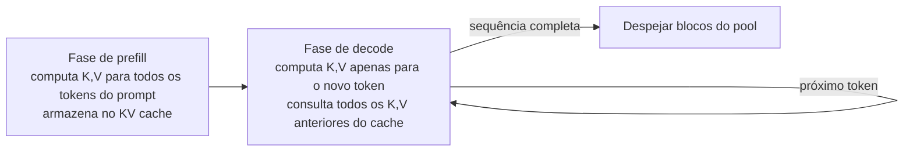

## Definição

O **KV cache** (cache de chave-valor) é a estrutura de dados que torna a inferência autorregressiva de LLM computacionalmente viável. Durante a computação de atenção em um transformer, cada token deve prestar atenção às projeções de **chave** e **valor** de todos os tokens anteriores. Sem caching, essas projeções precisariam ser recomputadas do zero para cada novo token — escalando o custo de inferência quadraticamente com o comprimento do contexto.

O KV cache armazena os tensores de chave e valor para cada token gerado anteriormente, de forma que cada nova etapa de decode apenas computa as projeções do **único novo token** e consulta todos os tokens anteriores do cache. Isso reduz o custo por etapa de O(n²) para O(n) em termos de atenção, tornando a geração de contexto longo prática.

O trade-off é a memória: o KV cache cresce linearmente com o comprimento do contexto, o tamanho do batch, o número de camadas e o número de cabeças de atenção. Para um modelo de 70B servindo um contexto de 128K tokens, o KV cache pode consumir dezenas de gigabytes de VRAM — frequentemente mais do que os próprios pesos do modelo. Gerenciar essa memória é o desafio central de engenharia do serving de LLM.

## Como funciona

### Prefill vs. decode

- **Prefill**: Todos os tokens do prompt são processados em um único forward pass, produzindo tensores KV para cada token em cada camada. Esses são escritos no cache.
- **Decode**: Um novo token é gerado por forward pass. Apenas as projeções K,V do novo token são computadas; todos os tensores K,V anteriores são lidos do cache.

O prefill é limitado por computação (paralelizável entre tokens). O decode é limitado por largura de banda de memória (lendo grandes tensores KV da VRAM por etapa). Otimizar o decode é sobre minimizar o movimento de memória.

## Fórmula de memória do KV cache

Para uma única requisição com comprimento de sequência L:

KV memory = 2 × num_layers × num_heads × head_dim × L × dtype_bytes

Para Llama-3-70B (80 camadas, 64 cabeças, 128 head dim, FP16):
`2 × 80 × 64 × 128 × L × 2 bytes = 2,62 MB por 1K tokens`

Um batch de 100 requisições concorrentes com 4K tokens cada requer ~1 GB de memória de KV cache.

## Técnicas de otimização

| Técnica | Descrição | Benefício |
|---|---|---|
| PagedAttention | Alocação de blocos não-contíguos (veja vLLM) | Elimina fragmentação; habilita compartilhamento |
| Prefix caching | Reutiliza blocos KV para prefixos de prompt idênticos | Prompt do sistema computado uma vez, amortizado entre requisições |
| Chunked prefill | Divide prompts longos em chunks processados junto com decoding | Reduz head-of-line blocking de prefill-decode |
| Quantização de KV | Armazena tensores KV em INT8 ou FP8 em vez de FP16 | 2× de economia de memória com ~1% de perda de qualidade |
| Atenção multi-query (MQA) | Todas as cabeças compartilham uma única projeção K,V | Reduz o tamanho do KV cache por num\_heads |
| Atenção grouped-query (GQA) | Grupos de cabeças compartilham K,V (Llama 3, Mistral) | Intermediário entre MHA e MQA |

## Quando se preocupar com o KV cache

| Cenário | Preocupação com KV cache | Ação |
|---|---|---|
| Contexto longo (\>32K tokens) | Alta — cache domina a memória | Habilite quantização de KV, reduza o tamanho do batch |
| Muitos usuários concorrentes | Alta — cache por requisição se acumula | Use PagedAttention + política de despejo |
| Saídas curtas, prompts curtos | Baixa — cache é pequeno | Serving padrão, sem tratamento especial |
| Prompt de sistema compartilhado por todos os usuários | Alta — custo de prefill repetido | Habilite prefix caching para amortizar |
| Beam search (k=4+) | Muito alta — k cópias do cache | Prefira amostragem a beam search em produção |

## Fontes

- [Paper PagedAttention — SOSP 2023](https://arxiv.org/abs/2309.06180) — introduziu o gerenciamento paginado de KV cache para eliminar fragmentação
- [Documentação vLLM — KV cache](https://docs.vllm.ai/en/latest/design/kernel/paged_attention.html) — detalhes de implementação do PagedAttention e prefix caching
- [Blog chunked prefill — vLLM](https://blog.vllm.ai/2024/09/05/perf-update.html) — implementação e benchmarks do chunked prefill do vLLM
- [Paper GQA](https://arxiv.org/abs/2305.13245) — atenção grouped-query para compressão de KV cache (Ainslie et al., 2023)
- [Quantização de KV cache — Hooper et al. 2024](https://arxiv.org/abs/2401.18079) — KVQuant: quantização de KV cache abaixo de 4 bits

## Veja também

- [Otimização de inferência](/docs/inference-optimization)
- [vLLM](/docs/inference-optimization/vllm)
- [Speculative decoding](/docs/inference-optimization/speculative-decoding)
- [Quantização](/docs/quantization)
