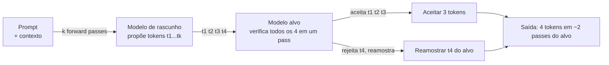

## Definição

**Speculative decoding** é uma técnica de redução de latência para inferência autorregressiva de LLM que explora a observação de que a verificação de tokens é mais barata do que a geração de tokens. Um **modelo de rascunho** (também chamado de propositor) pequeno e rápido gera uma sequência de k tokens candidatos em k forward passes. O **modelo alvo** (também chamado de verificador) grande então verifica todos os k tokens em um único forward pass paralelo — aceitando o prefixo mais longo de tokens que corresponde ao que o alvo teria gerado, e rejeitando o restante.

O insight principal é que o custo do forward pass do modelo alvo é aproximadamente constante independentemente do comprimento da sequência dentro da janela de contexto. Então, verificar 4 tokens propostos custa aproximadamente o mesmo que verificar 1 token. Quando as previsões do modelo de rascunho estão corretas (taxa de aceitação α é alta), o throughput por segundo de parede de relógio aumenta significativamente — para um usuário aguardando uma resposta de chatbot, isso se traduz diretamente em menor tempo-para-primeiro-token (TTFT) e menor latência entre tokens.

O speculative decoding é **sem perdas por design**: nunca altera a distribuição de saída do modelo alvo. Tokens de rascunho rejeitados são descartados; o modelo alvo reamostras de sua própria distribuição no ponto de rejeição. Isso garante as propriedades estatísticas das saídas do modelo grande.

## Como funciona

### Opções de modelo de rascunho

| Estratégia de rascunho | Descrição | Quando usar |
|---|---|---|
| Modelo pequeno com fine-tuning | Modelo separado 10–50x menor que o alvo | Melhor taxa de aceitação; requer overhead de armazenamento e memória |
| Correspondência de n-gramas | Propõe tokens do contexto recente usando busca por n-gramas | Zero overhead de memória; eficaz para saídas repetitivas/templatizadas |
| Cabeças Medusa | Múltiplas cabeças de saída em cima do modelo alvo, treinadas para propor k tokens | Nenhum modelo separado; compartilha a computação do alvo |
| EAGLE | Modelo especulativo treinado nos estados ocultos do alvo | Alta taxa de aceitação; acoplamento mais forte à arquitetura do alvo |

## Quando usar / Quando NÃO usar

| Cenário | Usar speculative decoding | Pular ou adiar |
|---|---|---|
| Interação de usuário único sensível à latência (chatbot) | Sim — reduz visivelmente a latência por token | Não — para jobs de throughput em batch, os benefícios são menores |
| Sequências de saída longas com estrutura repetitiva | Sim — alta taxa de aceitação do rascunho | Não — para saídas curtas (&lt;20 tokens), o overhead pode anular os ganhos |
| Serving de uma família de modelos com um irmão pequeno correspondente | Sim — ex: Llama-3-70B com rascunho Llama-3-8B | Não — arquiteturas incompatíveis produzem baixas taxas de aceitação |
| Throughput máximo de GPU (processamento em batch) | Talvez — speculative decoding pode prejudicar o throughput em batch | Sim — continuous batching sozinho é mais eficiente para throughput |
| Implantação com recursos limitados | Não — requer carregar tanto o rascunho quanto os modelos alvo | Sim — se a memória GPU já está saturada |

## Taxa de aceitação e desempenho

As taxas de aceitação típicas (α) para speculative decoding variam de 0,6 a 0,85 dependendo da tarefa e da qualidade do modelo de rascunho. Com α = 0,75 e k = 4 tokens de rascunho, o speedup esperado é aproximadamente 2–3x para cargas de trabalho de usuário único limitadas por latência. Para cargas de trabalho em batch onde a GPU já está saturada, o speedup se aproxima de 1x — o speculative decoding ajuda a latência, não o throughput.

O vLLM suporta speculative decoding via `--speculative-model`, `--num-speculative-tokens` e `--speculative-draft-tensor-parallel-size`. O SGLang tem suporte nativo ao Eagle. Ambos os engines reportam métricas de taxa de aceitação para ajuste fino.

## Fontes

- [Paper de speculative decoding — Chen et al. 2023](https://arxiv.org/abs/2302.01318) — paper original de speculative decoding do Google DeepMind
- [Inferência rápida de transformers — Leviathan et al. 2023](https://arxiv.org/abs/2211.17192) — paper de amostragem especulativa paralela (concorrente com Chen et al.)
- [Paper EAGLE](https://arxiv.org/abs/2401.15077) — modelo especulativo usando estados ocultos do alvo para alta taxa de aceitação
- [Documentação de speculative decoding do vLLM](https://docs.vllm.ai/en/latest/features/spec_decode.html) — guia de configuração para n-gram, modelo de rascunho e EAGLE no vLLM
- [GitHub do vLLM](https://github.com/vllm-project/vllm) — código-fonte e benchmarks

## Veja também

- [Otimização de inferência](/docs/inference-optimization)
- [vLLM](/docs/inference-optimization/vllm)
- [KV cache](/docs/inference-optimization/kv-cache)
