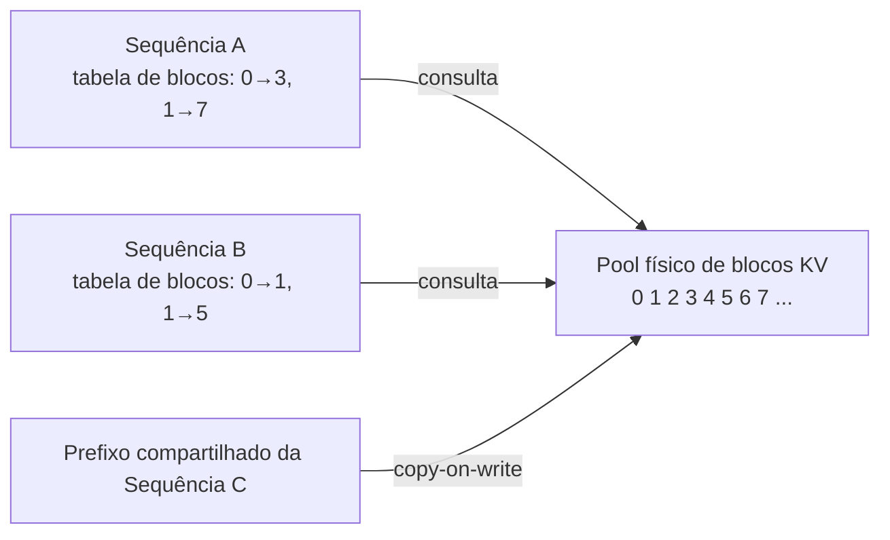

## Definição

**vLLM** é um engine open-source de inferência e serving de LLM desenvolvido no Sky Computing Lab da UC Berkeley (Woosuk Kwon et al.) e lançado em 2023. Ele introduziu duas inovações fundamentais — **PagedAttention** para gerenciamento eficiente de memória do KV cache e **continuous batching** para maximizar a utilização da GPU — que juntas permitem throughput até 24x maior que o serving ingênuo de requisição única sob carga concorrente.

O vLLM envolve pesos de modelos Hugging Face e expõe uma API REST compatível com OpenAI, tornando-o um substituto drop-in da API OpenAI em implantações locais ou auto-hospedadas. Ele suporta todas as principais famílias de modelos open-weight (Llama, Mistral, Qwen, Gemma, Falcon) e backends de hardware (NVIDIA CUDA, AMD ROCm, Google TPU, Intel Gaudi).

## Como funciona

### PagedAttention

As implementações de atenção tradicionais requerem uma região de memória contígua para o KV cache de cada sequência, levando a fragmentação: uma GPU pode ter memória livre no total, mas sem nenhum bloco contíguo grande o suficiente para uma nova requisição. O PagedAttention toma emprestado o conceito de paginação do SO — o KV cache é dividido em **blocos** de tamanho fixo (padrão: 16 tokens por bloco), os blocos são armazenados em um pool global, e cada sequência recebe uma **tabela de blocos** mapeando blocos lógicos para páginas físicas. Isso elimina tanto a fragmentação interna quanto a externa.

Blocos também podem ser **compartilhados** entre sequências com prefixos idênticos (ex: o mesmo prompt de sistema), reduzindo a memória e habilitando o prefix caching.

### Continuous batching

O batching estático mantém a GPU até que a sequência mais lenta em um batch termine de gerar. O continuous batching opera em nível de **iteração**: após cada forward pass, o escalonador verifica quais sequências terminaram, libera seus blocos imediatamente e insere requisições aguardando nos slots liberados. Isso mantém a GPU saturada independentemente dos comprimentos de saída variáveis.

### Prefix caching

Prefixos de prompt idênticos — prompts de sistema, definições de ferramentas, exemplos few-shot — são automaticamente detectados e seus blocos KV reutilizados entre requisições. Isso efetivamente torna o prompt de sistema "gratuito" após a primeira requisição que o usa, reduzindo dramaticamente tanto a latência (sem custo de prefill) quanto a pressão de memória para cargas de trabalho com prefixo compartilhado.

## Quando usar / Quando NÃO usar

| Cenário | Usar vLLM | Usar alternativas |
|---|---|---|
| Serving de API de alta concorrência (\>10 req/s) | Sim — continuous batching + PagedAttention são essenciais | Não — `generate()` do Transformers é somente para requisição única |
| Endpoint auto-hospedado compatível com OpenAI | Sim — API compatível drop-in | Não — se você quer um serviço gerenciado (Bedrock, Vertex AI) |
| Serving de modelos grandes (70B+) em múltiplas GPUs | Sim — paralelismo tensorial integrado | Não — para edge/mobile, use llama.cpp ou ONNX |
| Serving de modelo com fine-tuning LoRA | Sim — vLLM suporta adaptadores LoRA com hot-swap | Talvez — Lorax é mais especializado para multi-LoRA |
| Desenvolvimento em uma única GPU com modelo pequeno | Talvez — excessivo; pipeline `transformers` é mais simples | Sim — para um protótipo, a configuração do vLLM adiciona overhead |

## Opções de configuração principais

| Opção | Descrição |
|---|---|
| `--model` | ID do modelo HuggingFace ou caminho local |
| `--tensor-parallel-size` | Número de GPUs para paralelismo tensorial |
| `--max-model-len` | Comprimento máximo de contexto (orçamento de tokens) |
| `--gpu-memory-utilization` | Fração da memória GPU alocada ao pool KV (padrão 0,9) |
| `--enable-prefix-caching` | Habilitar prefix caching automático (radix) |
| `--speculative-model` | Modelo de rascunho para speculative decoding |
| `--block-size` | Tamanho do bloco KV cache em tokens (padrão 16) |

## Fontes

- [GitHub do vLLM](https://github.com/vllm-project/vllm) — código-fonte, documentação e rastreador de issues
- [Paper PagedAttention — SOSP 2023](https://arxiv.org/abs/2309.06180) — Kwon et al.; paper fundamental introduzindo gerenciamento paginado de KV cache
- [Documentação oficial do vLLM](https://docs.vllm.ai/) — guias de implantação, modelos suportados e referência de API
- [vLLM vs HuggingFace TGI benchmarks](https://arxiv.org/html/2511.17593v1) — análise comparativa de desempenho em vários níveis de concorrência
- [RunPod — guia vLLM PagedAttention](https://www.runpod.io/articles/guides/vllm-pagedattention-continuous-batching) — guia prático de implantação

## Veja também

- [Otimização de inferência](/docs/inference-optimization)
- [Speculative decoding](/docs/inference-optimization/speculative-decoding)
- [KV cache](/docs/inference-optimization/kv-cache)
- [Geração estruturada](/docs/structured-generation)
- [Quantização](/docs/quantization)
