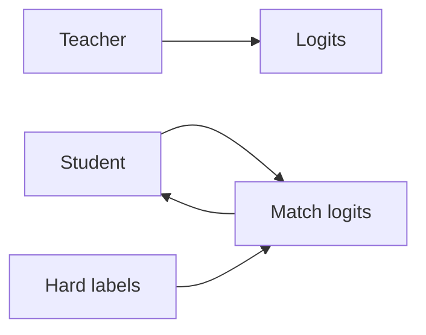

## Definição

Destilação de conhecimento treina um modelo estudante menor para igualar as saídas (e às vezes representações intermediárians) de um professor maior. The student gains from the teacher’s soft labels and can run with less compute.

É a [model compression](/docs/model-compression) technique that preserves more of the teacher’s behavior than training the student on hard labels alone. Used for BERT → DistilBERT, large [LLMs](/docs/llms) → smaller variants, and [transfer learning](/docs/transfer-learning) from ensembles.

## Como funciona

O **professor** (modelo grande) produz **logits** (ou embeddings) em dados de treinamento. O **estudante** (modelo menor) é trained to **match** the teacher’s logits (por ex. KL divergence with temperature scaling) in addition to or instead of **hard labels** (ground truth). Temperature softens the teacher distribution so the student learns from dark knowledge (relative scores across classes). Optionally, intermediate layers or attention can be matched. The student is trained with a mix of distillation loss and task loss; after training it runs with the student’s capacity and latency.

## Casos de uso

Knowledge distillation fits when you want a small, fast student that approximates a large teacher for deployment.

- Training smaller, faster models that approximate large ones (por ex. BERT → DistilBERT)
- Enabling deployment when the teacher is too heavy for production
- Transferring knowledge from ensembles or from multiple teachers

## Documentação externa

- [Distilling the Knowledge in a Neural Network (Hinton et al.)](https://arxiv.org/abs/1503.02531)
- [Hugging Face – Distillation](https://huggingface.co/docs/transformers/tasks/distillation)

## Veja também

- [Model compression](/docs/model-compression)
- [Transfer learning](/docs/transfer-learning)
