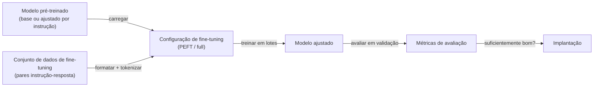

## Definição

Fine-tuning é o processo de continuar o treinamento de um modelo pré-treinado em um conjunto de dados menor e específico para uma tarefa, a fim de adaptar o seu comportamento. Para [LLMs](/docs/llms), isso significa partir de um modelo base (ou ajustado por instrução) e treiná-lo em exemplos que demonstram a saída desejada para seu caso de uso específico.

O fine-tuning resolve limitações do prompting: pode ensinar o modelo a adotar um tom ou formato consistente, reduzir alucinações em um domínio específico, condensar comportamentos que de outra forma requerem prompts longos e complexos, ou otimizar para latência ao reduzir o comprimento do prompt. É especialmente valioso quando você tem dados proprietários que não devem ir para um contexto de API, ou quando o desempenho zero-shot do modelo base está abaixo do necessário.

**Fine-tuning com parâmetros eficientes (PEFT)** — especialmente **LoRA** (Low-Rank Adaptation) e **QLoRA** (versão quantizada) — tornaram o fine-tuning de LLMs acessível em hardware consumidor. Em vez de atualizar todos os bilhões de parâmetros, o LoRA injeta matrizes de pequena classificação treináveis nas camadas do transformer e congela o modelo original. Isso reduz os parâmetros treináveis em 100–1000× mantendo a maioria dos ganhos de desempenho.

## Funcionamento



### Abordagens de fine-tuning

**Fine-tuning completo** — atualiza todos os parâmetros do modelo. Requer muito hardware (tipicamente multi-GPU). **LoRA** — congela pesos originais, treina matrizes de baixo posto injetadas. Treina apenas 0,1–1% dos parâmetros. **QLoRA** — carrega o modelo base em 4 bits (NF4), treina adaptadores LoRA em float16. Permite fine-tuning de modelos de 7B+ em uma única GPU de 24 GB.

### Formato dos dados

Os dados de fine-tuning supervisionado são tipicamente **pares instrução-resposta** formatados em um template de chat. Qualidade supera quantidade: 1.000 exemplos de alta qualidade superam frequentemente 100.000 de baixa qualidade. Mantenha um conjunto de validação separado para detectar overfitting.

### Hiperparâmetros principais

**Taxa de aprendizado** — tipicamente 1e-4 a 1e-5 para LoRA, menor para fine-tuning completo. **Tamanho do lote** — maior é melhor (use acumulação de gradientes se necessário). **Épocas** — geralmente 1–3; o fine-tuning de LLMs tende a se superajustar rapidamente. **Rank do LoRA (r)** — valores maiores (16–64) capturam mais capacidade mas usam mais memória.

## Quando usar / Quando NÃO usar

| Cenário | Usar Fine-tuning | NÃO usar Fine-tuning |
|---------|----------------|---------------------|
| Estabelecer tom / estilo / formato consistente | Sim — o fine-tuning encoda isso diretamente | |
| Adaptar para terminologia de domínio específico | Sim — especialmente para domínios especializados | |
| Reduzir comprimento de prompts de produção | Sim — descarregar exemplos few-shot no modelo | |
| Adicionar conhecimento factual novo | Com cautela | RAG é mais controlável e auditável |
| Corrigir um único tipo de erro do modelo | Com cautela | Engenharia de prompts pode ser mais rápida |
| Poucos exemplos de treinamento (\<50–100) | | Dados insuficientes; use prompting |

## Comparações

| Abordagem | Fine-tuning | RAG | Prompting |
|-----------|------------|-----|-----------|
| Custo | Médio a alto (treinamento) | Baixo (recuperação) | Muito baixo |
| Comportamento | Encoda estilo/capacidade | Aumenta com fatos | Direciona modelo existente |
| Dados necessários | Centenas a milhares de exemplos | Qualquer corpus de documentos | Nenhum |
| Interpretabilidade | Baixa | Moderada (fontes rastreáveis) | Moderada |
| Melhor para | Estilo, formato, adequação de domínio | Acesso a fatos, atualização de conhecimento | Mudanças rápidas, testes |

## Vantagens e desvantagens

| Vantagens | Desvantagens |
|---------|------------|
| O comportamento do modelo se torna consistente e confiável | Requer dados rotulados de qualidade |
| Pode reduzir custos de API via prompts mais curtos | Risco de overfitting ou catastrophic forgetting |
| PEFT/LoRA torna possível com hardware limitado | Ciclo de feedback mais lento do que engenharia de prompts |
| Modelo encoda domínio especializado eficientemente | Difícil de atualizar dados de treinamento incrementalmente |

## Exemplos de código

```python
# QLoRA fine-tuning with Hugging Face + PEFT
from transformers import AutoModelForCausalLM, AutoTokenizer, BitsAndBytesConfig, TrainingArguments, Trainer
from peft import get_peft_model, LoraConfig, TaskType
import torch

model_id  = "meta-llama/Llama-3.2-1B"
bnb_config = BitsAndBytesConfig(
    load_in_4bit=True, bnb_4bit_quant_type="nf4",
    bnb_4bit_compute_dtype=torch.float16,
)

tokenizer = AutoTokenizer.from_pretrained(model_id)
model     = AutoModelForCausalLM.from_pretrained(model_id, quantization_config=bnb_config)

lora_cfg  = LoraConfig(task_type=TaskType.CAUSAL_LM, r=16, lora_alpha=32, lora_dropout=0.05)
model     = get_peft_model(model, lora_cfg)
model.print_trainable_parameters()   # ~0.1% of total params

# TrainingArguments + Trainer would follow (omitted for brevity)
```

## Recursos práticos

- [Documentação PEFT do Hugging Face](https://huggingface.co/docs/peft) — LoRA, QLoRA e outros métodos com exemplos de código
- [QLoRA: Fine-tuning eficiente de LLMs quantizados (artigo)](https://arxiv.org/abs/2305.14314) — Paper original descrevendo QLoRA
- [TRL (Transformers Reinforcement Learning)](https://github.com/huggingface/trl) — Biblioteca HuggingFace para SFT, DPO e treinamento RLHF

## Veja também

- [LLMs](/docs/llms)
- [Hugging Face](/docs/tools/huggingface)
- [Engenharia de Prompts](/docs/prompt-engineering)
- [RAG](/docs/rag)
