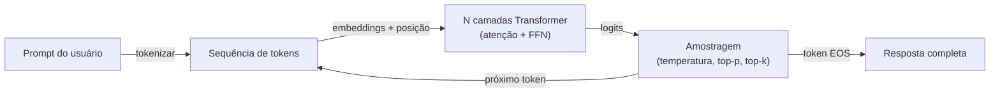

## Definição

Grandes Modelos de Linguagem são modelos [Transformer](/docs/transformers) de decodificador com bilhões de parâmetros, treinados em vastos corpora de texto para prever o próximo token. Em escala, eles desenvolvem capacidades emergentes: raciocínio, geração de código, aritmética e seguimento de instruções — sem supervisão específica por tarefa.

Os LLMs passam por três estágios principais de treinamento: **pré-treinamento** em trilhões de tokens de texto bruto (aprende conhecimento do mundo), **fine-tuning supervisionado** em demos de alta qualidade de seguimento de instruções (aprende a ser útil) e **RLHF** ou outras formas de alinhamento (aprende a ser seguro e confiável). O resultado é um modelo que pode conversar, escrever código, resumir documentos e muito mais via prompts em linguagem natural.

Modelos como GPT-4 (OpenAI), Claude (Anthropic), Gemini (Google) e Llama (Meta) diferem em tamanho, procedimentos de treinamento e políticas de implantação (API vs. código aberto). Todos compartilham a mesma ideia central: prever o próximo token em escala suficiente produz modelos capazes com uma única interface de prompt.

## Funcionamento

### Pré-treinamento

O modelo aprende a prever o próximo token em dados de texto web, livros e código em escala massiva. Isso fornece conhecimento amplo do mundo, incluindo linguagem de programação, raciocínio matemático e conhecimento factual.

### Fine-tuning supervisionado (SFT)

Sobre o modelo base, o SFT treina em exemplos de alta qualidade de instruções humanas e respostas desejadas. Isso transforma o preditor de próximo token em um assistente responsivo.

### Alinhamento (RLHF, DPO)

RLHF (Reinforcement Learning from Human Feedback) treina um modelo de recompensa nas preferências humanas e usa RL para otimizar o LLM contra ele. DPO (Direct Preference Optimization) é uma alternativa mais recente e mais simples que otimiza diretamente as preferências.

## Quando usar / Quando NÃO usar

| Cenário | Usar LLM | NÃO usar LLM |
|---------|---------|-------------|
| Geração de texto livre, resumo, Q&A | Sim — naturalmente adequado | |
| Seguimento de instruções e chatbots | Sim — os LLMs são fine-tunados para isso | |
| Compreensão e geração de código | Sim — os LLMs são treinados em código | |
| Previsão de séries temporais numéricas | | Usar modelos estatísticos/ML dedicados |
| Classificação de rótulos fixos com \>99% de precisão | | Classificadores fine-tunados mais confiáveis |
| Inferência sensível à latência (\<10ms) | | Os LLMs são lentos em relação a modelos menores |

## Comparações

| Aspecto | LLM | Modelo de ML clássico |
|---------|-----|----------------------|
| Treinamento | Pré-treinado em dados massivos | Treinado em dataset específico da tarefa |
| Adaptação | Prompting ou fine-tuning leve | Re-treinamento em novos dados |
| Flexibilidade de tarefas | Muito alto (multi-tarefa via prompt) | Baixo (específico para uma tarefa) |
| Latência de inferência | Alta (centenas de ms a segundos) | Baixa (ms) |
| Custo de inferência | Alto | Baixo |
| Interpretabilidade | Baixa | Moderada a alta |

## Vantagens e desvantagens

| Vantagens | Desvantagens |
|---------|------------|
| Multi-tarefa via simples mudanças de prompt | Propenso a alucinações — gera texto plausível mas incorreto |
| Capacidades zero-shot e few-shot sem re-treinamento | Alto custo computacional e de API |
| API simples — sem pipeline de ML necessário | Saídas não determinísticas — difícil de testar unitariamente |
| Modelos de código aberto disponíveis para uso local | Janelas de contexto limitadas (embora expandindo) |

## Recursos práticos

- [Documentação API da Anthropic](https://docs.anthropic.com/) — Referência completa para Claude com exemplos e guias
- [Documentação API da OpenAI](https://platform.openai.com/docs/) — Referência para GPT-4, modelos de embedding e fine-tuning
- [Hugging Face Hub](https://huggingface.co/models?pipeline_tag=text-generation) — Modelos de geração de texto de código aberto
- [LLM Leaderboard (LMSYS)](https://chat.lmsys.org/?leaderboard) — Rankings de arena comparativos para os LLMs mais populares

## Veja também

- [Transformers](/docs/transformers)
- [Fine-tuning](/docs/llms/fine-tuning)
- [Streaming](/docs/llms/streaming)
- [Engenharia de Prompts](/docs/prompt-engineering)
- [RAG](/docs/rag)
