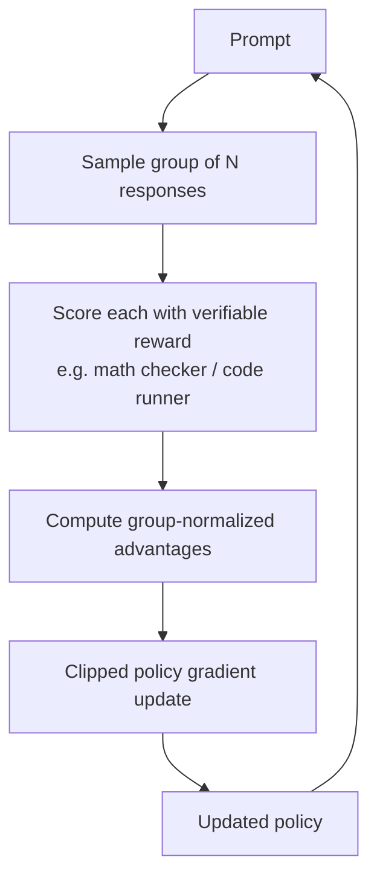
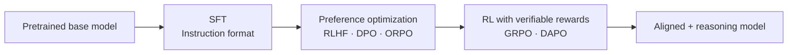

## Definição

**Pós-treinamento** é tudo que acontece com um modelo de linguagem após a etapa inicial de pré-treinamento. O pré-treinamento ensina ao modelo a estatística da linguagem; o pós-treinamento molda *como ele se comporta* — tornando-o útil, inofensivo, honesto e (para modelos de raciocínio) capaz de resolver problemas de forma sistemática.

A pilha moderna de pós-treinamento empilha múltiplas técnicas:

1. **Supervised Fine-Tuning (SFT)** — ensinar o formato de boas respostas.
2. **Otimização de preferência** — alinhar saídas com preferências humanas ou de IA (RLHF, DPO, ORPO).
3. **Reinforcement Learning with Verifiable Rewards (RLVR)** — treinar em tarefas com respostas verificáveis (GRPO, DAPO).

Cada camada visa um modo diferente de falha do modelo pré-treinado bruto: o modelo conhece *fatos*, mas precisa aprender o *formato de conversa*, depois o *alinhamento de preferência*, depois o *raciocínio sistemático*.

## Como funciona

### Supervised Fine-Tuning (SFT)

O SFT é o primeiro estágio de pós-treinamento. Um conjunto de dados de pares (instrução, resposta ideal) — frequentemente escritos ou curados por humanos — é usado para fazer fine-tuning do modelo com perda de entropia cruzada padrão. O SFT ensina ao modelo o **formato de interação** básico: como seguir instruções, produzir saídas estruturadas e responder de forma conversacional.

O SFT sozinho produz modelos de chat capazes, mas eles tendem a ser bajulatórios (concordando em vez de ser verdadeiros) e carecem de sensibilidade a preferências. O SFT é um pré-requisito para todas as técnicas de alinhamento subsequentes, porque o RLHF e o DPO exigem uma política de base razoável para otimizar.

### RLHF (Reinforcement Learning from Human Feedback)

O RLHF adiciona um sinal de preferência humana sobre o SFT. O pipeline tem três estágios:

1. **Treinamento do modelo de recompensa** — anotadores humanos classificam pares de saídas do modelo; uma rede neural separada (o modelo de recompensa) é treinada para prever qual resposta os humanos preferem.
2. **Otimização com RL** — o modelo principal é ajustado fino com PPO (Proximal Policy Optimization), maximizando a pontuação do modelo de recompensa enquanto uma penalidade de divergência KL impede que ele derive muito da linha de base SFT.
3. **Iteração** — novos prompts, novas saídas, novas anotações, repete.

O RLHF é computacionalmente caro (três modelos na memória: política, recompensa, referência), frágil a reward hacking e requer grandes orçamentos de anotação humana. Apesar desses custos, produziu a primeira geração de modelos de chat seguros e úteis (InstructGPT, Claude inicial, Gemini inicial).

### DPO (Direct Preference Optimization)

O DPO (Rafailov et al., 2023) elimina o modelo de recompensa separado. Ele reformula o objetivo do RLHF de modo que o próprio modelo de política implicitamente codifique a recompensa, treinando diretamente em **pares de preferência** (resposta escolhida, resposta rejeitada) usando uma perda de entropia cruzada binária.

**Principais concessões vs. RLHF:**

| | RLHF | DPO |
|---|---|---|
| Modelo de recompensa | Rede separada necessária | Implícito na política |
| Amostragem online | Sim — a política gera durante o treinamento | Não — treina em conjunto de dados estático |
| Estabilidade | PPO pode ser instável | Mais estável, mais simples de implementar |
| Eficiência de dados | Menor (online) | Maior (pares offline) |
| Flexibilidade | Pode usar qualquer sinal de recompensa | Requer dados de preferência em pares |

O DPO se tornou o método dominante de otimização de preferência em 2023–2024 devido à sua simplicidade. Variantes incluem **SimPO** (DPO sem referência) e **KTO** (dados de preferência não em pares).

### ORPO (Odds-Ratio Preference Optimization)

O ORPO (Hong et al., 2024) colapsa o pipeline de dois estágios SFT→DPO em uma **única etapa de treinamento**. Ele adiciona um termo de penalidade de razão de chances à perda SFT padrão, ensinando simultaneamente o seguimento de instruções e penalizando respostas rejeitadas — sem modelo de referência, sem modelo de recompensa, sem estágio SFT separado.

O ORPO é especialmente útil quando computação ou dados são limitados, e foi adotado por modelos menores de código aberto onde a pilha RLHF completa é muito custosa.

### GRPO (Group Relative Policy Optimization)

O GRPO é um método **RL online** introduzido com o DeepSeek-R1. Ele gera respostas *durante o treinamento* e usa estimativa de vantagem baseada em grupo em vez de uma rede crítica separada.

Para cada prompt, o GRPO amostra um **grupo** de respostas (tipicamente 8–64) e calcula a vantagem de cada resposta normalizando sua recompensa em relação à média e desvio padrão do grupo:

```
advantage_i = (reward_i − mean(group)) / std(group)
```

Isso elimina completamente o crítico (função de valor) — as estatísticas do grupo servem como linha de base. O GRPO então aplica uma atualização de gradiente de política com corte (similar ao corte do PPO) sobre essas vantagens.

**Por que o GRPO importou:** O DeepSeek-R1 usou GRPO puro com recompensas verificáveis (respostas matemáticas, resultados de testes de código) e obteve **raciocínio chain-of-thought** emergente e **auto-reflexão** sem nenhum rastro de raciocínio supervisionado. Isso demonstrou que o RL com recompensas verificáveis sozinho pode produzir capacidades de raciocínio que correspondem ou superam abordagens supervisionadas.



### DAPO (Dynamic Sampling Policy Optimization)

O DAPO (2025) aborda instabilidades observadas ao escalar o GRPO para modelos maiores e cadeias de raciocínio mais longas. Ele adiciona quatro melhorias sobre o GRPO:

| Melhoria | O que faz |
|---|---|
| **Clip-shifting** | Razão de corte assimétrica — encoraja a exploração em tokens de baixa probabilidade |
| **Dynamic sampling** | Pula prompts onde o modelo já está perfeito ou completamente falhando; foca o treinamento na "zona de luta" útil |
| **Token-level loss** | Gradiente de política calculado por token em vez de por sequência, evitando viés de comprimento |
| **Overflow reward shaping** | Penaliza respostas excessivamente longas para evitar reward hacking via verbosidade |

O DAPO permite treinamento estável em escalas onde o GRPO diverge, e foi adotado em execuções subsequentes de treinamento de modelos de raciocínio de código aberto.

### O pipeline completo de pós-treinamento



Nem todo modelo usa todos os estágios. Modelos de chat frequentemente param após SFT + DPO. Modelos de raciocínio (DeepSeek-R1, Qwen-thinking, estilo o1) adicionam GRPO/DAPO. A escolha depende da capacidade alvo e do orçamento de computação.

## Quando usar / Quando NÃO usar

| Cenário | Técnica recomendada | Por quê |
|---|---|---|
| Adaptando um modelo base para seguir instruções | SFT | Etapa mais barata e mais interpretável |
| Reduzindo bajulação, melhorando utilidade/inocuidade | DPO ou RLHF | Sinal de preferência direto; DPO é mais barato |
| SFT + alinhamento em único estágio com dados mínimos | ORPO | Combina ambos os objetivos; sem modelo de referência necessário |
| Ensinando raciocínio sistemático em matemática/código | GRPO ou DAPO | Recompensas verificáveis eliminam a necessidade de rótulos humanos |
| Treinamento de raciocínio em larga escala que deve ser estável | DAPO sobre GRPO | Amostragem dinâmica e perda por token evitam divergência |
| Você tem amplo orçamento de anotação humana e precisa de alinhamento de valores nuançado | RLHF | Preferências humanas capturam sutilezas que recompensas verificáveis não conseguem |

## Resumo de concessões

| Técnica | Sinal de recompensa | Online? | Custo computacional | Melhor para |
|---|---|---|---|---|
| SFT | Rótulos supervisionados | Não | Baixo | Seguimento de instruções |
| RLHF (PPO) | Pares de preferência humana + modelo de recompensa | Sim | Muito alto | Alinhamento nuançado |
| DPO | Pares de preferência humana | Não | Baixo–médio | Alinhamento de chat, pipeline mais simples |
| ORPO | Pares de preferência (sem modelo de referência) | Não | Baixo | Alinhamento em único estágio |
| GRPO | Recompensas verificáveis | Sim | Médio | Matemática, código, raciocínio |
| DAPO | Recompensas verificáveis | Sim | Médio–alto | Estabilidade de raciocínio em larga escala |

## Fontes

- [Post-Training in 2026: GRPO, DAPO, RLVR and Beyond — llm-stats.com](https://llm-stats.com/blog/research/post-training-techniques-2026)
- [Complete Guide to Post-Training LLMs: SFT, RLHF, DPO, GRPO — Sundeep Teki](https://www.sundeepteki.org/advice/the-complete-guide-to-post-training-llms-how-sft-rlhf-dpo-and-grpo-shape-llms)
- [GRPO deep-dive — Cameron Wolfe (Substack)](https://cameronrwolfe.substack.com/p/grpo)
- [Guide to LLM Post-Training Algorithms — HuggingFace](https://huggingface.co/blog/karina-zadorozhny/guide-to-llm-post-training-algorithms)
- [The Production Alignment Stack: RLHF, DPO, or Verifier-Driven RL? — Medium](https://medium.com/@adnanmasood/the-production-alignment-stack-rlhf-dpo-or-verifier-driven-rl-032fae9040aa)
- [Post-training methods for language models — Red Hat Developer](https://developers.redhat.com/articles/2025/11/04/post-training-methods-language-models)

## Veja também

- [Fine-tuning](/docs/llms/fine-tuning)
- [Aprendizado por reforço](/docs/rl)
- [Segurança em IA](/docs/ai-safety)
- [Grandes Modelos de Linguagem](/docs/llms)
