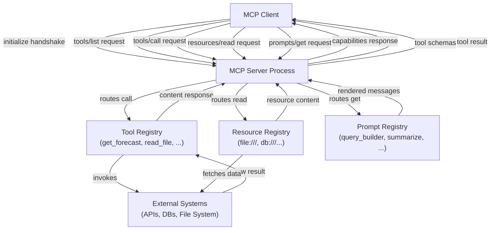

## Definição

Um **servidor MCP** é um processo que expõe capacidades a aplicações de IA compatíveis com MCP por meio do Model Context Protocol. Ele atua como a ponte entre um modelo de IA e algum sistema externo — um sistema de arquivos, uma API REST, um banco de dados, um executor de código — envolvendo a funcionalidade desse sistema em uma interface bem definida e descobrível. O servidor possui os detalhes de implementação; o cliente só precisa conhecer o protocolo. Qualquer cliente compatível com MCP pode se conectar a qualquer servidor MCP e imediatamente descobrir e usar suas capacidades sem trabalho de integração personalizado.

Um servidor MCP pode expor três categorias de capacidade. **Ferramentas** são funções chamáveis que aceitam entrada estruturada e retornam saída — a IA as invoca para realizar ações ou recuperar informações dinâmicas. **Recursos** são fontes de dados somente leitura endereçadas por URI que a IA pode ler para obter contexto — arquivos, registros de banco de dados, snapshots de API. **Prompts** são templates de prompt reutilizáveis e parametrizados armazenados no servidor que os clientes podem apresentar aos usuários ou injetar em conversas. Um único servidor pode oferecer qualquer combinação dessas; muitos servidores expõem apenas ferramentas.

O **ciclo de vida do servidor** segue um padrão previsível: o servidor inicia e se liga a um transporte (stdio para servidores locais, Streamable HTTP para servidores remotos), aguarda um cliente se conectar, completa o handshake `initialize` para negociar versões de protocolo e capacidades, e então entra em seu loop principal respondendo a requisições. Quando o cliente se desconecta ou envia um sinal de desligamento, o servidor realiza limpeza e sai. Como o protocolo tem estado dentro de uma sessão, o servidor pode manter estado por conexão — por exemplo, armazenando em cache respostas de API caras pela duração de uma sessão.

## Como funciona

### Configuração e inicialização do servidor

Configurar um servidor MCP começa criando uma instância `McpServer` (do SDK de alto nível) ou uma instância `Server` (do SDK de baixo nível) com um nome e versão. O nome e a versão são enviados ao cliente durante o handshake `initialize` e ajudam na depuração e registro. Após criar o servidor, você registra capacidades — ferramentas, recursos, prompts — antes de se conectar a um transporte. Os métodos ergonômicos `server.tool()`, `server.resource()` e `server.prompt()` da classe `McpServer` de alto nível do SDK gerenciam o roteamento de requisições e validação de schema internamente. A etapa de conexão (`server.connect(transport)`) inicia o loop de eventos e bloqueia até o fim da sessão.

### Definindo ferramentas

As ferramentas são a capacidade MCP mais comumente usada. Cada ferramenta tem três elementos obrigatórios: um **nome** (um identificador curto em minúsculas usado em requisições `tools/call`), uma **descrição** (uma explicação em linguagem natural que a IA usa para decidir quando e como chamar a ferramenta) e um **schema de entrada** (um schema Zod no SDK TypeScript, convertido para JSON Schema para o protocolo). Quando um cliente chama uma ferramenta, o SDK valida os argumentos recebidos contra o schema antes de invocar sua função de handler, para que você receba entrada validada e com segurança de tipos. O handler retorna um array `content` de blocos de conteúdo — texto, imagens ou recursos incorporados — que o cliente passa de volta ao modelo de IA. As ferramentas também podem definir `isError: true` em sua resposta para sinalizar um erro recuperável, o que permite que a IA tente novamente ou recue graciosamente.

### Definindo recursos

Os recursos expõem dados semelhantes a arquivos que a IA pode ler para contexto. Um recurso é identificado por um URI (por exemplo, `file:///path/to/data.json` ou `postgres://mydb/users/123`) e tem um tipo MIME que diz ao cliente como lidar com o conteúdo. Os recursos são descobertos via `resources/list` e lidos via `resources/read`. O SDK suporta tanto **recursos estáticos** (registrados com um URI fixo e conteúdo) quanto **recursos dinâmicos** (registrados com um padrão de template de URI, resolvidos no momento da leitura). Os templates de recursos usam a sintaxe de template de URI RFC 6570 — por exemplo, `file:///{path}` corresponde a qualquer caminho de arquivo. Quando o cliente lê um URI de recurso que corresponde a um template, seu handler recebe as variáveis de template extraídas e retorna o conteúdo. Os recursos devem ser usados para dados que a IA precisa ler, mas não modificar; para operações de escrita, use uma ferramenta.

### Definindo prompts

Os prompts são templates de interação reutilizáveis. Um prompt tem um nome, uma descrição e uma lista opcional de argumentos (nome, descrição, flag de obrigatoriedade). Quando um cliente solicita um prompt via `prompts/get`, seu handler recebe os valores dos argumentos e retorna uma lista de mensagens — tipicamente uma mistura de mensagens com role `user` e `assistant` — que o cliente injeta na conversa. Os prompts permitem que autores de servidor codifiquem conhecimento de domínio sobre como interagir com as capacidades do servidor. Por exemplo, um servidor de banco de dados pode expor um prompt `query_builder` que aceita uma descrição em linguagem natural de uma consulta e retorna um prompt estruturado que guia a IA a produzir SQL seguro e parametrizado.

### Configuração de transporte

A camada de transporte determina como o servidor se comunica com os clientes. O **transporte stdio** (`StdioServerTransport`) lê de `process.stdin` e escreve em `process.stdout`. É o padrão para servidores de ferramentas locais — a aplicação host cria o servidor como um processo filho e se comunica pelos fluxos do processo. Nenhuma configuração de rede é necessária, e o stderr do servidor está disponível para registro sem interferir com o protocolo. O **transporte Streamable HTTP** (`StreamableHTTPServerTransport`) é o padrão atual para servidores remotos (introduzido na especificação MCP 2025-03-26). Ele lida com mensagens do cliente para o servidor e streaming do servidor para o cliente em um único endpoint usando uma abordagem HTTP unificada — substituindo o transporte anterior HTTP+SSE, que agora está descontinuado. O Streamable HTTP é mais compatível com proxies HTTP, balanceadores de carga e firewalls corporativos, e evita as armadilhas de segurança das conexões SSE de longa duração.

> **Nota de descontinuação:** O `SSEServerTransport` (HTTP+SSE, da versão de especificação 2024-11-05) está **descontinuado** a partir da atualização da especificação MCP de março de 2025. Novos servidores devem usar `StreamableHTTPServerTransport`. Servidores SSE existentes podem continuar operando durante o período de transição, mas as principais plataformas (Atlassian, Keboola, Cloudflare) publicaram datas de fim de vida em meados de 2026.



## Quando usar / Quando NÃO usar

| Cenário | Construa um servidor MCP | Considere alternativas |
|---|---|---|
| Expondo uma API ou serviço existente para múltiplas aplicações de IA | Melhor opção — um servidor, qualquer cliente pode usá-lo | Function calling direto se apenas um provedor e app importam |
| Envolvendo um sistema de arquivos, banco de dados ou fonte de dados interna para contexto de IA | Melhor opção — recursos e ferramentas mapeiam naturalmente | Pipeline RAG personalizado se recuperação semântica é a necessidade principal |
| Fornecendo templates de prompt específicos de domínio para usuários de IA | A capacidade Prompts é feita especificamente para isso | Injeção de prompt de sistema se os templates são simples e estáticos |
| Construindo tooling para uma única aplicação de IA interna com um provedor | MCP adiciona estrutura útil, mas pode ser excessivo | Funções de ferramentas em processo são mais simples |
| Expondo ferramentas que exigem resultados em streaming em tempo real | Suportado via transporte Streamable HTTP | WebSockets ou streaming personalizado se o overhead do protocolo importa |
| Ferramentas que precisam manter estado de longa duração por usuário entre sessões | Requer design cuidadoso do servidor — as sessões são 1:1 | Serviço backend com estado com um wrapper MCP fino |

## Exemplos de código

### Servidor MCP completo com ferramentas, recursos e um prompt

```typescript
import { McpServer, ResourceTemplate } from "@modelcontextprotocol/sdk/server/mcp.js";
import { StdioServerTransport } from "@modelcontextprotocol/sdk/server/stdio.js";
import { z } from "zod";
import * as fs from "fs/promises";
import * as path from "path";

const server = new McpServer({
  name: "file-and-weather-server",
  version: "1.0.0",
});

// -----------------------------------------------------------------------
// Tool 1: Get weather forecast (mock — replace with a real weather API)
// -----------------------------------------------------------------------
server.tool(
  "get_weather",
  "Fetches the current weather forecast for a given city. Returns temperature, conditions, and humidity.",
  {
    city: z.string().describe("The city name, e.g. 'Tokyo' or 'Berlin'"),
    units: z
      .enum(["celsius", "fahrenheit"])
      .default("celsius")
      .describe("Temperature units"),
  },
  async ({ city, units }) => {
    // In production, call a real weather API here (e.g. Open-Meteo, WeatherAPI)
    const mockData = {
      city,
      temperature: units === "celsius" ? 18 : 64,
      units,
      condition: "Partly cloudy",
      humidity_percent: 72,
      forecast: "Light rain expected in the evening",
    };

    return {
      content: [
        {
          type: "text",
          text: JSON.stringify(mockData, null, 2),
        },
      ],
    };
  }
);

// -----------------------------------------------------------------------
// Tool 2: List directory contents
// -----------------------------------------------------------------------
server.tool(
  "list_directory",
  "Lists the files and subdirectories in a given directory path. Use this to explore file system structure.",
  {
    dir_path: z
      .string()
      .describe("Absolute path to the directory to list"),
  },
  async ({ dir_path }) => {
    try {
      const entries = await fs.readdir(dir_path, { withFileTypes: true });
      const listing = entries.map((e) => ({
        name: e.name,
        type: e.isDirectory() ? "directory" : "file",
      }));

      return {
        content: [
          {
            type: "text",
            text: JSON.stringify(listing, null, 2),
          },
        ],
      };
    } catch (err) {
      return {
        isError: true,
        content: [
          {
            type: "text",
            text: `Error listing directory: ${(err as Error).message}`,
          },
        ],
      };
    }
  }
);

// -----------------------------------------------------------------------
// Resource: Read any text file by path (URI template)
// -----------------------------------------------------------------------
server.resource(
  "text-file",
  new ResourceTemplate("file:///{file_path}", { list: undefined }),
  async (uri, { file_path }) => {
    const resolvedPath = path.resolve(String(file_path));

    try {
      const content = await fs.readFile(resolvedPath, "utf-8");
      return {
        contents: [
          {
            uri: uri.href,
            mimeType: "text/plain",
            text: content,
          },
        ],
      };
    } catch (err) {
      throw new Error(`Cannot read file at ${resolvedPath}: ${(err as Error).message}`);
    }
  }
);

// -----------------------------------------------------------------------
// Prompt: Guided file analysis template
// -----------------------------------------------------------------------
server.prompt(
  "analyze_file",
  "Generates a structured prompt that guides the AI to analyze a text file for issues, patterns, or summaries.",
  {
    file_path: z.string().describe("Path to the file to analyze"),
    focus: z
      .string()
      .optional()
      .describe("Optional: specific aspect to focus on, e.g. 'security issues' or 'performance'"),
  },
  async ({ file_path, focus }) => {
    const focusInstruction = focus
      ? `Focus specifically on: ${focus}.`
      : "Provide a general analysis.";

    return {
      messages: [
        {
          role: "user",
          content: {
            type: "text",
            text: `Please analyze the file at \`${file_path}\`.

${focusInstruction}

Use the \`read_file\` resource (URI: file:///${file_path}) to read its contents, then provide:
1. A brief summary of what the file contains
2. Key observations or findings
3. Any recommendations or concerns

Be concise and structured.`,
          },
        },
      ],
    };
  }
);

// -----------------------------------------------------------------------
// Start the server
// -----------------------------------------------------------------------
async function main() {
  const transport = new StdioServerTransport();
  await server.connect(transport);
  // Log to stderr so it doesn't interfere with the stdio protocol
  console.error("file-and-weather-server is running on stdio");
}

main().catch((err) => {
  console.error("Server failed to start:", err);
  process.exit(1);
});
```

### Transporte Streamable HTTP (transporte remoto padrão atual)

O transporte Streamable HTTP é o padrão atual para servidores MCP remotos. Ele expõe um único endpoint HTTP que lida tanto com requisição/resposta quanto com streaming iniciado pelo servidor.

```typescript
import { McpServer } from "@modelcontextprotocol/sdk/server/mcp.js";
import { StreamableHTTPServerTransport } from "@modelcontextprotocol/sdk/server/streamableHttp.js";
import express from "express";

const app = express();
app.use(express.json());

const server = new McpServer({ name: "remote-server", version: "1.0.0" });

// Register your tools, resources, and prompts here (same API as stdio)
// server.tool(...), server.resource(...), server.prompt(...)

// Single endpoint handles all MCP communication (requests + streaming)
app.all("/mcp", async (req, res) => {
  const transport = new StreamableHTTPServerTransport({ sessionIdGenerator: undefined });
  await server.connect(transport);
  await transport.handleRequest(req, res, req.body);
});

app.listen(3000, () => {
  console.log("MCP server listening on http://localhost:3000/mcp");
});
```

> **Transporte SSE legado (descontinuado):** Se você precisar suportar clientes mais antigos que implementam apenas a especificação 2024-11-05, o `SSEServerTransport` de `@modelcontextprotocol/sdk/server/sse.js` pode ser mantido ao lado do endpoint Streamable HTTP durante a migração. Novas implementações não devem usar SSE como transporte principal.

## Recursos práticos

- [MCP TypeScript SDK — referência da API do servidor](https://github.com/modelcontextprotocol/typescript-sdk/tree/main/src/server) — Código-fonte e documentação inline para `McpServer`, transportes e todos os tipos do lado do servidor.
- [Exemplos oficiais de servidores MCP](https://github.com/modelcontextprotocol/servers) — Implementações de referência incluindo sistema de arquivos, GitHub, PostgreSQL, Slack e mais — inestimáveis como pontos de partida.
- [Documentação de transporte MCP](https://modelcontextprotocol.io/specification/2025-03-26/basic/transports) — Especificação do protocolo cobrindo transportes stdio e Streamable HTTP (o padrão atual); inclui notas de descontinuação para o transporte legado HTTP+SSE.
- [Documentação do Zod](https://zod.dev) — A biblioteca de schemas usada pelo SDK TypeScript para validação de entrada; entender os tipos Zod mapeia diretamente para schemas de parâmetros de ferramentas.

## Veja também

- [Visão geral do Model Context Protocol](/docs/mcp)
- [Construindo clientes MCP](/docs/mcp/building-clients)
- [Ferramentas e ações de agentes](/docs/agents/tools-actions)
