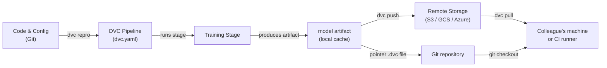

## Definição

Data Version Control (DVC) é uma ferramenta de código aberto que estende o Git para rastrear arquivos grandes, conjuntos de dados e artefatos de modelos que não podem ser armazenados eficientemente em um repositório Git. Enquanto o Git registra cada mudança no código-fonte, o DVC armazena um pequeno arquivo ponteiro (`.dvc`) no repositório e envia os bytes de dados reais para um backend de armazenamento remoto configurável — S3, GCS, Azure Blob, SSH ou mesmo um diretório local. Isso mantém o repositório leve enquanto preserva a reprodutibilidade completa.

O DVC vai além do simples versionamento de arquivos. Ele introduz o conceito de **pipelines** — um DAG (Grafo Acíclico Dirigido) de estágios definidos em um arquivo `dvc.yaml`. Cada estágio especifica seu comando, suas entradas (dependências) e suas saídas, para que o DVC possa determinar quais estágios precisam ser reexecutados quando as entradas mudam. O resultado é um sistema de build para ML: reproduzível, incremental e com controle de versão junto com o código que o produziu.

O DVC se integra estreitamente com os fluxos de trabalho do Git. Um arquivo `dvc.lock`, confirmado no Git, captura o hash de conteúdo exato de cada entrada e saída no momento em que uma pipeline foi executada, de modo que fazer checkout de um commit histórico do Git e executar `dvc pull` restaura exatamente o conjunto de dados e os artefatos de modelo que existiam naquele ponto da história.

## Como funciona



### Inicializar um repositório DVC

Executar `dvc init` dentro de um repositório Git cria um diretório `.dvc/` que contém a configuração e o cache local do DVC. O DVC registra uma entrada `.gitignore` para a pasta de cache e adiciona alguns pequenos arquivos de rastreamento que devem ser confirmados no Git. A partir deste ponto, `dvc add <file>` cria um arquivo ponteiro `.dvc` para qualquer arquivo grande — os bytes reais vão para o cache local e nunca são confirmados no Git. Essa abordagem de duas camadas significa que o repositório permanece rápido para clonar enquanto o DVC gerencia os ativos pesados separadamente.

### Definir e executar pipelines

Um arquivo `dvc.yaml` declara cada estágio da pipeline com seu comando, dependências de entrada e artefatos de saída. Quando você executa `dvc repro`, o DVC inspeciona o grafo de dependências, compara os hashes de conteúdo de todas as entradas com o snapshot do `dvc.lock` e reexecuta apenas os estágios cujas entradas mudaram. Isso é análogo ao `make`, mas endereçado por conteúdo em vez de baseado em timestamp, portanto é determinístico mesmo entre máquinas e runners de CI. As pipelines podem ser parametrizadas por meio de um arquivo `params.yaml`, e o DVC registra quais valores de parâmetros foram usados em cada execução.

### Armazenamento remoto e colaboração

Um remoto DVC é um local de armazenamento configurado com `dvc remote add`. As equipes normalmente configuram um bucket de nuvem compartilhado para que todos os membros extraiam os mesmos dados. `dvc push` faz upload de artefatos novos ou alterados para o remoto, e `dvc pull` faz download exatamente das versões referenciadas pelo `dvc.lock` do commit Git atual. Esse fluxo de trabalho significa que integrar um novo membro da equipe a um projeto é `git clone` seguido de `dvc pull` — um único comando que materializa o conjunto de dados correto e os artefatos de modelo para aquela branch.

### Experimentos

`dvc exp run` e `dvc exp show` fornecem uma camada leve de rastreamento de experimentos sobre as pipelines. Cada experimento é um stash temporário do Git de mudanças de parâmetros e métricas de resultados, que podem ser comparados em uma tabela e promovidos a uma branch completa se forem promissores. Isso é menos rico em recursos do que ferramentas dedicadas como MLflow ou W&B, mas tem a vantagem de não exigir infraestrutura adicional — tudo vive no repositório Git.

## Quando usar / Quando NÃO usar

| Usar quando | Evitar quando |
|---|---|
| Seus conjuntos de dados ou arquivos de modelo são muito grandes para o Git (>100 MB) | Todos os dados cabem confortavelmente no Git LFS e nenhuma pipeline é necessária |
| Você precisa de pipelines ML reproduzíveis vinculadas a versões de código | Seus requisitos de rastreamento de experimentos excedem a abordagem leve do DVC |
| Sua equipe usa Git e quer um fluxo de trabalho unificado de controle de versão | Você precisa de uma UI completa para gerenciamento de experimentos (prefira MLflow ou W&B) |
| Pipelines CI/CD precisam extrair artefatos de dados exatos por branch | Os dados são extremamente sensíveis e não podem sair do armazenamento on-premises |
| Você quer comparar resultados de experimentos sem um servidor separado | O projeto não tem remoto compartilhado e a colaboração não é uma preocupação |

## Comparações

| Critério | DVC | Git LFS | MLflow Tracking |
|---|---|---|---|
| Propósito principal | Versionamento de dados + pipeline | Versionamento de arquivos grandes | Rastreamento de experimentos + registro de modelos |
| Suporte a pipeline | Sim (dvc.yaml DAG) | Não | Não (apenas registra execuções) |
| Comparação de experimentos | Básica (dvc exp show) | Não | Rica (UI + API) |
| Backends remotos | S3, GCS, Azure, SSH, local | Servidores LFS GitHub, GitLab | Local, S3, Azure, SFTP |
| Servidor necessário | Não | Não | Opcional (servidor MLflow) |
| Integração com Git | Princípio central de design | Princípio central de design | Opcional (via mlflow.log_param) |

## Prós e contras

| Prós | Contras |
|---|---|
| Nenhum servidor adicional necessário — tudo no Git + armazenamento de objetos | Curva de aprendizado para equipes não familiarizadas com pipelines baseadas em DAG |
| Pipelines reproduzíveis com cache endereçado por conteúdo | Grandes conflitos dvc.lock podem ser complicados em monorepos muito ativos |
| Funciona com qualquer armazenamento em nuvem ou mesmo diretórios locais | A UI de experimentos é mínima comparada ao MLflow / W&B |
| Leve — DVC é apenas uma ferramenta CLI | Não lida com orquestração de treinamento distribuído |
| Integração CI/CD de primeira classe via CML | Os custos de armazenamento remoto são responsabilidade da equipe |

## Exemplos de código

```bash
# --- DVC setup and basic data tracking ---
git init my-ml-project && cd my-ml-project
dvc init
git add .dvc .dvcignore
git commit -m "Initialize DVC"

dvc remote add -d myremote s3://my-bucket/dvc-store
git add .dvc/config
git commit -m "Add DVC remote"

dvc add data/train.csv
git add data/train.csv.dvc data/.gitignore
git commit -m "Track training dataset with DVC"

dvc push

# --- Collaborator workflow ---
git clone https://github.com/org/my-ml-project
cd my-ml-project
dvc pull
```

```yaml
# dvc.yaml
stages:
  featurize:
    cmd: python src/featurize.py --input data/train.csv --output data/features.parquet
    deps:
      - src/featurize.py
      - data/train.csv
    outs:
      - data/features.parquet
  train:
    cmd: python src/train.py --features data/features.parquet --output models/
    deps:
      - src/train.py
      - data/features.parquet
      - params.yaml
    outs:
      - models/
    metrics:
      - reports/metrics.json:
          cache: false
```

```python
# src/train.py
import json
import argparse
from pathlib import Path
import yaml
import joblib
import pandas as pd
from sklearn.ensemble import GradientBoostingClassifier
from sklearn.model_selection import train_test_split
from sklearn.metrics import accuracy_score


def main(features_path: str, output_dir: str) -> None:
    params = yaml.safe_load(Path("params.yaml").read_text())["train"]
    df = pd.read_parquet(features_path)
    X = df.drop(columns=["label"])
    y = df["label"]
    X_train, X_test, y_train, y_test = train_test_split(X, y, test_size=0.2, random_state=42)
    model = GradientBoostingClassifier(
        n_estimators=params["n_estimators"],
        max_depth=params["max_depth"],
        random_state=42,
    )
    model.fit(X_train, y_train)
    out = Path(output_dir)
    out.mkdir(parents=True, exist_ok=True)
    joblib.dump(model, out / "model.joblib")
    accuracy = float(accuracy_score(y_test, model.predict(X_test)))
    Path("reports").mkdir(exist_ok=True)
    Path("reports/metrics.json").write_text(json.dumps({"accuracy": accuracy}, indent=2))
    print(f"Accuracy: {accuracy:.4f}")


if __name__ == "__main__":
    parser = argparse.ArgumentParser()
    parser.add_argument("--features", required=True)
    parser.add_argument("--output", required=True)
    args = parser.parse_args()
    main(args.features, args.output)
```

## Recursos práticos

- [Documentação oficial do DVC](https://dvc.org/doc) — Guia abrangente cobrindo instalação, pipelines, remotos e experimentos.
- [Tutorial DVC Get Started](https://dvc.org/doc/start) — Tutorial prático para configurar um projeto DVC do zero.
- [Blog Iterative: Git-based MLOps](https://iterative.ai/blog) — Artigos sobre fluxos de trabalho MLOps combinando DVC, CML e MLEM.
- [Repositório GitHub do DVC](https://github.com/iterative/dvc) — Código-fonte e issues da comunidade.

## Veja também

- [CI/CD para ML](/docs/mlops/cicd)
- [Rastreamento de experimentos](/docs/mlops/experiment-tracking)
- [MLflow](/docs/mlops/mlflow)
