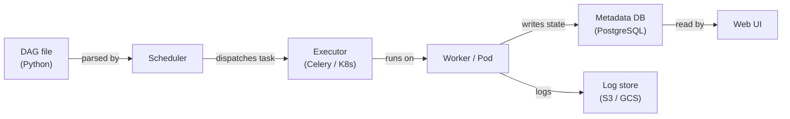

## Definição

Apache Airflow é uma plataforma de código aberto para criar, agendar e monitorar workflows de forma programática. Os workflows são expressos como **Grafos Acíclicos Dirigidos (DAGs)** escritos em Python, o que dá aos engenheiros a expressividade completa de uma linguagem de programação para definir dependências complexas, lógica de ramificação, geração dinâmica de tarefas e políticas de repetição. O Airflow foi criado originalmente no Airbnb em 2014 e posteriormente doado à Apache Software Foundation; tornou-se o padrão de fato para orquestração de workflows em lote em engenharia de dados e MLOps.

No contexto de ML, o Airflow orquestra o ciclo de vida completo do modelo: ingestão de dados, pré-processamento, engenharia de features, treinamento do modelo, avaliação, registro de artefatos e implantação. Ele não executa o processamento por si mesmo — em vez disso, delega a sistemas especializados (Spark, dbt, SageMaker, Kubernetes) por meio de seu rico ecossistema de operadores.

## Como funciona

### DAGs e dependências de tarefas

Um DAG é um arquivo Python que instancia um objeto `airflow.DAG` e define tarefas usando operadores. As dependências entre tarefas são declaradas com o operador de deslocamento de bits `>>` ou chamadas `set_downstream`/`set_upstream`.

### Operadores, sensores e hooks

Os **operadores** são as unidades atômicas de trabalho no Airflow. Os **sensores** são uma classe especial de operador que bloqueia até que uma condição seja atendida. Os **hooks** fornecem conexões reutilizáveis a sistemas externos.

### XComs e comunicação entre tarefas

Os **XComs** permitem que as tarefas enviem e recebam pequenos valores entre instâncias de tarefas dentro do mesmo DAG run. São ideais para passar métricas de avaliação do modelo, caminhos de artefatos ou flags de decisão.

### Arquitetura do scheduler

Com `KubernetesExecutor`, cada instância de tarefa obtém seu próprio pod Kubernetes isolado, eliminando a contenção de recursos de workers compartilhados.



## Quando usar / Quando NÃO usar

| Usar quando | Evitar quando |
|---|---|
| Você precisa de orquestração de workflow em lote com dependências complexas | Sua carga de trabalho requer latência sub-minuto ou é dirigida por eventos |
| Sua equipe se sente confortável escrevendo workflows em Python | Você quer um construtor de workflow low-code ou UI-first |
| Você precisa de integração rica com serviços cloud (AWS, GCP, Azure) | Seus DAGs são extremamente simples e um cron job seria suficiente |
| Você requer trilhas de auditoria detalhadas, tentativas e alertas | Você precisa de um serviço de orquestração gerenciado e sem operações |

## Comparações

| Critério | Apache Airflow | Prefect |
|---|---|---|
| Facilidade de uso | Moderada | Alta |
| Escalabilidade | Alta | Alta |
| Qualidade da UI | Boa | Excelente |
| Curva de aprendizado | Íngreme | Suave |

## Prós e contras

| Prós | Contras |
|---|---|
| Ecossistema maduro com centenas de integrações de providers | Sobrecarga operacional significativa |
| Expressividade Python completa para geração dinâmica de DAGs | Erros de análise de DAG podem quebrar o scheduler silenciosamente |
| Forte suporte da comunidade e empresarial | Não adequado para streaming ou agendamento sub-minuto |
| KubernetesExecutor permite isolamento de recursos por tarefa | XComs são limitados em tamanho |

## Exemplo de código

```python
from __future__ import annotations
from datetime import datetime, timedelta
from airflow import DAG
from airflow.operators.python import PythonOperator

default_args = {
    "owner": "ml-team",
    "retries": 2,
    "retry_delay": timedelta(minutes=5),
    "email_on_failure": True,
    "email": ["ml-alerts@example.com"],
}

def extract_data(**context) -> None:
    import pandas as pd, pathlib
    df = pd.DataFrame({"feature_a": [1.0, 2.0], "feature_b": [0.1, 0.4], "label": [0, 1]})
    output_path = "/tmp/airflow/training_data.parquet"
    pathlib.Path(output_path).parent.mkdir(parents=True, exist_ok=True)
    df.to_parquet(output_path, index=False)
    context["ti"].xcom_push(key="data_path", value=output_path)

def train_model(**context) -> None:
    import pandas as pd, mlflow, mlflow.sklearn
    from sklearn.linear_model import LogisticRegression
    from sklearn.model_selection import train_test_split
    from sklearn.metrics import accuracy_score

    data_path = context["ti"].xcom_pull(task_ids="extract_data", key="data_path")
    df = pd.read_parquet(data_path)
    X = df[["feature_a", "feature_b"]].values
    y = df["label"].values
    X_train, X_test, y_train, y_test = train_test_split(X, y, test_size=0.2, random_state=42)
    with mlflow.start_run(run_name="airflow-logistic-regression"):
        model = LogisticRegression()
        model.fit(X_train, y_train)
        accuracy = accuracy_score(y_test, model.predict(X_test))
        mlflow.log_metric("accuracy", accuracy)
        mlflow.sklearn.log_model(model, artifact_path="model")

with DAG(
    dag_id="ml_training_pipeline",
    description="Extract -> Train pipeline for nightly model refresh",
    default_args=default_args,
    start_date=datetime(2024, 1, 1),
    schedule="0 2 * * *",
    catchup=False,
    tags=["ml", "training"],
) as dag:
    extract = PythonOperator(task_id="extract_data", python_callable=extract_data)
    train = PythonOperator(task_id="train_model", python_callable=train_model)
    extract >> train
```

## Recursos práticos

- [Documentação Apache Airflow](https://airflow.apache.org/docs/) — Referência oficial para DAGs, operadores, executores e configuração.
- [Astronomer — Guias Airflow](https://www.astronomer.io/docs/learn/) — Tutoriais práticos sobre criação, teste e implantação de DAGs.
- [Índice de pacotes de providers Airflow](https://airflow.apache.org/docs/#providers-packages-docs-apache-airflow-providers) — Explore todas as integrações oficiais.
- [Airflow gerenciado — Amazon MWAA](https://docs.aws.amazon.com/mwaa/latest/userguide/what-is-mwaa.html) — Referência do serviço Airflow gerenciado da AWS.

## Veja também

- [Pipelines de dados](/docs/mlops/data-engineering)
- [Apache Spark](/docs/mlops/data-engineering/spark)
- [MLOps CI/CD](/docs/mlops/cicd)
