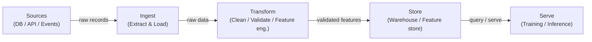

# Pipelines de dados

## Definição

Uma pipeline de dados é uma sequência automatizada de etapas que move dados brutos de uma ou mais fontes para um destino onde podem ser consumidos por analistas, dashboards ou modelos de machine learning. No contexto de ML, as pipelines não se tratam apenas de mover dados: elas garantem que os dados cheguem na forma certa, no momento certo e com qualidade verificável para que os modelos treinem e sirvam de forma previsível. Sem pipelines confiáveis, cada artefato subsequente — features, modelos treinados, previsões — é suspeito.

As pipelines de dados estão na base de todo sistema MLOps. Elas abrangem a ingestão de fontes heterogêneas (bancos de dados, APIs, streams de eventos, arquivos), a transformação para produzir conjuntos de dados limpos e estruturados ou vetores de features, o armazenamento em data warehouses ou feature stores, e o serving para jobs de treinamento ou endpoints de inferência online. As escolhas de design na camada de pipeline — batch vs. streaming, push vs. pull, schema-on-read vs. schema-on-write — se propagam até a latência, frescor e confiabilidade do modelo.

A qualidade dos dados é o contrato oculto entre engenheiros de dados e equipes de modelos. Desvio de esquema, explosões de nulos, mudança de distribuição e registros duplicados estão entre as causas mais comuns de degradação silenciosa do modelo. As pipelines modernas incorporam pontos de verificação de validação (usando ferramentas como Great Expectations ou testes dbt) para detectar esses problemas antes que dados ruins cheguem ao treinamento ou serving.

## Como funciona

### Batch vs. Streaming

Pipelines batch processam dados em pedaços delimitados em um cronograma — de hora em hora, diariamente ou acionados por chegada de arquivos. São mais simples de construir e raciocinar e são o padrão certo quando o consumidor downstream (um job de treinamento noturno, um dashboard BI) não requer frescor abaixo de um minuto. Pipelines de streaming processam registros à medida que chegam, permitindo features quase em tempo real para modelos online. A compensação é a complexidade operacional: você precisa lidar com chegadas tardias, eventos fora de ordem e semântica exactly-once.

### ETL vs. ELT

Extract-Transform-Load (ETL) aplica transformações antes que os dados pousem no armazenamento de destino. Extract-Load-Transform (ELT) carrega dados brutos primeiro e depois os transforma dentro de um warehouse ou lakehouse poderoso (por exemplo, BigQuery, Snowflake, Databricks). ELT preserva o histórico bruto e permite exploração ad hoc sem re-ingestão — uma grande vantagem em cargas de trabalho ML onde a engenharia de features evolui constantemente.

### Qualidade de dados e validação de esquema

Verificações de qualidade de dados devem ser incorporadas em cada estágio da pipeline, não acrescentadas no final. Na ingestão, as verificações confirmam que os dados de origem estão conformes com o esquema esperado. Na transformação, verificações em nível de linha afirmam regras de negócio. Na camada de serving, verificações estatísticas detectam desvio de distribuição — o assassino silencioso de modelos implantados.



## Quando usar / Quando NÃO usar

| Usar quando | Evitar quando |
|---|---|
| Várias fontes de dados precisam ser consolidadas para treinamento ML | Os dados já existem em uma única tabela limpa pronta para uso direto |
| Os dados precisam ser atualizados em um cronograma ou em tempo real | Sua análise é uma exploração pontual que não será repetida |
| Os modelos downstream requerem garantias de qualidade | O overhead de uma pipeline completa excede o valor para um protótipo rápido |
| As transformações precisam ser versionadas, testadas e reproduzíveis | O volume de dados é trivial e um script simples em um notebook é suficiente |
| Vários consumidores compartilham os mesmos dados processados | O sistema de origem já fornece uma API limpa e com contrato |

## Comparações

| Critério | Pipeline batch | Pipeline de streaming |
|---|---|---|
| Frescor dos dados | Minutos a horas (baseado em cronograma) | Sub-segundo a segundos |
| Complexidade | Baixa — conjuntos de dados delimitados, retentativas simples | Alta — dados tardios, janelamento, estado |
| Custo | Previsível, computação em rajadas | Computação contínua, baseline frequentemente maior |
| Tolerância a falhas | Reexecutar o batch com falha | Semântica exactly-once ou at-least-once necessária |
| Caso de uso ML típico | Treinamento offline, atualização noturna de features | Feature store online, pontuação em tempo real |

## Prós e contras

| Prós | Contras |
|---|---|
| Centraliza e padroniza o acesso a dados entre equipes | Investimento inicial não trivial para construir e manter |
| Permite transformações de dados reproduzíveis e testadas | Falhas de pipeline se propagam para todos os consumidores downstream |
| Incorpora verificações de qualidade antes que dados ruins cheguem a modelos | Depurar pipelines distribuídas é complexo |
| Suporta versionamento e rastreamento de linhagem | Streaming adiciona sobrecarga operacional significativa |
| Desacopla produtores de consumidores | Requer disciplina de governança e propriedade de dados |

## Exemplos de código

```python
import pandas as pd
import pandera as pa
from pandera import Column, DataFrameSchema, Check
from pathlib import Path

raw_schema = DataFrameSchema({
    "user_id": Column(int, nullable=False),
    "event_ts": Column(str, nullable=False),
    "amount": Column(float, Check(lambda x: x >= 0), nullable=False),
    "category": Column(str, nullable=True),
})

def extract(source_path: str) -> pd.DataFrame:
    return pd.read_csv(source_path)

def validate(df: pd.DataFrame, schema: DataFrameSchema) -> pd.DataFrame:
    return schema.validate(df)

def transform(df: pd.DataFrame) -> pd.DataFrame:
    df = df.copy()
    df["event_date"] = pd.to_datetime(df["event_ts"])
    df.drop(columns=["event_ts"], inplace=True)
    df["category"] = df["category"].fillna("unknown")
    import numpy as np
    df["log_amount"] = np.log1p(df["amount"])
    df.drop_duplicates(subset=["user_id", "event_date"], inplace=True)
    return df

def load(df: pd.DataFrame, dest_path: str) -> None:
    Path(dest_path).parent.mkdir(parents=True, exist_ok=True)
    df.to_parquet(dest_path, index=False)

def run_pipeline(source: str, destination: str) -> None:
    raw = extract(source)
    validated = validate(raw, raw_schema)
    clean = transform(validated)
    load(clean, destination)
    print("[pipeline] completed successfully")

if __name__ == "__main__":
    run_pipeline("data/raw/events.csv", "data/processed/events.parquet")
```

## Recursos práticos

- [The Data Engineering Cookbook (Andreas Kretz)](https://github.com/andkret/Cookbook) — Guia abrangente de código aberto cobrindo padrões de ingestão, armazenamento e processamento.
- [Documentação dbt](https://docs.getdbt.com/) — O padrão para transformações ELT em SQL com testes integrados e linhagem.
- [Great Expectations](https://docs.greatexpectations.io/) — Framework de qualidade e validação de dados que se integra com a maioria das ferramentas de pipeline.
- [Pandera](https://pandera.readthedocs.io/) — Validação de esquema leve para DataFrames do pandas e Spark em Python.
- [Fundamentals of Data Engineering (O'Reilly)](https://www.oreilly.com/library/view/fundamentals-of-data/9781098108298/) — Livro cobrindo o ciclo de vida completo da engenharia de dados.

## Veja também

- [Apache Airflow](/docs/mlops/data-engineering/airflow)
- [Apache Spark](/docs/mlops/data-engineering/spark)
- [Apache Kafka](/docs/mlops/data-engineering/kafka)
- [MLOps](/docs/mlops)
