## Definição

Apache Kafka é uma plataforma de streaming de eventos distribuída desenvolvida originalmente no LinkedIn e lançada como código aberto em 2011. É projetada para lidar com streams de eventos de alto throughput, baixa latência e duráveis — mensagens de log, eventos de atividade de usuários, leituras de sensores, transações — em um cluster de hardware commodity. Kafka atua como um log persistente e reproduzível: produtores escrevem eventos em **tópicos** nomeados, e consumidores leem desses tópicos no seu próprio ritmo, independentemente uns dos outros.

No contexto de ML, Kafka ocupa dois papéis críticos. Primeiro, serve como a espinha dorsal de dados para **pipelines de features em tempo real**. Segundo, é usado para **pipelines de serving de modelos**: as requisições de previsão chegam como mensagens Kafka, um consumidor aplica o modelo e produz eventos de previsão para um tópico de resultados.

## Como funciona

### Tópicos e partições

Um **tópico** é um log nomeado, ordenado e imutável de eventos. Os tópicos são divididos em **partições** — a unidade de paralelismo no Kafka.

### Produtores

Um **produtor** é um cliente que publica registros em um ou mais tópicos. Quando uma chave está presente, o Kafka usa hashing consistente para rotear todos os registros com a mesma chave para a mesma partição.

### Consumidores e grupos de consumidores

Um **consumidor** lê registros de uma ou mais partições. Os consumidores se organizam em **grupos de consumidores**: cada registro é entregue a exatamente um consumidor dentro de um grupo.

```mermaid
flowchart LR
  Producer["Producer<br/>(App / IoT / DB CDC)"] -- "publish events" --> Topic["Kafka Topic<br/>(partitioned, replicated)"]
  Topic -- "consume raw events" --> StreamProcessor["Stream Processor<br/>(Spark / Flink / Kafka Streams)"]
  StreamProcessor -- "write features" --> FeatureStore["Online Feature Store<br/>(Feast / Redis)"]
  FeatureStore -- "low-latency read" --> ModelServer["Model Server<br/>(REST / gRPC)"]
  ModelServer -- "publish predictions" --> PredictionTopic["Prediction Topic"]
  PredictionTopic -- "consume" --> Consumer["Consumer<br/>(Monitoring / Downstream app)"]
```



## Quando usar / Quando NÃO usar

| Usar quando | Evitar quando |
|---|---|
| Você precisa de streaming de eventos de alto throughput e durável | Seu caso de uso é enfileiramento de tarefas simples com taxa modesta de mensagens |
| Vários grupos de consumidores independentes precisam ler o mesmo stream de eventos | Você precisa de lógica de roteamento complexa ou filas de mensagens mortas |
| Você precisa reproduzir eventos históricos para preencher feature stores | A complexidade operacional de um cluster Kafka não é justificada pela carga de trabalho |
| Computação de features em tempo real é necessária para serving de ML online | As mensagens são grandes (> alguns MB) |
| A ordenação de eventos por entidade deve ser preservada | Sua equipe precisa de um message broker totalmente gerenciado |

## Comparações

| Critério | Apache Kafka | RabbitMQ |
|---|---|---|
| Throughput | Extremamente alto — milhões de mensagens/seg. | Moderado — centenas de milhares/seg. |
| Latência | Baixa (ms de um dígito) | Muito baixa — sub-milissegundo |
| Persistência de mensagens | Mensagens retidas por período configurável; totalmente reproduzíveis | Mensagens excluídas após confirmação por padrão |
| Modelo de consumidor | Baseado em pull | Baseado em push |
| Complexidade | Alta | Moderada |
| Melhor caso de uso ML | Pipelines de features em tempo real, event sourcing | Filas de tarefas para jobs ML assíncronos |

## Prós e contras

| Prós | Contras |
|---|---|
| Throughput extremamente alto e escalabilidade horizontal | Complexidade operacional significativa |
| Log durável e reproduzível permite backfills e auditabilidade | Não adequado para cargas de trabalho com mensagens muito pequenas ou infrequentes |
| Desacopla produtores e consumidores | A evolução do esquema requer um schema registry |
| Vários grupos de consumidores podem ler o mesmo tópico independentemente | Ajustar contagens de partições requer experiência |
| Forte ecossistema: Kafka Connect, Kafka Streams, ksqlDB | Overhead operacional historicamente maior que alternativas hospedadas |

## Exemplo de código

```python
import json, time, random, threading
from datetime import datetime
from kafka import KafkaProducer, KafkaConsumer
from kafka.admin import KafkaAdminClient, NewTopic

BROKER = "localhost:9092"
EVENTS_TOPIC = "user-events"
PREDICTIONS_TOPIC = "predictions"

def ensure_topics() -> None:
    admin = KafkaAdminClient(bootstrap_servers=BROKER)
    existing = admin.list_topics()
    topics_to_create = [
        NewTopic(name=t, num_partitions=3, replication_factor=1)
        for t in [EVENTS_TOPIC, PREDICTIONS_TOPIC] if t not in existing
    ]
    if topics_to_create:
        admin.create_topics(new_topics=topics_to_create, validate_only=False)
    admin.close()

def run_producer(num_events: int = 20, delay: float = 0.5) -> None:
    producer = KafkaProducer(
        bootstrap_servers=BROKER,
        value_serializer=lambda v: json.dumps(v).encode("utf-8"),
        key_serializer=lambda k: k.encode("utf-8"),
        acks="all", retries=3,
    )
    for i in range(num_events):
        user_id = f"user_{random.randint(1, 5)}"
        event = {
            "event_id": i, "user_id": user_id,
            "page_id": random.choice(["home", "product", "checkout", "search"]),
            "dwell_time_sec": round(random.uniform(1.0, 120.0), 2),
            "timestamp": datetime.utcnow().isoformat(),
        }
        producer.send(topic=EVENTS_TOPIC, key=user_id, value=event)
        time.sleep(delay)
    producer.flush()
    producer.close()

def score_event(event: dict) -> float:
    base = event["dwell_time_sec"] / 120.0
    multiplier = {"checkout": 1.5, "product": 1.2, "search": 0.9, "home": 0.7}.get(event["page_id"], 1.0)
    return min(round(base * multiplier, 4), 1.0)

def run_consumer(max_messages: int = 20) -> None:
    consumer = KafkaConsumer(
        EVENTS_TOPIC, bootstrap_servers=BROKER,
        group_id="ml-feature-pipeline",
        value_deserializer=lambda b: json.loads(b.decode("utf-8")),
        auto_offset_reset="earliest", enable_auto_commit=True, consumer_timeout_ms=5000,
    )
    prediction_producer = KafkaProducer(
        bootstrap_servers=BROKER,
        value_serializer=lambda v: json.dumps(v).encode("utf-8"),
        key_serializer=lambda k: k.encode("utf-8"),
    )
    count = 0
    for message in consumer:
        if count >= max_messages:
            break
        event = message.value
        score = score_event(event)
        prediction = {
            "event_id": event["event_id"], "user_id": event["user_id"],
            "purchase_probability": score, "scored_at": datetime.utcnow().isoformat(),
        }
        prediction_producer.send(topic=PREDICTIONS_TOPIC, key=event["user_id"], value=prediction)
        count += 1
    consumer.close()
    prediction_producer.flush()
    prediction_producer.close()

if __name__ == "__main__":
    ensure_topics()
    consumer_thread = threading.Thread(target=run_consumer, args=(20,))
    consumer_thread.start()
    time.sleep(1.0)
    run_producer(num_events=20, delay=0.3)
    consumer_thread.join()
```

## Recursos práticos

- [Documentação Apache Kafka](https://kafka.apache.org/documentation/) — Referência oficial para brokers, produtores, consumidores, Kafka Streams e Kafka Connect.
- [Confluent Developer — Tutoriais Kafka](https://developer.confluent.io/tutorials/) — Tutoriais práticos.
- [Kafka: The Definitive Guide, 2nd edition (O'Reilly)](https://www.oreilly.com/library/view/kafka-the-definitive/9781492043072/) — Livro abrangente.
- [Biblioteca kafka-python](https://kafka-python.readthedocs.io/) — Documentação do cliente Python.
- [Feast — Open Source Feature Store](https://docs.feast.dev/) — Feature store que se integra com Kafka.

## Veja também

- [Pipelines de dados](/docs/mlops/data-engineering)
- [Apache Spark](/docs/mlops/data-engineering/spark)
- [Monitoramento MLOps](/docs/mlops/monitoring)
