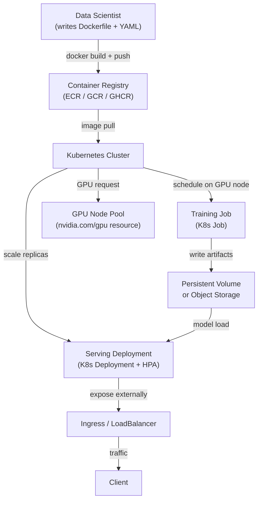

## Definição

Kubernetes (K8s) é uma plataforma de orquestração de containers que automatiza a implantação, o escalonamento e o gerenciamento de cargas de trabalho containerizadas. Embora o Kubernetes tenha sido projetado para serviços web sem estado, a comunidade de ML o adotou amplamente como infraestrutura base para trabalhos de treinamento, pontuação em lote e serviço de modelos — pois ele resolve os problemas de infraestrutura de ML mais difíceis: isolamento de recursos, ambientes reprodutíveis, agendamento de GPU e escalonamento horizontal.

Executar ML no Kubernetes vanilla — sem uma abstração de nível superior como o [KubeFlow](/docs/mlops/deployment/kubeflow) — significa compor primitivos padrão do Kubernetes: `Job` para execuções de treinamento pontuais, `CronJob` para retreinamento agendado, `Deployment` para instâncias de serviço de longa duração e `HorizontalPodAutoscaler` para autoescalonamento. Essa abordagem dá às equipes controle total sobre cada aspecto de suas cargas de trabalho, ao custo de mais criação de YAML e menos ferramentas específicas de ML incorporadas.

A diferença essencial em relação à execução de ML em VMs bare-metal é que o Kubernetes fornece gerenciamento declarativo de recursos: você especifica quanto de CPU, RAM e GPU um trabalho de treinamento precisa, e o agendador o coloca automaticamente em um nó adequado. O Kubernetes também lida com falhas de nós, reinicializações de pods e implantações contínuas sem intervenção manual. Para equipes de ML que já operam um cluster Kubernetes (ou cuja organização possui um), este é frequentemente o caminho pragmático para a produção antes de investir em uma plataforma completa como o KubeFlow.

## Como funciona



### Containerização de modelos de ML

O primeiro passo para executar ML no Kubernetes é empacotar o código do modelo e suas dependências em uma imagem Docker. Um Dockerfile de ML bem estruturado usa builds multi-estágio para separar a camada de instalação de dependências (que raramente muda e pode ser cacheada) da camada de código da aplicação (que muda com frequência). A imagem base deve ser fixada em uma versão específica — para cargas de trabalho de GPU, a NVIDIA fornece imagens base `nvcr.io/nvidia/pytorch` e `nvcr.io/nvidia/tensorflow` que incluem CUDA, cuDNN e NCCL pré-instalados e validados em conjunto. A imagem resultante é enviada para um registro de containers e referenciada por nome e digest (não `latest`) nos manifestos do Kubernetes, garantindo que o mesmo ambiente exato seja usado sempre.

### Agendamento de GPU e gerenciamento de recursos

O Kubernetes oferece suporte ao agendamento de GPU por meio do plugin de dispositivo NVIDIA, que expõe GPUs como um recurso agendável (`nvidia.com/gpu`). Um pod que solicita `nvidia.com/gpu: 1` só será agendado em um nó com uma GPU livre, e a GPU é alocada exclusivamente para esse pod durante todo o seu ciclo de vida. Os pools de nós são geralmente configurados com diferentes tipos de GPU (T4 para inferência, A100 para grandes trabalhos de treinamento) e rotulados adequadamente, permitindo que os pods usem `nodeSelector` ou `nodeAffinity` para direcionar o hardware correto. Cotas de recursos no nível do namespace impedem que uma única equipe monopolize a capacidade de GPU do cluster.

### Trabalhos de treinamento

Execuções de treinamento pontuais são expressas como objetos `Job` do Kubernetes. Um Job cria um ou mais pods, aguarda sua conclusão bem-sucedida (código de saída 0) e registra o resultado. Para treinamento distribuído em várias GPUs ou nós, o `training-operator` (anteriormente o Kubeflow Training Operator, mas implantável de forma autônoma) estende o Kubernetes com os recursos customizados `PyTorchJob` e `TFJob` que coordenam o treinamento multi-nó e multi-GPU com PyTorch DDP ou Horovod. Cada pod worker recebe a mesma imagem de container, mas diferentes variáveis de ambiente de rank e world size, permitindo treinamento de dados paralelo com rendezvous automático.

### Implantações de serviço e autoescalonamento

O serviço de modelos é expresso como um `Deployment` do Kubernetes com um número desejado de réplicas e solicitações/limites de recursos. Um `Service` do tipo `ClusterIP` roteia o tráfego entre as réplicas, e um serviço `Ingress` ou `LoadBalancer` expõe o endpoint externamente. O `HorizontalPodAutoscaler` (HPA) escala o número de réplicas com base na utilização de CPU, métricas customizadas (ex.: requisições por segundo do Prometheus) ou métricas externas (ex.: profundidade da fila SQS para workers em lote). Para serviço sensível à latência, os `PodDisruptionBudgets` garantem que atualizações contínuas nunca colocam offline mais do que uma fração configurável das réplicas simultaneamente.

## Quando usar / Quando NÃO usar

| Usar quando | Evitar quando |
|---|---|
| A organização já opera um cluster Kubernetes | A equipe não tem experiência com Kubernetes e não há equipe de plataforma para apoiá-la |
| É necessário controle total sobre a infraestrutura (on-premises, air-gapped) | Um serviço de ML gerenciado (SageMaker, Vertex AI) está disponível e se adequa ao caso de uso |
| As cargas de trabalho de ML precisam compartilhar um cluster com outras cargas de trabalho de engenharia | A simplicidade de uma VM ou trabalho de treinamento em nuvem é suficiente |
| O agendamento de GPU é necessário sem a sobrecarga de uma plataforma de ML completa | O custo de configuração e manutenção do K8s supera os benefícios operacionais |
| A portabilidade entre provedores de nuvem é um requisito rígido | AutoML, rastreamento de experimentos ou multi-tenancy são necessários (considerar KubeFlow) |

## Comparações

| Critério | ML no Kubernetes (vanilla) | KubeFlow |
|---|---|---|
| Complexidade | Média — objetos K8s padrão | Alta — muitos CRDs, Istio, Argo, MLMD |
| Funcionalidades | Manual — construir o que é necessário | Integradas: pipelines, AutoML (Katib), serviço (KServe), notebooks |
| Curva de aprendizado | Média — conhecimento de K8s suficiente | Íngreme — requer conhecimento específico de KubeFlow além do K8s |
| Flexibilidade | Alta — uso sem restrições de primitivos K8s | Moderada — vinculada às abstrações do KubeFlow |
| Opções gerenciadas | EKS, GKE, AKS (qualquer K8s gerenciado) | Vertex AI Pipelines (baseado em GKE), AWS Managed KubeFlow |
| Tempo de configuração | Horas a dias | Dias a semanas |

## Vantagens e desvantagens

| Vantagens | Desvantagens |
|---|---|
| Controle total — usar qualquer recurso K8s sem restrições de framework | Todas as ferramentas específicas de ML (UI de pipeline, rastreamento de experimentos) precisam ser adicionadas separadamente |
| Agendamento de GPU e treinamento multi-nó com o training-operator | Muito YAML — a criação de manifestos pode ser tediosa e propensa a erros |
| Funciona em qualquer nuvem ou cluster on-premises (sem dependência de fornecedor) | Depurar GPU no K8s requer familiaridade com taints de nó, limites e o plugin de dispositivo |
| Implantações contínuas e autoescalonamento com o HPA padrão do K8s | A configuração de cotas de recursos e afinidade de nós requer o envolvimento da equipe de plataforma |
| Integra-se com workflows GitOps existentes (Argo CD, Flux) | Sem registro de modelos, rastreamento de experimentos ou UI de pipeline integrados |

## Exemplos de código

```dockerfile
# Dockerfile — Multi-stage build for an ML model serving image
# Stage 1: install Python dependencies (cacheable layer)
# Stage 2: copy application code on top

# --- Stage 1: dependency builder ---
FROM python:3.11-slim AS builder

WORKDIR /build

# Install build tools and compile dependencies
RUN apt-get update && apt-get install -y --no-install-recommends \
    gcc \
    libgomp1 \
 && rm -rf /var/lib/apt/lists/*

COPY requirements.txt .
# Install dependencies into an isolated prefix so we can copy only them to the final image
RUN pip install --prefix=/install --no-cache-dir -r requirements.txt


# --- Stage 2: lean runtime image ---
FROM python:3.11-slim AS runtime

WORKDIR /app

# Copy only the installed packages from the builder (keeps image small)
COPY --from=builder /install /usr/local

# Copy application source code
COPY src/ ./src/

# The model artifact is mounted via a Kubernetes PersistentVolumeClaim or downloaded at startup
# It is NOT baked into the image to keep image size manageable
ENV MODEL_PATH=/models/model.joblib
ENV MODEL_VERSION=unknown
ENV PORT=8080

EXPOSE 8080

# Run as non-root for security best practices
RUN useradd -m appuser
USER appuser

CMD ["python", "-m", "uvicorn", "src.fastapi_serving:app", "--host", "0.0.0.0", "--port", "8080"]
```

```yaml
# k8s-manifests.yaml
# Three Kubernetes resources:
#   1. Deployment — runs the model serving pods
#   2. Service — routes traffic to the pods
#   3. HorizontalPodAutoscaler — scales replicas based on CPU usage

---
apiVersion: apps/v1
kind: Deployment
metadata:
  name: fraud-detector
  namespace: ml-serving
  labels:
    app: fraud-detector
    version: v1
spec:
  replicas: 2
  selector:
    matchLabels:
      app: fraud-detector
  strategy:
    type: RollingUpdate
    rollingUpdate:
      maxSurge: 1          # allow one extra pod during rollout
      maxUnavailable: 0    # never take a pod down before a new one is ready
  template:
    metadata:
      labels:
        app: fraud-detector
        version: v1
    spec:
      # Pull the model from an init container instead of baking it into the image
      initContainers:
        - name: download-model
          image: amazon/aws-cli:2.15.0
          command:
            - aws
            - s3
            - cp
            - s3://my-ml-bucket/models/fraud-detector/v1/model.joblib
            - /models/model.joblib
          env:
            - name: AWS_REGION
              value: us-east-1
          volumeMounts:
            - name: model-volume
              mountPath: /models

      containers:
        - name: serving
          image: ghcr.io/org/fraud-detector:sha-abc1234  # pinned by digest, not latest
          ports:
            - containerPort: 8080
          env:
            - name: MODEL_PATH
              value: /models/model.joblib
            - name: MODEL_VERSION
              value: v1
          resources:
            requests:
              cpu: "500m"
              memory: "512Mi"
            limits:
              cpu: "1"
              memory: "1Gi"
              # Uncomment for GPU-based inference:
              # nvidia.com/gpu: "1"
          volumeMounts:
            - name: model-volume
              mountPath: /models
          # Liveness probe — restart if the app hangs
          livenessProbe:
            httpGet:
              path: /health
              port: 8080
            initialDelaySeconds: 15
            periodSeconds: 10
          # Readiness probe — do not send traffic until model is loaded
          readinessProbe:
            httpGet:
              path: /health
              port: 8080
            initialDelaySeconds: 10
            periodSeconds: 5

      volumes:
        - name: model-volume
          emptyDir: {}  # ephemeral volume shared between init and main containers

---
apiVersion: v1
kind: Service
metadata:
  name: fraud-detector
  namespace: ml-serving
spec:
  selector:
    app: fraud-detector
  ports:
    - name: http
      port: 80
      targetPort: 8080
  type: ClusterIP

---
apiVersion: autoscaling/v2
kind: HorizontalPodAutoscaler
metadata:
  name: fraud-detector-hpa
  namespace: ml-serving
spec:
  scaleTargetRef:
    apiVersion: apps/v1
    kind: Deployment
    name: fraud-detector
  minReplicas: 2
  maxReplicas: 10
  metrics:
    - type: Resource
      resource:
        name: cpu
        target:
          type: Utilization
          averageUtilization: 70   # scale out when average CPU exceeds 70%
```

```bash
# Useful kubectl commands for ML workloads on Kubernetes

# Check GPU node availability and allocatable GPUs
kubectl get nodes -l accelerator=nvidia-tesla-t4 -o custom-columns="NODE:.metadata.name,GPU:.status.allocatable.nvidia\.com/gpu"

# Watch pod startup (useful for debugging model download in init containers)
kubectl logs -n ml-serving deploy/fraud-detector -c download-model --follow

# View resource usage of serving pods
kubectl top pods -n ml-serving -l app=fraud-detector

# Scale the deployment manually (overrides HPA temporarily)
kubectl scale deploy/fraud-detector -n ml-serving --replicas=4

# Trigger a rolling update with a new image
kubectl set image deploy/fraud-detector serving=ghcr.io/org/fraud-detector:sha-def5678 -n ml-serving

# Watch rollout status
kubectl rollout status deploy/fraud-detector -n ml-serving
```

## Recursos práticos

- [Documentação oficial do Kubernetes](https://kubernetes.io/docs/) — Referência completa para todos os conceitos do Kubernetes e objetos de API.
- [NVIDIA GPU Operator para Kubernetes](https://docs.nvidia.com/datacenter/cloud-native/gpu-operator/overview.html) — Automatiza a configuração de drivers de GPU, plugins de dispositivo e monitoramento em nós K8s.
- [Kubeflow Training Operator](https://www.kubeflow.org/docs/components/training/) — CRDs autônomos para PyTorchJob, TFJob e treinamento distribuído MPI (implantável sem o KubeFlow completo).
- [Documentação do HPA do Kubernetes](https://kubernetes.io/docs/tasks/run-application/horizontal-pod-autoscale/) — Guia oficial para autoescalonamento de CPU, memória e métricas customizadas.

## Veja também

- [KubeFlow](/docs/mlops/deployment/kubeflow)
- [Serviço de modelos](/docs/mlops/deployment/model-serving)
- [Terraform para infraestrutura de ML](/docs/mlops/iac/terraform)
