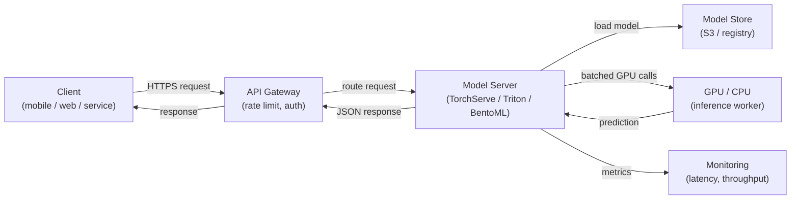

## Definição

O serviço de modelos é o processo de disponibilizar um modelo de ML treinado para inferência — aceitar dados de entrada, executar uma previsão e retornar resultados aos chamadores. É a ponte entre o mundo offline de treinamento e experimentação e o mundo online de aplicações em produção. Uma camada de serviço bem projetada é tão importante quanto a qualidade do modelo: um modelo com 98% de acurácia implantado com latência de 10 segundos frequentemente não tem utilidade em um contexto de produto.

O serviço de modelos abrange três paradigmas distintos que diferem fundamentalmente em latência, throughput e requisitos de infraestrutura. A **inferência em lote** processa grandes volumes de dados segundo um cronograma, gravando as previsões em um banco de dados ou arquivo; é a opção de maior throughput, mas não pode responder a solicitações individuais em tempo real. A **inferência em tempo real (online)** expõe um endpoint de API que retorna previsões em milissegundos; ela prioriza a baixa latência em detrimento do throughput. A **inferência por streaming** processa eventos de uma fila ou fluxo conforme chegam, ficando entre o lote e o tempo real em termos de latência e complexidade.

O escalonamento de um sistema de serviço de modelos envolve desafios específicos de ML: os modelos são geralmente arquivos grandes carregados em memória (ou VRAM de GPU), o tempo de inicialização é significativo para o autoescalonamento, a utilização da GPU precisa ser maximizada para ser rentável, e a latência de previsão tem uma distribuição de cauda que pode ser imprevisível sob carga. Frameworks como NVIDIA Triton Inference Server, TorchServe e BentoML existem especificamente para enfrentar esses desafios.

## Como funciona



### Inferência em lote

Na inferência em lote, um trabalho agendado (cron, DAG do Airflow ou um agendador em nuvem) lê um conjunto de dados do armazenamento, executa previsões em todo ele e grava os resultados de volta. O modelo é carregado uma vez por execução do trabalho, portanto o custo amortizado de carregamento por previsão é insignificante. Esse padrão é adequado para casos de uso como geração de recomendações noturnas, pontuação de todos os clientes para risco de churn ou anotação de um data warehouse com sentimento previsto. A principal alavanca de escalonamento é o paralelismo entre partições de dados — cada partição pode ser processada por um worker separado. Um erro comum é o viés entre treinamento e serviço: o script de pontuação em lote usa uma lógica de pré-processamento diferente da do pipeline de treinamento.

### Inferência de API em tempo real

O serviço em tempo real expõe o modelo por trás de um endpoint HTTP (ou gRPC) que responde de forma síncrona a solicitações individuais. O principal desafio de engenharia é a latência: o carregamento do modelo é lento (segundos a minutos para modelos grandes), portanto as instâncias devem ser mantidas aquecidas ou pré-escaladas. Frameworks como TorchServe e BentoML gerenciam o carregamento do modelo, a desserialização de requisições, o agrupamento de requisições concorrentes (batching dinâmico) e verificações de saúde. O escalonamento horizontal via Kubernetes ou serviços gerenciados (AWS SageMaker Endpoints, GCP Vertex AI Endpoints) adiciona réplicas quando o throughput excede um limite. A memória da GPU determina quantas réplicas do modelo cabem em um único nó, o que impacta diretamente nos custos.

### Inferência por streaming

A inferência por streaming conecta o servidor de modelos a um fluxo de eventos (Kafka, Kinesis, Pub/Sub). Os eventos chegam continuamente e as previsões são emitidas para um tópico de saída. Esse padrão é adequado para detecção de fraudes em fluxos de transações, detecção de anomalias em tempo real em dados de sensores ou qualquer caso de uso onde um novo evento precisa ser pontuado em algumas centenas de milissegundos, mas o volume é alto demais para HTTP síncrono. O servidor de modelos atua como consumidor-produtor: lê do tópico de entrada, executa a inferência e grava no tópico de saída. O gerenciamento de backpressure é crítico — o consumidor não deve ficar para trás do produtor durante picos de tráfego.

### Considerações de escalonamento

O agendamento de GPU é o fator de custo dominante para modelos grandes. As principais alavancas incluem: **batching dinâmico** (acumulação de múltiplas requisições em uma única chamada de GPU), **quantização de modelos** (redução de precisão de FP32 para INT8 para caber mais modelos por GPU), **cache de modelos** (manter o modelo na VRAM entre requisições) e **autoescalonamento** (adição ou remoção de réplicas com base na profundidade da fila ou SLOs de latência). O Triton Inference Server da NVIDIA suporta tudo isso com um arquivo de configuração declarativo por modelo, tornando-o a primeira escolha para frotas de modelos heterogêneos em produção.

## Quando usar / Quando NÃO usar

| Usar quando | Evitar quando |
|---|---|
| Uma aplicação downstream precisa de previsões no momento da requisição | Todos os consumidores podem tolerar previsões calculadas com horas de antecedência |
| As previsões precisam refletir imediatamente a versão mais recente do modelo | O conjunto de dados é pequeno o suficiente para ser pontuado à noite em lote com baixo custo |
| É necessária pontuação orientada a eventos (streaming) | O modelo só é usado para análise offline sem sistema downstream |
| O custo de inferência do modelo é alto e a utilização da GPU precisa ser maximizada | Na fase de protótipo, onde um script simples chamado diretamente é suficiente |

## Comparações

| Critério | TorchServe | TF Serving | NVIDIA Triton | BentoML | FastAPI (custom) |
|---|---|---|---|---|---|
| Suporte a frameworks | PyTorch nativo | TensorFlow / Keras | Multi-framework (ONNX, TF, PyTorch, TensorRT) | Agnóstico a framework | Agnóstico a framework |
| Batching dinâmico | Sim | Sim | Sim (altamente configurável) | Sim | Implementação manual |
| Suporte a gRPC | Sim | Sim | Sim | Sim | Via grpcio |
| Otimização de GPU | Boa | Boa | Melhor da categoria | Boa | Manual |
| Facilidade de configuração | Média | Média | Alta (configuração complexa) | Baixa (Python nativo) | Muito baixa |
| Maturidade em produção | Alta | Alta | Muito alta | Alta | Depende da implementação |

## Vantagens e desvantagens

| Vantagens | Desvantagens |
|---|---|
| Desacopla atualizações do modelo das entregas do código da aplicação | Adiciona complexidade de infraestrutura em comparação com inferência inline |
| Permite o escalonamento independente da capacidade de inferência | A latência de cold start pode ser significativa para modelos grandes |
| Frameworks dedicados gerenciam batching, verificações de saúde e versionamento | Instâncias de GPU são caras; o gerenciamento de custos requer atenção |
| Suporte nativo a testes A/B e implantações canary | A inferência por streaming requer expertise em Kafka/Kinesis além de ML |
| Hooks de monitoramento para latência, throughput e desvio de previsões | O viés modelo-serviço (pré-processamento diferente) é um risco persistente |

## Exemplos de código

```python
# fastapi_serving.py
# Production-ready FastAPI model serving endpoint with dynamic model loading,
# input validation via Pydantic, and health check endpoint.

from __future__ import annotations

import os
from contextlib import asynccontextmanager
from typing import List

import joblib
import numpy as np
import uvicorn
from fastapi import FastAPI, HTTPException
from pydantic import BaseModel, Field

# --- Input/output schemas ---

class PredictionRequest(BaseModel):
    """Input features for a single inference request."""
    features: List[float] = Field(
        ...,
        min_length=20,
        max_length=20,
        description="Exactly 20 numerical features (must match training schema).",
        example=[0.1, -0.5, 1.2] + [0.0] * 17,
    )


class PredictionResponse(BaseModel):
    label: int
    probability: float
    model_version: str


# --- Model lifecycle management ---

MODEL: dict = {}  # holds the loaded model and metadata


@asynccontextmanager
async def lifespan(app: FastAPI):
    """Load model at startup; release resources on shutdown."""
    model_path = os.environ.get("MODEL_PATH", "models/model.joblib")
    model_version = os.environ.get("MODEL_VERSION", "unknown")

    if not os.path.exists(model_path):
        raise RuntimeError(f"Model file not found at {model_path}")

    MODEL["clf"] = joblib.load(model_path)
    MODEL["version"] = model_version
    print(f"Model v{model_version} loaded from {model_path}")
    yield
    MODEL.clear()
    print("Model unloaded.")


# --- API definition ---

app = FastAPI(
    title="ML Model Serving API",
    description="Real-time inference endpoint for the fraud detection model.",
    version="1.0.0",
    lifespan=lifespan,
)


@app.get("/health")
def health() -> dict:
    """Liveness probe — returns 200 when the model is loaded."""
    if "clf" not in MODEL:
        raise HTTPException(status_code=503, detail="Model not loaded")
    return {"status": "ok", "model_version": MODEL["version"]}


@app.post("/predict", response_model=PredictionResponse)
def predict(request: PredictionRequest) -> PredictionResponse:
    """
    Run inference on a single input vector.
    Returns the predicted label and the positive-class probability.
    """
    clf = MODEL.get("clf")
    if clf is None:
        raise HTTPException(status_code=503, detail="Model not ready")

    X = np.array(request.features).reshape(1, -1)
    label = int(clf.predict(X)[0])
    probability = float(clf.predict_proba(X)[0][label])

    return PredictionResponse(
        label=label,
        probability=probability,
        model_version=MODEL["version"],
    )


if __name__ == "__main__":
    # For local testing: MODEL_PATH=models/model.joblib MODEL_VERSION=v1 python fastapi_serving.py
    uvicorn.run(app, host="0.0.0.0", port=8080, log_level="info")
```

```python
# client_example.py
# Simple client that calls the FastAPI serving endpoint

import httpx

BASE_URL = "http://localhost:8080"

# Health check
response = httpx.get(f"{BASE_URL}/health")
print(response.json())  # {"status": "ok", "model_version": "v1"}

# Prediction
payload = {"features": [0.1, -0.5, 1.2] + [0.0] * 17}
response = httpx.post(f"{BASE_URL}/predict", json=payload)
print(response.json())
# {"label": 1, "probability": 0.87, "model_version": "v1"}
```

## Recursos práticos

- [Documentação do BentoML](https://docs.bentoml.com/) — Serviço de modelos agnóstico a framework com batching integrado, containerização e integrações de implantação.
- [NVIDIA Triton Inference Server](https://docs.nvidia.com/deeplearning/triton-inference-server/user-guide/docs/index.html) — Serviço de alto desempenho para frotas de modelos multi-framework com otimização de GPU.
- [Documentação do TorchServe](https://pytorch.org/serve/) — Solução oficial de serviço de modelos PyTorch com personalização de handlers.
- [Documentação do FastAPI](https://fastapi.tiangolo.com/) — Framework web Python moderno e de alto desempenho amplamente usado para APIs de serviço de ML customizadas.

## Veja também

- [KubeFlow](/docs/mlops/deployment/kubeflow)
- [ML no Kubernetes](/docs/mlops/deployment/ml-kubernetes)
- [Monitoramento](/docs/mlops/monitoring)
