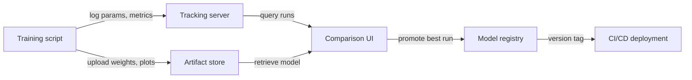

# Rastreamento de experimentos

## Definição

O rastreamento de experimentos é a prática de registrar sistematicamente cada detalhe de uma execução de treinamento de ML para que os resultados possam ser reproduzidos, comparados e auditados. Sem ele, as equipes perdem o controle de quais hiperparâmetros produziram quais resultados, desperdiçam computação redescubrindo configurações e não conseguem demonstrar conformidade quando modelos influenciam decisões de alto risco.

Um registro completo de experimento captura quatro categorias de informações. Os **parâmetros** são as entradas do treinamento: taxa de aprendizado, tamanho do batch, escolhas de arquitetura do modelo, conjuntos de features. As **métricas** são as saídas: curvas de perda, precisão, F1, AUC, latência. Os **artefatos** são os arquivos produzidos: pesos do modelo treinado, datasets pré-processados, gráficos de avaliação, matrizes de confusão. Os **metadados** são o contexto: versão do código (commit git), ambiente (versões de bibliotecas, hardware), versão do dataset, tempo de execução e o nome da pessoa que o executou.

O versionamento de modelos é a extensão natural: uma vez que se rastreiam os experimentos, é possível promover o artefato da melhor execução para um registro de modelos, etiquetá-lo com uma versão semântica e vincular cada implantação de serving a um experimento específico. Isso fecha o ciclo entre experimentação e produção, tornando os rollbacks simples e as auditorias possíveis.

## Como funciona

### Instrumentação

O script de treinamento é instrumentado com algumas linhas de código do SDK que abrem um contexto de "execução" e registram dados em um servidor central durante o treinamento. A maioria dos frameworks (PyTorch Lightning, Hugging Face Trainer, Keras) tem integrações nativas que registram automaticamente métricas comuns sem código adicional.

### Armazenamento centralizado

Os dados registrados são persistidos em um armazenamento backend — um sistema de arquivos local, um banco de dados em nuvem gerenciado ou uma plataforma SaaS. Parâmetros e métricas são armazenados como registros estruturados; os artefatos são enviados para armazenamento de objetos (S3, GCS, Azure Blob). O backend é consultado pela UI e pelo SDK.

### Comparação e análise

A UI de rastreamento permite filtrar, classificar e comparar execuções nas quatro dimensões. É possível plotar curvas de métricas de muitas execuções no mesmo gráfico, agrupar por valores de parâmetros e exportar resultados para um dataframe para análise personalizada. Isso facilita a identificação das execuções Pareto-ótimas (melhor precisão para um dado orçamento de latência, por exemplo).

### Promoção de modelos

O artefato da melhor execução é registrado em um registro de modelos com um número de versão e estado de transição (Staging → Production → Archived). Os sistemas CI/CD subsequentes consultam o registro para saber qual versão do modelo implantar, criando uma entrega limpa entre experimentação e serving.





## Quando usar / Quando NÃO usar

| São executados mais ... | É executado um único... |
|----------|------------|
| São executados mais do que um punhado de experimentos e é necessário comparar resultados | É executado um único treinamento pontual que nunca será revisitado |
| A reprodutibilidade é necessária (indústria regulamentada, publicação de pesquisa) | O experimento é trivial (p. ex., uma busca em grid de dois parâmetros com resultados óbvios) |
| Vários membros da equipe compartilham resultados de experimentos | A equipe trabalha sozinha e mantém notas em uma planilha pessoal que é suficiente |
| Deseja-se promover versões de modelos para produção de forma sistemática | O modelo nunca é implantado e os resultados não precisam ser auditados |

## Exemplos de código

```python
# generic_tracking.py
# Framework-agnostic experiment tracking pattern.
# Works with any ML library; swap out the model training code as needed.
# pip install mlflow scikit-learn pandas

import mlflow
from sklearn.linear_model import LogisticRegression
from sklearn.datasets import make_classification
from sklearn.model_selection import train_test_split
from sklearn.metrics import accuracy_score, roc_auc_score
import numpy as np

# --- Configuration ---
EXPERIMENT_NAME = "binary-classification-demo"
PARAMS = {
    "C": 0.1,           # Regularization strength
    "max_iter": 1000,
    "solver": "lbfgs",
    "random_state": 42,
}

# --- Data preparation ---
X, y = make_classification(
    n_samples=2000, n_features=20, n_informative=10, random_state=42
)
X_train, X_test, y_train, y_test = train_test_split(
    X, y, test_size=0.2, random_state=42
)

mlflow.set_experiment(EXPERIMENT_NAME)

with mlflow.start_run(run_name=f"logreg-C{PARAMS['C']}") as run:
    mlflow.log_params(PARAMS)

    model = LogisticRegression(**PARAMS)
    model.fit(X_train, y_train)

    y_pred = model.predict(X_test)
    y_prob = model.predict_proba(X_test)[:, 1]

    metrics = {
        "accuracy": accuracy_score(y_test, y_pred),
        "roc_auc": roc_auc_score(y_test, y_prob),
        "n_train": len(X_train),
        "n_test": len(X_test),
    }
    mlflow.log_metrics(metrics)

    mlflow.sklearn.log_model(model, artifact_path="model")

    import json, tempfile, os
    with tempfile.TemporaryDirectory() as tmp:
        meta_path = os.path.join(tmp, "run_metadata.json")
        with open(meta_path, "w") as f:
            json.dump({"git_commit": "abc1234", "dataset_version": "v1.3"}, f)
        mlflow.log_artifact(meta_path)

    print(f"Run ID : {run.info.run_id}")
    print(f"Accuracy: {metrics['accuracy']:.4f} | ROC-AUC: {metrics['roc_auc']:.4f}")
```


## Comparações

| Critério | MLflow | Weights & Biases (W&B) |
|-----------|--------|------------------------|
| Facilidade de configuração | Auto-hospedável com `mlflow ui`; somente pip install | Conta SaaS necessária; instalação CLI; nível gratuito disponível |
| Qualidade da UI | Funcional mas espartana; boa para comparação tabular | Polida, interativa; excelente para mídia e sobreposições de curvas |
| Colaboração | Servidor compartilhado necessário; sem controle de acesso integrado no OSS | Espaços de trabalho de equipe, acesso baseado em funções e compartilhamento integrados |
| Preço | Gratuito e de código aberto; oferta gerenciada via Databricks | Nível gratuito para indivíduos; pago para equipes grandes |
| Integrações | Integração profunda com Databricks, Spark, sklearn, PyTorch | Integrações amplas; forte em pesquisa e academia |

## Recursos práticos

- [MLflow Tracking Documentation](https://mlflow.org/docs/latest/tracking.html) — Guia oficial cobrindo a API de tracking, backends, armazenamentos de artefatos e autologging.
- [Weights & Biases – Experiment Tracking Quickstart](https://docs.wandb.ai/quickstart) — Guia passo a passo para registrar sua primeira execução do W&B em menos de cinco minutos.
- [Neptune.ai – Experiment Tracking Guide](https://neptune.ai/blog/ml-experiment-tracking) — Visão geral neutra de fornecedor sobre o que rastrear, por que e como comparar ferramentas.
- [Made With ML – Experiment Tracking](https://madewithml.com/courses/mlops/experiment-tracking/) — Tutorial prático baseado em notebooks integrando o MLflow em um loop de treinamento real.

## Veja também

- [MLflow](/docs/mlops/mlflow)
- [Weights & Biases](/docs/mlops/wandb)
- [MLOps](/docs/mlops)
