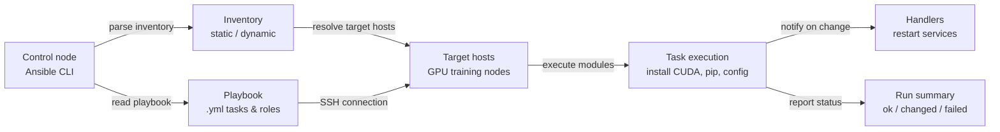

## Definição

Ansible é uma ferramenta de automação de código aberto criada pela Red Hat que lida com gerenciamento de configuração, implantação de aplicações e automação de tarefas em uma frota de servidores usando arquivos YAML simples e legíveis por humanos chamados **playbooks**. Sua escolha arquitetural definidora é ser **sem agente**: o Ansible se conecta aos nós gerenciados via SSH (Linux) ou WinRM (Windows) e executa tarefas diretamente, sem necessidade de daemon ou software agente nas máquinas alvo. Isso o torna significativamente mais fácil de adotar do que ferramentas baseadas em agentes — você pode começar a gerenciar servidores existentes sem nenhum software pré-instalado além do Python e de um servidor SSH.

O Ansible opera em um **modelo push**: um operador executa um playbook a partir de um nó de controle, o Ansible se conecta ao inventário de hosts alvo e executa as tarefas em ordem. As tarefas chamam **módulos** — unidades de trabalho idempotentes que sabem como instalar pacotes, gerenciar arquivos, iniciar serviços, executar comandos e interagir com APIs de nuvem. Módulos comunitários e oficiais cobrem virtualmente todo gerenciador de pacotes Linux, serviço, provedor de nuvem, dispositivo de rede e aplicação. Os roles agrupam tarefas, arquivos, templates e variáveis relacionados em unidades reutilizáveis e compartilháveis que podem ser publicadas no Ansible Galaxy ou mantidas em repositórios Git internos.

Em contextos de ML e engenharia de dados, o Ansible preenche a lacuna que o [Terraform](/docs/mlops/iac/terraform) deixa. O Terraform provisiona infraestrutura (cria a instância de GPU, a VPC, o bucket S3); o Ansible configura o que roda nessa infraestrutura (instala a versão correta do CUDA, configura o ambiente Python, configura dependências de treinamento distribuído e garante que as ferramentas de monitoramento de GPU estejam em execução). As duas ferramentas são complementares, não concorrentes: um workflow típico de MLOps usa o Terraform para provisionar recursos de nuvem e o Ansible para inicializar esses recursos em um estado pronto para treinar.

## Como funciona

### Inventário

O inventário define quais hosts o Ansible gerencia. Um inventário estático é um arquivo INI ou YAML listando nomes de hosts ou endereços IP agrupados por função (por exemplo, `[gpu_training_nodes]`, `[model_serving]`). Inventários dinâmicos consultam APIs de nuvem (AWS EC2, GCP Compute, Azure VMs) em tempo de execução para construir a lista de hosts a partir da infraestrutura em uso — essencial para ambientes de autoescalonamento. Variáveis de host e grupo definem valores de configuração por host ou por grupo que são referenciados nos playbooks.

### Playbooks e tarefas

Um playbook é um arquivo YAML contendo uma ou mais **plays**. Cada play tem como alvo um grupo de hosts e uma lista de **tarefas**. Cada tarefa chama um módulo com argumentos e opcionalmente define condições (`when`), loops (`loop`) e handlers acionados em caso de mudança. As tarefas são executadas sequencialmente dentro de uma play; as plays podem ser executadas em paralelo entre os hosts. O resultado de cada tarefa é um dos seguintes: `ok` (nenhuma mudança necessária), `changed` (mudança foi feita), `failed` ou `skipped`. O Ansible imprime um resumo desses resultados após cada execução de playbook.

### Roles

Os roles fornecem uma estrutura de diretório padronizada para organizar automação relacionada: `tasks/`, `handlers/`, `templates/`, `files/`, `vars/`, `defaults/` e `meta/`. Um role pode ser aplicado a múltiplas plays em múltiplos playbooks, e roles podem depender de outros roles. O Ansible Galaxy hospeda milhares de roles comunitários (por exemplo, `geerlingguy.docker`, `nvidia.nvidia_driver`) que podem ser instalados com `ansible-galaxy install` e usados diretamente nos playbooks.

### Variáveis e templating

O Ansible usa o motor de templating Jinja2 em todos os playbooks e arquivos de template. As variáveis podem ser definidas em múltiplos níveis (padrões de role, vars de grupo, vars de host, vars de playbook, vars extras passadas com `-e`) com uma ordem de precedência clara. Templates (arquivos `.j2`) geram arquivos de configuração dinamicamente — por exemplo, gerando um arquivo de configuração de treinamento distribuído com o IP correto do nó master, número de GPUs e tamanho de batch para cada ambiente.

### Idempotência e handlers

Os módulos do Ansible são projetados para ser idempotentes: executar um playbook várias vezes produz o mesmo estado final sem causar efeitos colaterais indesejados. Se um pacote já estiver instalado na versão correta, a tarefa reporta `ok` e não faz nada. **Handlers** são tarefas especiais que são executadas no final de uma play somente se notificadas por uma tarefa que resultou em `changed` — usadas para reiniciar serviços (como um daemon de treinamento acelerado por CUDA) apenas quando sua configuração realmente muda.



## Quando usar / Quando NÃO usar

| Usar quando | Evitar quando |
|----------|------------|
| Configurando software em servidores existentes: instalando CUDA, Python, pacotes pip, serviços do sistema | Provisionando nova infraestrutura de nuvem do zero (use o Terraform para isso) |
| Inicializando nós de treinamento de GPU depois que o Terraform os cria | Você precisa de rastreamento de estado detalhado em centenas de recursos (o Ansible não tem arquivo de estado) |
| Configurando ambientes de ML consistentes entre máquinas de desenvolvimento, staging e produção | Você precisa de grafos de dependência complexos entre recursos de nuvem com ordenação automática |
| Executando comandos ad-hoc em uma frota de servidores (por exemplo, atualizar um arquivo de configuração em todos) | As máquinas alvo não podem ser alcançadas via SSH ou WinRM a partir do nó de controle |
| Implantando atualizações de aplicações ou distribuindo mudanças de configuração em muitos nós | Você está provisionando recursos nativos de nuvem (VPCs, funções IAM, buckets S3) — use o Terraform |
| Equipes que precisam de ferramentas IaC de baixa barreira com uma curva de aprendizado superficial em YAML | Você precisa de execução paralela muito rápida; a sobrecarga SSH do Ansible limita a escalabilidade em milhares de nós |

## Comparações

| Critério | Ansible | Terraform |
|-----------|---------|-----------|
| Paradigma | Procedural com módulos idempotentes — tarefas executam em ordem | Declarativo — descreve o estado desejado, o Terraform computa o diff |
| Gerenciamento de estado | Sem estado — sem rastreamento embutido do que foi aplicado anteriormente | Arquivo de estado explícito mapeia configuração para IDs de recursos reais |
| Caso de uso principal | Gerenciamento de configuração e implantação de software em hosts existentes | Provisionamento de infraestrutura de nuvem (instâncias, redes, armazenamento) |
| Suporte a provedores de nuvem | Módulos de nuvem existem, mas são menos abrangentes que os provedores do Terraform | 1.000+ provedores com cobertura profunda e versionada de API |
| Idempotência | Nível de tarefa — cada módulo deve ser escrito de forma idempotente | Nativo — plan/apply sempre converge para o estado declarado |
| Curva de aprendizado | Baixa — tarefas YAML são legíveis; nenhuma nova linguagem necessária | Moderada — sintaxe HCL + modelo mental de estado/plano para aprender |
| Agente necessário | Não — sem agente, conecta via SSH | Não — o Terraform roda na máquina de controle, chama APIs de nuvem |
| Quando usar juntos | O Ansible configura software na infraestrutura que o Terraform provisionou | O Terraform provisiona recursos; o Ansible lida com configuração de OS e app |

## Vantagens e desvantagens

| Aspecto | Vantagens | Desvantagens |
|---------|-----------|--------------|
| Arquitetura sem agente | Nenhum software para instalar nos nós alvo; funciona com SSH existente | Sobrecarga SSH limita o desempenho em escala muito grande (10.000+ nós) |
| Playbooks YAML | Automação legível e autodocumentada por humanos | Lógica complexa (loops, condicionais) fica verbosa em YAML |
| Módulos idempotentes | Seguro para re-executar; correção de drift sem efeitos colaterais | A idempotência depende da qualidade do módulo; módulos shell/command não são inerentemente idempotentes |
| Ansible Galaxy | Grande ecossistema de roles comunitários para software comum | A qualidade dos roles comunitários varia; fixar versões de roles é crítico para reprodutibilidade |
| Sem arquivo de estado | Simples, sem sobrecarga de gerenciamento de estado | Sem detecção embutida de drift entre execuções; ferramentas manuais ou de terceiros necessárias |
| Templating Jinja2 | Geração poderosa de configuração dinâmica | A depuração de templates é mais difícil do que código nativo; erros surgem em tempo de execução |

## Exemplos de código

```yaml
# ml_environment_setup.yml
# Ansible playbook to configure a GPU training node for ML workloads.
# Installs CUDA toolkit, cuDNN, Python 3.11, pip packages, and sets up
# a systemd service for the Prometheus node exporter.
#
# Usage:
#   ansible-playbook -i inventory.ini ml_environment_setup.yml
#
# inventory.ini example:
#   [gpu_training_nodes]
#   10.0.1.10 ansible_user=ubuntu ansible_ssh_private_key_file=~/.ssh/ml-key.pem
#   10.0.1.11 ansible_user=ubuntu ansible_ssh_private_key_file=~/.ssh/ml-key.pem

---
- name: Configure GPU training nodes for ML workloads
  hosts: gpu_training_nodes
  become: true  # Run tasks as root via sudo
  vars:
    cuda_version: "12.1"
    python_version: "3.11"
    pip_packages:
      - torch==2.3.0
      - torchvision==0.18.0
      - torchaudio==2.3.0
      - numpy==1.26.4
      - pandas==2.2.2
      - scikit-learn==1.4.2
      - mlflow==2.13.0
      - evidently==0.4.30
      - prometheus-client==0.20.0
    node_exporter_version: "1.8.1"
    ml_user: "mlops"
    ml_workdir: "/opt/ml"

  handlers:
    - name: restart node_exporter
      ansible.builtin.systemd:
        name: node_exporter
        state: restarted
        daemon_reload: true

  tasks:
    # --- System prerequisites ---

    - name: Update apt package cache
      ansible.builtin.apt:
        update_cache: true
        cache_valid_time: 3600  # Skip update if cache is less than 1 hour old

    - name: Install system dependencies
      ansible.builtin.apt:
        name:
          - build-essential
          - git
          - wget
          - curl
          - htop
          - nvtop          # GPU monitoring in terminal
          - python{{ python_version }}
          - python{{ python_version }}-dev
          - python{{ python_version }}-venv
          - python3-pip
        state: present

    # --- CUDA installation ---

    - name: Check if CUDA {{ cuda_version }} is already installed
      ansible.builtin.command: nvcc --version
      register: nvcc_check
      changed_when: false
      failed_when: false

    - name: Add CUDA repository keyring
      ansible.builtin.shell: |
        wget -qO /tmp/cuda-keyring.deb \
          https://developer.download.nvidia.com/compute/cuda/repos/ubuntu2204/x86_64/cuda-keyring_1.1-1_all.deb
        dpkg -i /tmp/cuda-keyring.deb
      when: cuda_version not in (nvcc_check.stdout | default(''))
      args:
        creates: /usr/share/keyrings/cuda-archive-keyring.gpg

    - name: Install CUDA toolkit {{ cuda_version }}
      ansible.builtin.apt:
        name: cuda-toolkit-{{ cuda_version | replace('.', '-') }}
        state: present
        update_cache: true
      when: cuda_version not in (nvcc_check.stdout | default(''))

    - name: Set CUDA environment variables in /etc/environment
      ansible.builtin.lineinfile:
        path: /etc/environment
        line: "{{ item }}"
        state: present
      loop:
        - 'CUDA_HOME=/usr/local/cuda'
        - 'PATH=/usr/local/cuda/bin:$PATH'
        - 'LD_LIBRARY_PATH=/usr/local/cuda/lib64:$LD_LIBRARY_PATH'

    # --- ML user and workspace ---

    - name: Create dedicated ML user
      ansible.builtin.user:
        name: "{{ ml_user }}"
        shell: /bin/bash
        home: "/home/{{ ml_user }}"
        create_home: true
        state: present

    - name: Create ML working directory
      ansible.builtin.file:
        path: "{{ ml_workdir }}"
        state: directory
        owner: "{{ ml_user }}"
        group: "{{ ml_user }}"
        mode: "0755"

    # --- Python virtual environment and packages ---

    - name: Create Python virtual environment
      ansible.builtin.command:
        cmd: python{{ python_version }} -m venv {{ ml_workdir }}/venv
        creates: "{{ ml_workdir }}/venv/bin/python"
      become_user: "{{ ml_user }}"

    - name: Upgrade pip in virtual environment
      ansible.builtin.pip:
        name: pip
        state: latest
        virtualenv: "{{ ml_workdir }}/venv"
      become_user: "{{ ml_user }}"

    - name: Install ML Python packages
      ansible.builtin.pip:
        name: "{{ pip_packages }}"
        virtualenv: "{{ ml_workdir }}/venv"
        state: present
      become_user: "{{ ml_user }}"

    - name: Write requirements.txt for reproducibility
      ansible.builtin.copy:
        dest: "{{ ml_workdir }}/requirements.txt"
        content: "{{ pip_packages | join('\n') }}\n"
        owner: "{{ ml_user }}"
        group: "{{ ml_user }}"
        mode: "0644"

    # --- Prometheus Node Exporter for infrastructure monitoring ---

    - name: Check if node_exporter is already installed
      ansible.builtin.stat:
        path: /usr/local/bin/node_exporter
      register: node_exporter_stat

    - name: Download Prometheus node_exporter {{ node_exporter_version }}
      ansible.builtin.get_url:
        url: "https://github.com/prometheus/node_exporter/releases/download/v{{ node_exporter_version }}/node_exporter-{{ node_exporter_version }}.linux-amd64.tar.gz"
        dest: /tmp/node_exporter.tar.gz
        mode: "0644"
      when: not node_exporter_stat.stat.exists

    - name: Extract and install node_exporter
      ansible.builtin.unarchive:
        src: /tmp/node_exporter.tar.gz
        dest: /tmp
        remote_src: true
      when: not node_exporter_stat.stat.exists

    - name: Copy node_exporter binary to /usr/local/bin
      ansible.builtin.copy:
        src: "/tmp/node_exporter-{{ node_exporter_version }}.linux-amd64/node_exporter"
        dest: /usr/local/bin/node_exporter
        mode: "0755"
        remote_src: true
      when: not node_exporter_stat.stat.exists
      notify: restart node_exporter

    - name: Create node_exporter systemd service
      ansible.builtin.copy:
        dest: /etc/systemd/system/node_exporter.service
        content: |
          [Unit]
          Description=Prometheus Node Exporter
          After=network.target

          [Service]
          User=nobody
          ExecStart=/usr/local/bin/node_exporter \
            --collector.systemd \
            --collector.processes
          Restart=on-failure

          [Install]
          WantedBy=multi-user.target
        mode: "0644"
      notify: restart node_exporter

    - name: Enable and start node_exporter
      ansible.builtin.systemd:
        name: node_exporter
        enabled: true
        state: started
        daemon_reload: true

    # --- Verification ---

    - name: Verify GPU is visible to CUDA
      ansible.builtin.command: nvidia-smi
      register: nvidia_smi_output
      changed_when: false
      failed_when: nvidia_smi_output.rc != 0

    - name: Print GPU info
      ansible.builtin.debug:
        var: nvidia_smi_output.stdout_lines

    - name: Verify PyTorch can see the GPU
      ansible.builtin.command:
        cmd: "{{ ml_workdir }}/venv/bin/python -c \"import torch; print('CUDA available:', torch.cuda.is_available()); print('GPU count:', torch.cuda.device_count())\""
      register: torch_check
      changed_when: false
      become_user: "{{ ml_user }}"

    - name: Print PyTorch GPU availability
      ansible.builtin.debug:
        var: torch_check.stdout_lines
```

## Recursos práticos

- [Documentação do Ansible](https://docs.ansible.com/ansible/latest/index.html) — Documentação oficial cobrindo playbooks, módulos, roles, inventário e melhores práticas.
- [Ansible Galaxy](https://galaxy.ansible.com/) — Hub comunitário para roles e coleções Ansible reutilizáveis, incluindo drivers de GPU NVIDIA, Docker e roles do Kubernetes.
- [Jeff Geerling — Ansible for DevOps](https://www.ansiblefordevops.com/) — Livro abrangente e repositório GitHub acompanhante cobrindo o Ansible do básico até padrões de produção.
- [Coleção Ansible da NVIDIA](https://github.com/nvidia/ansible-collection-nvidia-gpu) — Coleção Ansible oficial da NVIDIA para gerenciar drivers de GPU, CUDA e instalações de NCCL.
- [Guia de melhores práticas do Ansible](https://docs.ansible.com/ansible/latest/tips_tricks/ansible_tips_tricks.html) — Dicas e truques oficiais cobrindo estrutura de diretórios, gerenciamento de variáveis e otimização de desempenho.

## Veja também

- [Terraform](/docs/mlops/iac/terraform)
- [ML no Kubernetes](/docs/mlops/deployment/ml-kubernetes)
- [MLOps](/docs/mlops)
