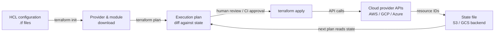

## Definição

Terraform é uma ferramenta de Infraestrutura como Código (IaC) de código aberto criada pela HashiCorp que permite definir, provisionar e gerenciar infraestrutura em nuvem e on-premises usando uma linguagem de configuração declarativa chamada HCL (HashiCorp Configuration Language). Você descreve o estado final desejado da sua infraestrutura — quais recursos devem existir, como devem ser configurados e como se relacionam entre si — e o Terraform descobre o que criar, atualizar ou destruir para atingir esse estado. Esse modelo declarativo é fundamentalmente diferente das abordagens de scripts imperativos, onde você descreve a sequência de etapas a executar.

A pedra angular da arquitetura do Terraform é seu ecossistema de **provedores**. Um provedor é um plugin que traduz definições de recursos HCL em chamadas de API contra uma plataforma específica: AWS, Google Cloud, Azure, Kubernetes, Datadog, GitHub e centenas de outros. Cada provedor mantém seu próprio ciclo de releases versionado, e o Terraform baixa os provedores automaticamente com base nos blocos `required_providers`. Isso significa que uma única configuração Terraform pode simultaneamente provisionar um cluster de treinamento de GPU na AWS, um bucket GCS para dados de treinamento, um namespace Kubernetes para serviço de modelos e um painel Grafana para monitoramento — com ferramentas consistentes em todas as plataformas.

O **gerenciamento de estado** é o que torna o Terraform idempotente e planejável. O Terraform mantém um arquivo de estado que mapeia cada recurso na configuração para sua contraparte no mundo real (identificada por IDs de recursos do provedor de nuvem). Quando você executa `terraform plan`, o Terraform compara o arquivo de estado atual com sua configuração e a infraestrutura em uso, produzindo um diff que mostra exatamente o que vai mudar antes que qualquer mudança seja feita. Para workflows de equipe, o estado é armazenado em um backend compartilhado (S3, GCS, Terraform Cloud) com bloqueio para evitar modificações concorrentes. Essa auditabilidade e previsibilidade tornam o Terraform a ferramenta IaC dominante para provisionar infraestrutura de treinamento e serviço de ML em ambientes regulados e colaborativos.

## Como funciona

### Escrever configuração

Os engenheiros escrevem arquivos HCL (`.tf`) que declaram recursos, fontes de dados, variáveis, saídas e módulos. Os recursos correspondem a objetos de infraestrutura (uma instância EC2, um bucket S3, uma implantação Kubernetes). As fontes de dados leem infraestrutura existente sem gerenciá-la. As variáveis parametrizam as configurações para reutilização em ambientes diferentes. Os módulos encapsulam conjuntos reutilizáveis de recursos — um módulo de "cluster de treinamento de GPU" pode ser instanciado várias vezes com diferentes tipos de instância e regiões.

### Inicializar e planejar

Executar `terraform init` baixa os provedores e módulos necessários e inicializa o backend. Executar `terraform plan` produz um plano de execução legível por humanos: uma lista de recursos a adicionar (+), alterar (~) ou destruir (−). A fase de plano é somente leitura — não faz nenhuma mudança na infraestrutura. As equipes normalmente integram `terraform plan` em pipelines de CI para revisar mudanças em pull requests antes do merge.

### Aplicar e gerenciamento de estado

`terraform apply` executa o plano, chamando APIs de provedores para criar, atualizar ou deletar recursos em ordem de dependência. O Terraform resolve o grafo de dependências automaticamente com base em referências entre recursos (por exemplo, uma sub-rede que referencia um ID de VPC). Após o apply, o arquivo de estado é atualizado para refletir o novo estado da infraestrutura. Para infraestrutura de ML, isso significa que instâncias de GPU, buckets de armazenamento, funções IAM e clusters Kubernetes são todos criados na ordem correta com as configurações corretas em um único comando.

### Destruir e gerenciamento de ciclo de vida

`terraform destroy` desmonta todos os recursos gerenciados pela configuração — útil para ambientes de treinamento efêmeros que não devem rodar (e custar dinheiro) entre trabalhos de treinamento. Metaargumentos de ciclo de vida (`create_before_destroy`, `prevent_destroy`, `ignore_changes`) dão controle granular sobre como o Terraform lida com recursos sensíveis, como buckets de armazenamento de artefatos de modelos que nunca devem ser acidentalmente deletados.



## Quando usar / Quando NÃO usar

| Usar quando | Evitar quando |
|----------|------------|
| Provisionando infraestrutura de nuvem que precisa ser reprodutível em ambientes | Configurando software dentro de instâncias existentes (use o Ansible para isso) |
| Gerenciando infraestrutura de ML em escala: clusters de GPU, armazenamento, rede, Kubernetes | Sua equipe não tem infraestrutura de nuvem para gerenciar (sem servidores, sem contas de nuvem) |
| Vários membros da equipe precisam colaborar na mesma infraestrutura | Você precisa executar comandos shell arbitrários ou configurar configurações no nível do OS nas instâncias |
| Você quer mudanças de infraestrutura revisadas via pull requests antes da aplicação | Sua infraestrutura existente não foi criada com o Terraform e o custo de migração é proibitivo |
| A infraestrutura precisa ser versionada, auditada e revertida de forma confiável | Você precisa de mudanças rápidas e iterativas na configuração de aplicações durante o desenvolvimento |
| Você opera em múltiplos provedores de nuvem e quer um workflow unificado | Sua organização já padroniza em uma ferramenta IaC concorrente (Pulumi, CDK) com conhecimento institucional |

## Comparações

| Critério | Terraform | Ansible |
|-----------|-----------|---------|
| Paradigma | Declarativo — descreve o estado desejado | Procedural — descreve as etapas para atingir o estado |
| Gerenciamento de estado | Arquivo de estado explícito; rastreia IDs de recursos | Sem estado — sem rastreamento de estado embutido |
| Caso de uso principal | Provisionamento de recursos de nuvem (instâncias, redes, armazenamento) | Gerenciamento de configuração e implantação de aplicações em instâncias existentes |
| Suporte a provedores de nuvem | 1.000+ provedores via ecossistema de plugins | Módulos para principais nuvens; menos abrangente que o Terraform |
| Idempotência | Nativo — plan/apply sempre converge para o estado desejado | Nível de tarefa — cada tarefa deve ser escrita de forma idempotente |
| Curva de aprendizado | Sintaxe HCL + modelo mental de estado/plano | Playbooks YAML; barreira inicial menor |
| Quando usar ambos | O Terraform provisiona infraestrutura; o Ansible configura software nela — eles se complementam | Ver acima |

## Vantagens e desvantagens

| Aspecto | Vantagens | Desvantagens |
|---------|-----------|--------------|
| Modelo declarativo | A intenção é clara; o plano mostra as mudanças exatas antes do apply | Não consegue expressar facilmente lógica condicional ou loops complexos (embora o HCL tenha melhorado) |
| Arquivo de estado | Permite planejamento preciso e detecção de drift | O arquivo de estado é sensível; corrupção ou perda é um incidente grave |
| Ecossistema de provedores | Cobre virtualmente todo serviço de nuvem e ferramenta SaaS | A qualidade dos provedores varia; alguns provedores comunitários são mal mantidos |
| Workflow de plan/apply | As mudanças são revisáveis antes da execução | Ciclo de iteração mais lento do que scripts imperativos para prototipagem rápida |
| Reutilização de módulos | Padrões de infraestrutura DRY via módulos publicados ou internos | Grafos de módulos grandes podem ser lentos para inicializar e planejar |
| Idempotência | Seguro para executar repetidamente; comportamento convergente | Ciclos de destruição/recriação para certas mudanças de recursos (por exemplo, renomeação) causam tempo de inatividade |

## Exemplos de código

```hcl
# ml_infrastructure.tf
# Provisions an AWS GPU training instance and S3 bucket for ML artifacts.
# Prerequisites: AWS CLI configured, Terraform >= 1.5, appropriate IAM permissions.
# Run: terraform init && terraform plan && terraform apply

terraform {
  required_version = ">= 1.5"
  required_providers {
    aws = {
      source  = "hashicorp/aws"
      version = "~> 5.0"
    }
  }
  # Remote state backend — replace with your bucket and key
  backend "s3" {
    bucket         = "my-org-terraform-state"
    key            = "mlops/training/terraform.tfstate"
    region         = "us-east-1"
    dynamodb_table = "terraform-state-lock"
    encrypt        = true
  }
}

provider "aws" {
  region = var.aws_region
}

# --- Variables ---

variable "aws_region" {
  description = "AWS region for all resources"
  type        = string
  default     = "us-east-1"
}

variable "environment" {
  description = "Deployment environment: dev, staging, prod"
  type        = string
  default     = "dev"
}

variable "gpu_instance_type" {
  description = "EC2 instance type for GPU training. p3.2xlarge has 1x V100."
  type        = string
  default     = "p3.2xlarge"
}

variable "key_pair_name" {
  description = "Name of an existing EC2 key pair for SSH access"
  type        = string
}

# --- Data sources ---

# Use the latest Deep Learning AMI (GPU) for the region
data "aws_ami" "dl_ami" {
  most_recent = true
  owners      = ["amazon"]

  filter {
    name   = "name"
    values = ["Deep Learning AMI GPU PyTorch*"]
  }

  filter {
    name   = "architecture"
    values = ["x86_64"]
  }
}

# Default VPC for simplicity — use a dedicated VPC in production
data "aws_vpc" "default" {
  default = true
}

# --- S3 bucket for training artifacts ---

resource "aws_s3_bucket" "ml_artifacts" {
  bucket = "ml-artifacts-${var.environment}-${random_id.suffix.hex}"

  tags = {
    Environment = var.environment
    Purpose     = "ml-training-artifacts"
    ManagedBy   = "terraform"
  }
}

resource "random_id" "suffix" {
  byte_length = 4
}

# Block all public access to the artifacts bucket
resource "aws_s3_bucket_public_access_block" "ml_artifacts" {
  bucket                  = aws_s3_bucket.ml_artifacts.id
  block_public_acls       = true
  block_public_policy     = true
  ignore_public_acls      = true
  restrict_public_buckets = true
}

# Enable versioning so artifact overwrites can be recovered
resource "aws_s3_bucket_versioning" "ml_artifacts" {
  bucket = aws_s3_bucket.ml_artifacts.id
  versioning_configuration {
    status = "Enabled"
  }
}

# --- IAM role for the training instance ---

resource "aws_iam_role" "ml_training" {
  name = "ml-training-role-${var.environment}"

  assume_role_policy = jsonencode({
    Version = "2012-10-17"
    Statement = [{
      Action    = "sts:AssumeRole"
      Effect    = "Allow"
      Principal = { Service = "ec2.amazonaws.com" }
    }]
  })

  tags = {
    Environment = var.environment
    ManagedBy   = "terraform"
  }
}

resource "aws_iam_role_policy" "ml_s3_access" {
  name = "ml-s3-access"
  role = aws_iam_role.ml_training.id

  policy = jsonencode({
    Version = "2012-10-17"
    Statement = [{
      Effect = "Allow"
      Action = [
        "s3:GetObject",
        "s3:PutObject",
        "s3:ListBucket",
        "s3:DeleteObject"
      ]
      Resource = [
        aws_s3_bucket.ml_artifacts.arn,
        "${aws_s3_bucket.ml_artifacts.arn}/*"
      ]
    }]
  })
}

resource "aws_iam_instance_profile" "ml_training" {
  name = "ml-training-profile-${var.environment}"
  role = aws_iam_role.ml_training.name
}

# --- Security group for training instance ---

resource "aws_security_group" "ml_training" {
  name        = "ml-training-sg-${var.environment}"
  description = "Security group for ML GPU training instances"
  vpc_id      = data.aws_vpc.default.id

  # SSH access — restrict to your IP in production
  ingress {
    from_port   = 22
    to_port     = 22
    protocol    = "tcp"
    cidr_blocks = ["0.0.0.0/0"]
    description = "SSH — restrict to known IPs in production"
  }

  # JupyterLab access
  ingress {
    from_port   = 8888
    to_port     = 8888
    protocol    = "tcp"
    cidr_blocks = ["0.0.0.0/0"]
    description = "JupyterLab — restrict to known IPs in production"
  }

  egress {
    from_port   = 0
    to_port     = 0
    protocol    = "-1"
    cidr_blocks = ["0.0.0.0/0"]
    description = "Allow all outbound traffic"
  }

  tags = {
    Environment = var.environment
    ManagedBy   = "terraform"
  }
}

# --- GPU Training EC2 instance ---

resource "aws_instance" "ml_training" {
  ami                    = data.aws_ami.dl_ami.id
  instance_type          = var.gpu_instance_type
  key_name               = var.key_pair_name
  iam_instance_profile   = aws_iam_instance_profile.ml_training.name
  vpc_security_group_ids = [aws_security_group.ml_training.id]

  # 100 GB root volume for datasets and model checkpoints
  root_block_device {
    volume_type           = "gp3"
    volume_size           = 100
    delete_on_termination = true
    encrypted             = true
  }

  # Bootstrap script: export the S3 bucket name as an environment variable
  user_data = <<-EOF
    #!/bin/bash
    echo "export ML_ARTIFACTS_BUCKET=${aws_s3_bucket.ml_artifacts.bucket}" >> /etc/environment
    echo "export AWS_DEFAULT_REGION=${var.aws_region}" >> /etc/environment
  EOF

  tags = {
    Name        = "ml-training-${var.environment}"
    Environment = var.environment
    Purpose     = "gpu-training"
    ManagedBy   = "terraform"
  }

  # Prevent accidental destruction in production
  lifecycle {
    prevent_destroy = false # Set to true for production instances
  }
}

# --- Outputs ---

output "training_instance_id" {
  description = "EC2 instance ID of the GPU training instance"
  value       = aws_instance.ml_training.id
}

output "training_instance_public_ip" {
  description = "Public IP address of the GPU training instance"
  value       = aws_instance.ml_training.public_ip
}

output "ml_artifacts_bucket_name" {
  description = "Name of the S3 bucket for ML artifacts"
  value       = aws_s3_bucket.ml_artifacts.bucket
}

output "ml_artifacts_bucket_arn" {
  description = "ARN of the S3 bucket for ML artifacts"
  value       = aws_s3_bucket.ml_artifacts.arn
}
```

## Recursos práticos

- [Documentação do Terraform](https://developer.hashicorp.com/terraform/docs) — Documentação oficial da HashiCorp cobrindo sintaxe HCL, provedores, estado, workspaces e módulos.
- [Documentação do provedor AWS do Terraform](https://registry.terraform.io/providers/hashicorp/aws/latest/docs) — Referência abrangente para todos os recursos e fontes de dados da AWS disponíveis no provedor AWS do Terraform.
- [Melhores práticas do Terraform](https://developer.hashicorp.com/terraform/language/style) — Guia de estilo oficial cobrindo estrutura de módulos, convenções de nomenclatura e padrões de gerenciamento de estado.
- [Gruntwork — Terraform: Up and Running](https://www.terraformupandrunning.com/) — Livro amplamente recomendado sobre padrões de Terraform em produção, módulos e testes.
- [Terraform Registry](https://registry.terraform.io/) — Registro oficial de provedores e módulos publicados, incluindo módulos comunitários para Kubernetes, EKS e configurações de instâncias de GPU.

## Veja também

- [Ansible](/docs/mlops/iac/ansible)
- [ML no Kubernetes](/docs/mlops/deployment/ml-kubernetes)
- [MLOps](/docs/mlops)
