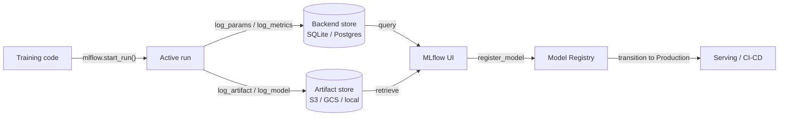

## Definição

MLflow é uma plataforma de código aberto projetada para gerenciar o ciclo de vida completo do aprendizado de máquina. Lançada originalmente pela Databricks em 2018, tornou-se uma das ferramentas MLOps mais amplamente adotadas devido à sua simplicidade, independência de framework e ao fato de poder ser executada inteiramente on-premise sem nenhuma dependência de nuvem. Um simples `pip install mlflow` e uma mudança de duas linhas de código é suficiente para começar a rastrear experimentos.

O MLflow organiza sua funcionalidade em quatro componentes estreitamente integrados. **Tracking** registra parâmetros, métricas e artefatos para cada execução de treinamento. **Projects** empacota código ML em unidades reproduzíveis e executáveis definidas por um arquivo `MLproject`. **Models** fornece um formato padrão para empacotar modelos que podem ser servidos por qualquer destino de implantação compatível. **Model Registry** fornece um armazenamento de modelos centralizado com gerenciamento de ciclo de vida (estados Staging, Production, Archived) e histórico de versões. Juntos, esses componentes cobrem o caminho do experimento bruto ao deployment em produção.

O MLflow pode ser executado localmente (backend SQLite, artefatos no sistema de arquivos local), em um servidor autogerenciado (PostgreSQL + S3) ou como serviço completamente gerenciado via Databricks Managed MLflow. O núcleo de código aberto possui licença Apache 2.0, tornando-o adequado para indústrias regulamentadas onde os dados não podem sair da infraestrutura própria.

## Como funciona

### Servidor de tracking

Quando você chama `mlflow.start_run()`, o cliente abre uma execução no servidor de tracking e começa a armazenar logs em buffer. Parâmetros (`log_param`, `log_params`) e métricas (`log_metric`, `log_metrics`) são gravados no armazenamento backend (SQLite ou PostgreSQL). Os artefatos são enviados para o armazenamento de artefatos (sistema de arquivos local, S3, GCS, Azure Blob, HDFS). O servidor expõe uma API REST consumida pelo SDK do cliente e pela interface web.

### MLflow Projects

Um projeto é um diretório (ou repositório git) com um arquivo YAML `MLproject` que declara os pontos de entrada, parâmetros e o ambiente conda/pip. Executar `mlflow run . -P lr=0.01` resolve o ambiente, define os parâmetros e lança o ponto de entrada — produzindo automaticamente uma execução rastreada. Isso torna os experimentos reproduzíveis para qualquer pessoa com acesso ao repositório.

### MLflow Models

Um modelo salvo com `mlflow.<flavor>.log_model()` é armazenado no formato MLmodel: um diretório contendo o modelo serializado, um descritor YAML `MLmodel` e um `conda.yaml` / `requirements.txt`. O flavor `pyfunc` fornece uma interface uniforme `model.predict(data)` independentemente do framework subjacente, permitindo que o mesmo modelo seja carregado por diferentes backends de serving.

### Model Registry

O registro armazena versões de modelos com nome e estados de transição. Sistemas CI/CD automatizados consultam o registro para obter a versão `Production` mais recente para implantar. Aprovadores humanos ou trabalhos de validação automatizados transitam versões entre estados. Cada versão vincula-se de volta à sua execução de origem, preservando a proveniência completa.



## Quando usar / Quando NÃO usar

| Usar quando | Evitar quando |
|----------|------------|
| É necessária uma plataforma MLOps completamente auto-hospedada e de código aberto | A equipe precisa de recursos colaborativos ricos (relatórios compartilhados, notificações do Slack) nativamente |
| Os dados não podem sair da infraestrutura própria (indústrias regulamentadas) | Um produto SaaS sem infraestrutura para gerenciar é preferido |
| O Databricks já é utilizado e se deseja integração nativa | O fluxo de trabalho é apenas de notebooks sem implantação em produção planejada |
| A independência de framework é importante (sklearn, XGBoost, PyTorch, TF, etc.) | É necessária otimização avançada de hiperparâmetros incorporada |
| O controle de custos é crítico e a licença de código aberto é necessária | A equipe não tem largura de banda de engenharia para gerenciar um servidor e armazenamento de artefatos |

## Comparações

| Critério | MLflow | Weights & Biases (W&B) |
|-----------|--------|------------------------|
| Facilidade de configuração | Auto-hospedável com um comando; nenhuma conta necessária | SaaS; conta gratuita necessária; sem infraestrutura para gerenciar |
| Qualidade da UI | Limpa mas básica; focada em métricas tabulares e comparação de execuções | Muito polida; excelente registro de mídia, gráficos personalizados, relatórios |
| Colaboração | Servidor compartilhado necessário; sem RBAC integrado no OSS | Espaços de trabalho de equipe integrados, links de compartilhamento e acesso baseado em funções |
| Preço | Gratuito e de código aberto; Databricks Managed MLflow tem custo adicional | Gratuito para indivíduos; planos pagos para equipes |
| Otimização de hiperparâmetros | Integra-se com Optuna, Ray Tune externamente | Sweeps integrados com busca Bayesiana/grid/aleatória |

## Exemplos de código

```python
# mlflow_full_example.py
# Full MLflow tracking example: logs params, metrics, a custom artifact,
# and registers the model in the Model Registry.
# pip install mlflow scikit-learn matplotlib

import mlflow
import mlflow.sklearn
import matplotlib.pyplot as plt
import numpy as np
from sklearn.ensemble import GradientBoostingClassifier
from sklearn.datasets import load_breast_cancer
from sklearn.model_selection import train_test_split, cross_val_score
from sklearn.metrics import (
    accuracy_score, roc_auc_score, classification_report
)
import os, tempfile, json

X, y = load_breast_cancer(return_X_y=True)
X_train, X_test, y_train, y_test = train_test_split(
    X, y, test_size=0.2, stratify=y, random_state=0
)

params = {
    "n_estimators": 200,
    "learning_rate": 0.05,
    "max_depth": 4,
    "subsample": 0.8,
    "random_state": 0,
}

mlflow.set_experiment("breast-cancer-gbt")

with mlflow.start_run(run_name="gbt-tuned") as run:

    mlflow.log_params(params)
    clf = GradientBoostingClassifier(**params)
    clf.fit(X_train, y_train)

    y_pred = clf.predict(X_test)
    y_prob = clf.predict_proba(X_test)[:, 1]
    cv_scores = cross_val_score(clf, X_train, y_train, cv=5, scoring="roc_auc")

    metrics = {
        "accuracy": accuracy_score(y_test, y_pred),
        "roc_auc": roc_auc_score(y_test, y_prob),
        "cv_roc_auc_mean": cv_scores.mean(),
        "cv_roc_auc_std": cv_scores.std(),
    }
    mlflow.log_metrics(metrics)

    with tempfile.TemporaryDirectory() as tmp:
        fig, ax = plt.subplots(figsize=(8, 5))
        feat_imp = clf.feature_importances_
        top_idx = np.argsort(feat_imp)[-10:]
        ax.barh(range(10), feat_imp[top_idx])
        ax.set_title("Top 10 feature importances")
        fig.tight_layout()
        plot_path = os.path.join(tmp, "feature_importance.png")
        fig.savefig(plot_path)
        plt.close(fig)
        mlflow.log_artifact(plot_path, artifact_path="plots")

        report = classification_report(y_test, y_pred, output_dict=True)
        report_path = os.path.join(tmp, "classification_report.json")
        with open(report_path, "w") as f:
            json.dump(report, f, indent=2)
        mlflow.log_artifact(report_path, artifact_path="evaluation")

    mlflow.sklearn.log_model(
        clf,
        artifact_path="model",
        registered_model_name="breast-cancer-gbt",
    )

    print(f"Run ID  : {run.info.run_id}")
    for k, v in metrics.items():
        print(f"  {k}: {v:.4f}")
```

## Recursos práticos

- [MLflow Official Documentation](https://mlflow.org/docs/latest/index.html) — Referência completa dos quatro componentes, API REST e destinos de implantação.
- [MLflow GitHub Repository](https://github.com/mlflow/mlflow) — Código-fonte, rastreador de problemas e exemplos; útil para entender os internos e contribuir.
- [Databricks – MLflow Tutorials](https://docs.databricks.com/en/mlflow/index.html) — Uso de MLflow em produção no Databricks com integração do Unity Catalog.
- [Towards Data Science – MLflow in Production](https://towardsdatascience.com/deploy-mlflow-with-docker-compose-8059f16b6039) — Tutorial da comunidade para implantar um servidor MLflow auto-hospedado com Docker Compose, PostgreSQL e MinIO.

## Veja também

- [Experiment tracking](/docs/mlops/experiment-tracking)
- [Weights & Biases](/docs/mlops/wandb)
- [MLOps](/docs/mlops)
